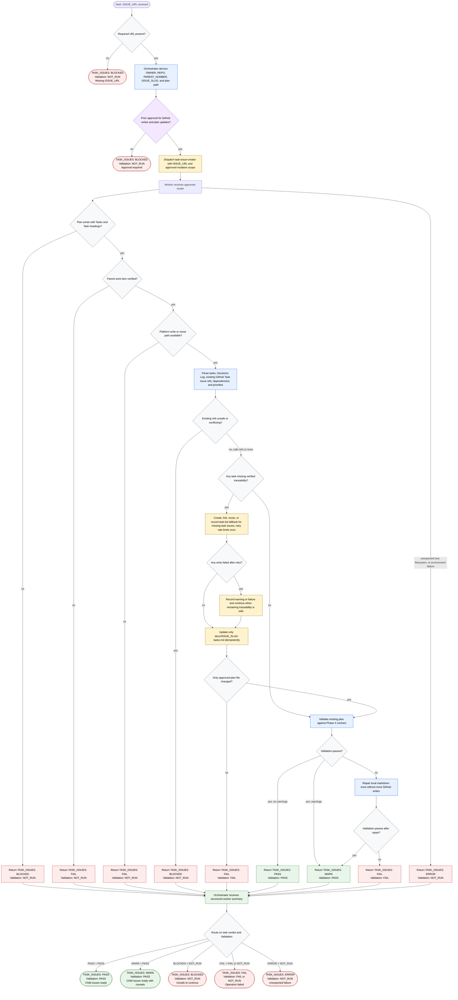

# Creating GitHub Child Issues

This workflow shares the same Phase 4 shape as the Jira subtask flow: the
orchestrator derives routing identifiers, confirms approval for platform writes
and local plan updates, dispatches a worker, routes the returned verdict, and
relays a compact summary. The GitHub-specific implementation details are the
`ISSUE_URL` input, `ISSUE_SLUG` plan path, `task-issue-creator` worker, GitHub
parent issue verification, task issue refs, and write-path selection across
native sub-issues, linked issues, or task-list fallback.

Readiness rule: report `TASK_ISSUES: PASS` only when parent lookup,
write-path detection, existing-ref safety checks, approved issue creation or
reuse, scoped plan updates, and validation all pass. The caller-facing rollup
must include write model and capability, but not raw `gh` JSON, REST responses,
or full plan contents.
