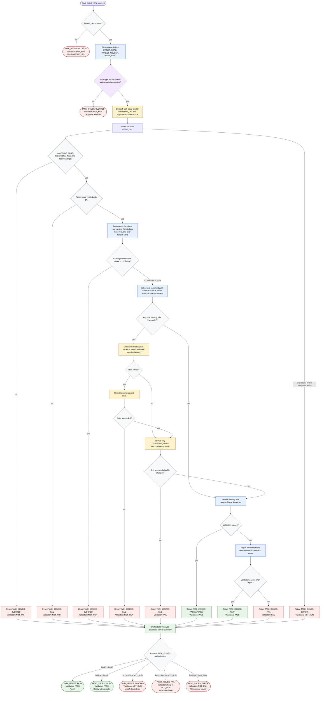

# Creating GitHub Child Issues

This workflow separates orchestration from mutation. The orchestrator derives
routing identifiers from `ISSUE_URL`, confirms prior approval for GitHub writes
and `docs/<ISSUE_SLUG>-tasks.md` updates, dispatches `task-issue-creator`, and
routes the returned verdict. The worker trusts the clarified Phase 4 plan for
task intent, but verifies the parent issue, existing refs, write capability,
mutation boundary, and final plan structure before reporting success.

Readiness rule: report `TASK_ISSUES: PASS` only when parent lookup,
existing-ref safety checks, approved writes or fallback traceability, scoped
plan updates, and validation all pass. The caller-facing rollup must include
write model and capability, but not raw `gh` JSON, REST responses, or full plan
contents.
