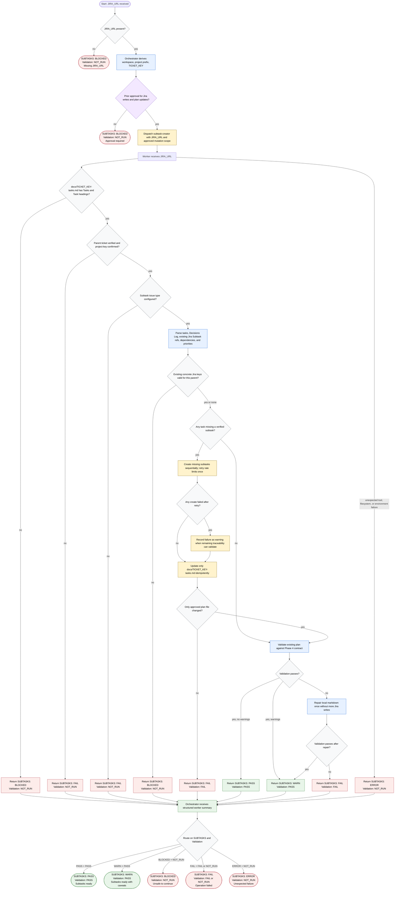

# Creating Jira Subtasks

This workflow separates orchestration from Jira mutation. The orchestrator
derives `TICKET_KEY` from `JIRA_URL`, confirms prior approval for Jira writes
and `docs/<TICKET_KEY>-tasks.md` updates, dispatches `subtask-creator`, and
routes the returned verdict. The worker trusts the clarified Phase 4 plan for
task intent, but verifies the parent ticket, subtask configuration, existing
Jira keys, mutation boundary, and final plan structure before reporting
success.

Readiness rule: report `SUBTASKS: PASS` only when parent lookup, subtask
configuration, existing-key safety checks, approved subtask creation or reuse,
scoped plan updates, and validation all pass. Existing keys for another parent
block the workflow; missing Decisions Log or partial creates may produce
`SUBTASKS: WARN`.
