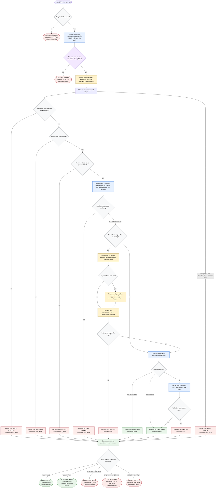

# Creating Jira Subtasks

This workflow shares the same Phase 4 shape as the GitHub child-issue flow: the
orchestrator derives routing identifiers, confirms approval for platform writes
and local plan updates, dispatches a worker, routes the returned verdict, and
relays a compact summary. The Jira-specific implementation details are the
`JIRA_URL` input, `TICKET_KEY` plan path, `subtask-creator` worker, Jira parent
ticket verification, subtask refs, and the project subtask issue-type check.

Readiness rule: report `SUBTASKS: PASS` only when parent lookup, subtask
configuration, existing-ref safety checks, approved subtask creation or reuse,
scoped plan updates, and validation all pass. Existing keys for another parent
block the workflow; missing Decisions Log or partial creates may produce
`SUBTASKS: WARN`. Jira summaries do not include GitHub-style write model or
capability lines.
