# Creating Jira Subtasks

This Jira Phase 4 workflow assumes upstream approval already exists for Jira
subtask writes and the scoped update to `docs/<TICKET_KEY>-tasks.md`; when
invoked standalone without that approval, it stops unless explicit approval is
provided. The orchestrator derives routing identifiers, dispatches the single
`subtask-creator` worker, and relays only the structured verdict. The worker
owns parent verification, Jira create metadata checks, subtask creation or
reuse, scoped plan updates, and validation. Jira create metadata and subtask
configuration are treated as runtime evidence because Jira requires a subtask
issue type and parent for subtask creation, and createable fields come from
create metadata ([Jira REST v3 issues](https://developer.atlassian.com/cloud/jira/platform/rest/v3/api-group-issues/));
Jira subtask work types can also be enabled, disabled, or customized by
administrators ([Configure sub-tasks](https://support.atlassian.com/jira-cloud-administration/docs/configure-sub-tasks/)).

```mermaid
flowchart TD
  START([Start: JIRA_URL received for approved Phase 4]) --> INPUT{JIRA_URL present and parseable?}
  INPUT -->|no, missing or malformed| ORCH_BLOCK_INPUT([SUBTASKS: BLOCKED<br/>Validation: NOT_RUN<br/>Parent: UNKNOWN<br/>TICKET_KEY: UNKNOWN<br/>Plan file: not updated<br/>Zero counts, header-only linkage table, and URL reason])
  INPUT -->|yes| DERIVE["Derive workspace, project prefix, TICKET_KEY, and docs/&lt;TICKET_KEY&gt;-tasks.md"]

  DERIVE --> UPSTREAM{Upstream approval evidence present?}
  UPSTREAM -->|yes| DISPATCH[Dispatch single worker: subtask-creator with JIRA_URL and approved mutation scope]
  UPSTREAM -->|no, standalone invocation| STANDALONE{Explicit approval for Jira writes and docs/&lt;TICKET_KEY&gt;-tasks.md update?}
  STANDALONE -->|approved| DISPATCH
  STANDALONE -->|declined or absent| ORCH_BLOCK_APPROVAL([SUBTASKS: BLOCKED<br/>Validation: NOT_RUN<br/>Derived TICKET_KEY when URL is valid<br/>Plan file: not updated])

  DISPATCH --> W_START[Worker receives JIRA_URL and approved scope]
  W_START --> PLAN{docs/&lt;TICKET_KEY&gt;-tasks.md exists with Tasks and Task headings?}
  PLAN -->|no| W_BLOCK_PLAN[Return SUBTASKS: BLOCKED<br/>Validation: NOT_RUN]
  PLAN -->|yes| PARENT{Parent Jira ticket verified?}
  PARENT -->|no| W_FAIL_PARENT[Return SUBTASKS: FAIL<br/>Validation: NOT_RUN]
  PARENT -->|yes| PARSE[Parse tasks, Decisions Log, existing Jira Subtask refs, dependencies, and priorities]

  PARSE --> REFS{Existing concrete Jira refs safe for this parent?}
  REFS -->|no, invalid or different parent| W_BLOCK_REFS[Return SUBTASKS: BLOCKED<br/>Validation: NOT_RUN]
  REFS -->|yes, safe refs or none| MISSING{Any task missing verified traceability?}
  MISSING -->|no| VALIDATE[Validate existing plan against Phase 4 contract]
  MISSING -->|yes| SUBTYPE{Jira create metadata shows usable subtask issue type?}
  SUBTYPE -->|absent or subtasks disabled| W_FAIL_CONFIG[Return SUBTASKS: FAIL<br/>Validation: NOT_RUN<br/>No createable subtask type]
  SUBTYPE -->|multiple and no deterministic approved choice| W_BLOCK_CONFIG[Return SUBTASKS: BLOCKED<br/>Validation: NOT_RUN<br/>Manual subtask type selection required]
  SUBTYPE -->|multiple with deterministic configured choice| CONFIG_WARN[Record Jira configuration warning and use verified subtask type]
  SUBTYPE -->|exactly one usable type| FIELDS{Required create fields satisfiable from plan, parent, defaults, or Jira metadata?}
  CONFIG_WARN --> FIELDS
  FIELDS -->|no, required-field mismatch| W_FAIL_FIELDS[Return SUBTASKS: FAIL<br/>Validation: NOT_RUN<br/>Required Jira create field unavailable]
  FIELDS -->|yes| CREATE[Create or reuse missing subtasks sequentially; retry rate limits once]

  CREATE --> PARTIAL{Any create failed after retry?}
  PARTIAL -->|yes| WARN_RECORD[Record Not Created rows, warnings, and failures; continue when remaining traceability is safe]
  PARTIAL -->|no| UPDATE[Update only docs/&lt;TICKET_KEY&gt;-tasks.md idempotently]
  WARN_RECORD --> UPDATE
  UPDATE --> BOUNDARY{Write ledger shows only approved plan file changed?}
  BOUNDARY -->|no| W_FAIL_BOUNDARY[Return SUBTASKS: FAIL<br/>Validation: FAIL]
  BOUNDARY -->|yes| VALIDATE

  VALIDATE --> VALID{Validation passes?}
  VALID -->|yes, no warnings| W_SUMMARY_PASS[Return SUBTASKS: PASS<br/>Validation: PASS]
  VALID -->|yes, warnings or Not Created rows| W_SUMMARY_WARN[Return SUBTASKS: WARN<br/>Validation: PASS]
  VALID -->|no| REPAIR[Repair local markdown once without additional Jira writes]
  REPAIR --> REVALIDATE{Validation passes after repair?}
  REVALIDATE -->|yes| W_SUMMARY_WARN
  REVALIDATE -->|no| W_FAIL_VALIDATE[Return SUBTASKS: FAIL<br/>Validation: FAIL]
  W_START -->|unexpected tool, filesystem, or environment failure| W_ERROR[Return SUBTASKS: ERROR<br/>Validation: NOT_RUN]

  W_BLOCK_PLAN --> RECEIVE[Orchestrator receives structured worker summary]
  W_FAIL_PARENT --> RECEIVE
  W_BLOCK_REFS --> RECEIVE
  W_FAIL_CONFIG --> RECEIVE
  W_BLOCK_CONFIG --> RECEIVE
  W_FAIL_FIELDS --> RECEIVE
  W_FAIL_BOUNDARY --> RECEIVE
  W_SUMMARY_PASS --> RECEIVE
  W_SUMMARY_WARN --> RECEIVE
  W_FAIL_VALIDATE --> RECEIVE
  W_ERROR --> RECEIVE

  RECEIVE --> ROUTE{Route on SUBTASKS and Validation}
  ROUTE -->|PASS + PASS| PASS([SUBTASKS: PASS<br/>Validation: PASS<br/>All tasks linked to Jira subtasks])
  ROUTE -->|WARN + PASS| WARN([SUBTASKS: WARN<br/>Validation: PASS<br/>Linked tasks usable; Not Created rows require caller warning and manual resolution before task execution])
  ROUTE -->|BLOCKED + NOT_RUN| BLOCKED([SUBTASKS: BLOCKED<br/>Validation: NOT_RUN<br/>Unsafe or unapproved to continue])
  ROUTE -->|FAIL + FAIL or NOT_RUN| FAIL([SUBTASKS: FAIL<br/>Validation: FAIL or NOT_RUN<br/>Jira operation or local contract failed])
  ROUTE -->|ERROR + NOT_RUN| ERROR([SUBTASKS: ERROR<br/>Validation: NOT_RUN<br/>Unexpected failure])

  classDef guard fill:#fff3cd,stroke:#856404,color:#000;
  classDef check fill:#e7f1ff,stroke:#0b5ed7,color:#000;
  classDef decision fill:#f8f9fa,stroke:#495057,color:#000;
  classDef human fill:#f3e8ff,stroke:#6f42c1,color:#000;
  classDef output fill:#e8f5e9,stroke:#2e7d32,color:#000;
  classDef success fill:#e8f5e9,stroke:#2e7d32,color:#000;
  classDef stop fill:#fdecea,stroke:#b02a37,color:#000;

  class INPUT,UPSTREAM,STANDALONE,PLAN,PARENT,REFS,MISSING,SUBTYPE,FIELDS,PARTIAL,BOUNDARY,VALID,REVALIDATE,ROUTE decision;
  class DERIVE,PARSE,VALIDATE,REPAIR check;
  class DISPATCH,CONFIG_WARN,CREATE,WARN_RECORD,UPDATE guard;
  class UPSTREAM,STANDALONE human;
  class RECEIVE,W_SUMMARY_PASS,W_SUMMARY_WARN output;
  class PASS success;
  class WARN output;
  class ORCH_BLOCK_INPUT,ORCH_BLOCK_APPROVAL,W_BLOCK_PLAN,W_FAIL_PARENT,W_BLOCK_REFS,W_FAIL_CONFIG,W_BLOCK_CONFIG,W_FAIL_FIELDS,W_FAIL_BOUNDARY,W_FAIL_VALIDATE,W_ERROR,BLOCKED,FAIL,ERROR stop;
```

Readiness rule: report `SUBTASKS: PASS` only when every task in
`docs/<TICKET_KEY>-tasks.md` is linked to a verified Jira subtask for the parent
and validation passes. Report `SUBTASKS: WARN` with `Validation: PASS` when the
artifact is structurally valid but has non-fatal caveats; linked tasks are
usable, while any `Not Created` rows must be called out for manual resolution
before task execution begins.
