# executing-github-task

Per-task execution orchestrator for exactly one planned GitHub workflow task
identified by `ISSUE_SLUG` and `TASK_NUMBER`. The agent validates readiness,
crosses the first execution mutation boundary only after upstream critique
approval, delegates implementation and review work to one specialist at a time,
keeps only concise reports and verdicts in context, preserves Category A
workflow artifacts outside git history, and stops instead of continuing to the
next task, guessing through ambiguity, or applying unsafe workspace or GitHub
state changes.

```mermaid
flowchart TD
  START([Start executing-github-task]) --> INPUTS["Read ISSUE_SLUG and TASK_NUMBER"]
  INPUTS --> CONTEXT["Resolve owner/repo context and record gh capability or skip reason"]
  CONTEXT --> CONTRACTS["Read contracts.md for Phase 1-6 handoff artifacts, readiness, kickoff, and handoff shapes"]
  CONTRACTS --> REQUIRED{"Required Phase 1-6 handoff artifacts exist and align?"}
  REQUIRED -->|no| REPORT_BLOCKED["Assemble FINAL_TASK_REPORT: status BLOCKED"]
  REQUIRED -->|yes| READY{"Critique approved, selected task ready, branch usable, and no blocking contradiction?"}
  READY -->|no| REPORT_BLOCKED
  READY -->|yes| TRACKER_CAP{"Mandatory tracker update requires unavailable gh capability?"}
  TRACKER_CAP -->|yes| REPORT_BLOCKED
  TRACKER_CAP -->|no| SCOPE["Set mutation boundary: Category A out of git; Category B source/tests/config may change"]
  SCOPE --> PIPELINE["Read pipeline.md and follow ordered phase cycle"]
  PIPELINE --> KICKOFF["Dispatch execution-starter for GitHub kickoff"]

  KICKOFF --> KICKOFF_STATUS{KICKOFF_REPORT status}
  KICKOFF_STATUS -->|READY| EXECUTE["Dispatch task-executor"]
  KICKOFF_STATUS -->|BLOCKED or ERROR| RECOVERY["Read retry-and-escalation.md; preserve completed phase results"]

  EXECUTE --> EXEC_STATUS{EXECUTION_REPORT status}
  EXEC_STATUS -->|COMPLETE| DOCUMENT["Dispatch documentation-writer"]
  EXEC_STATUS -->|NEEDS_CONTEXT, BLOCKED, or ERROR| RECOVERY

  DOCUMENT --> CATEGORY_A["Update Category A tracking on disk and keep it out of git history"]
  CATEGORY_A --> DOC_STATUS{DOCUMENTATION_REPORT status}
  DOC_STATUS -->|COMPLETE| VERIFY["Dispatch requirements-verifier"]
  DOC_STATUS -->|BLOCKED or ERROR| RECOVERY

  VERIFY --> VERIFY_STATUS{VERIFICATION_RESULT}
  VERIFY_STATUS -->|PASS| CLEAN["Dispatch clean-code-reviewer"]
  VERIFY_STATUS -->|FAIL: in-scope gaps| REQ_ATTEMPTS{"Requirements fix attempts < 3?"}
  VERIFY_STATUS -->|BLOCKED| RECOVERY
  VERIFY_STATUS -->|ambiguous or planning mistake| REPORT_USER["Assemble FINAL_TASK_REPORT: status STOPPED_FOR_USER_INPUT"]

  REQ_ATTEMPTS -->|yes| REQ_FIX["Build requirements fix brief from verifier findings; increment attempt count"]
  REQ_ATTEMPTS -->|no| REPORT_ESCALATED["Assemble FINAL_TASK_REPORT: status ESCALATED"]
  REQ_FIX --> REQ_EXEC["Re-dispatch task-executor with requirements fix brief"]
  REQ_EXEC --> REQ_DOC["Re-dispatch documentation-writer; keep Category A out of git"]
  REQ_DOC --> VERIFY

  CLEAN --> CLEAN_STATUS{Clean-code verdict}
  CLEAN_STATUS -->|PASS or PASS WITH SUGGESTIONS| ARCH["Dispatch architecture-reviewer"]
  CLEAN_STATUS -->|NEEDS FIXES| CLEAN_ATTEMPTS{"Clean-code fix attempts < 3?"}
  CLEAN_STATUS -->|BLOCKED or ERROR| RECOVERY
  CLEAN_ATTEMPTS -->|yes| CLEAN_FIX["Build clean-code fix brief from reviewer findings; increment attempt count"]
  CLEAN_ATTEMPTS -->|no| REPORT_ESCALATED
  CLEAN_FIX --> CLEAN_EXEC["Re-dispatch task-executor with clean-code fix brief"]
  CLEAN_EXEC --> CLEAN_DOC["Re-dispatch documentation-writer; keep Category A out of git"]
  CLEAN_DOC --> RERUN_CLEAN["Re-run clean-code-reviewer only"]
  RERUN_CLEAN --> CLEAN_STATUS

  ARCH --> ARCH_STATUS{Architecture verdict}
  ARCH_STATUS -->|PASS or PASS WITH SUGGESTIONS| SECURITY["Dispatch security-auditor"]
  ARCH_STATUS -->|NEEDS FIXES| ARCH_ATTEMPTS{"Architecture fix attempts < 3?"}
  ARCH_STATUS -->|BLOCKED or ERROR| RECOVERY
  ARCH_ATTEMPTS -->|yes| ARCH_FIX["Build architecture fix brief from reviewer findings; increment attempt count"]
  ARCH_ATTEMPTS -->|no| REPORT_ESCALATED
  ARCH_FIX --> ARCH_EXEC["Re-dispatch task-executor with architecture fix brief"]
  ARCH_EXEC --> ARCH_DOC["Re-dispatch documentation-writer; keep Category A out of git"]
  ARCH_DOC --> RERUN_ARCH["Re-run architecture-reviewer only"]
  RERUN_ARCH --> ARCH_STATUS

  SECURITY --> SECURITY_STATUS{Security verdict}
  SECURITY_STATUS -->|PASS or PASS WITH ADVISORIES| REPORT_COMPLETE["Read template-final-report.md and assemble FINAL_TASK_REPORT: status COMPLETE"]
  SECURITY_STATUS -->|NEEDS FIXES| SECURITY_ATTEMPTS{"Security fix attempts < 3?"}
  SECURITY_STATUS -->|BLOCKED or ERROR| RECOVERY
  SECURITY_ATTEMPTS -->|yes| SECURITY_FIX["Build security fix brief from auditor findings; increment attempt count"]
  SECURITY_ATTEMPTS -->|no| REPORT_ESCALATED
  SECURITY_FIX --> SECURITY_EXEC["Re-dispatch task-executor with security fix brief"]
  SECURITY_EXEC --> SECURITY_DOC["Re-dispatch documentation-writer; keep Category A out of git"]
  SECURITY_DOC --> RERUN_SECURITY["Re-run security-auditor only"]
  RERUN_SECURITY --> SECURITY_STATUS

  RECOVERY --> RECOVERY_CONTEXT{"New context, fix brief, explicit user decision, or restored gh capability available?"}
  RECOVERY_CONTEXT -->|no| REPORT_USER
  RECOVERY_CONTEXT -->|yes| RECOVERY_SAFE{"Affected retry path still safe and within budget?"}
  RECOVERY_SAFE -->|no| REPORT_ESCALATED
  RECOVERY_SAFE -->|yes| TARGETED_RETRY["Retry affected step only with updated context; do not restart passed phases"]
  TARGETED_RETRY --> AFFECTED{Affected phase}
  AFFECTED -->|kickoff| KICKOFF
  AFFECTED -->|execution| EXECUTE
  AFFECTED -->|documentation| DOCUMENT
  AFFECTED -->|requirements| VERIFY
  AFFECTED -->|clean-code| CLEAN
  AFFECTED -->|architecture| ARCH
  AFFECTED -->|security| SECURITY

  REPORT_COMPLETE --> STOP_SELECTED([Stop after TASK_NUMBER; no next GitHub task issue dispatch])
  REPORT_BLOCKED --> STOP_SELECTED
  REPORT_USER --> STOP_SELECTED
  REPORT_ESCALATED --> STOP_SELECTED

  class REQUIRED,READY,TRACKER_CAP,KICKOFF_STATUS,EXEC_STATUS,DOC_STATUS,VERIFY_STATUS,REQ_ATTEMPTS,CLEAN_STATUS,CLEAN_ATTEMPTS,ARCH_STATUS,ARCH_ATTEMPTS,SECURITY_STATUS,SECURITY_ATTEMPTS,RECOVERY_CONTEXT,RECOVERY_SAFE,AFFECTED decision;
  class INPUTS,CONTEXT,CONTRACTS,SCOPE,PIPELINE,KICKOFF,EXECUTE,DOCUMENT,CATEGORY_A,VERIFY,CLEAN,ARCH,SECURITY,REQ_EXEC,REQ_DOC,CLEAN_EXEC,CLEAN_DOC,RERUN_CLEAN,ARCH_EXEC,ARCH_DOC,RERUN_ARCH,SECURITY_EXEC,SECURITY_DOC,RERUN_SECURITY,RECOVERY,TARGETED_RETRY check;
  class REQ_FIX,CLEAN_FIX,ARCH_FIX,SECURITY_FIX refine;
  class REPORT_COMPLETE,REPORT_BLOCKED,REPORT_USER,REPORT_ESCALATED output;
  class STOP_SELECTED stop;
  classDef check fill:#e7f1ff,stroke:#0b5ed7,color:#000;
  classDef decision fill:#f8f9fa,stroke:#495057,color:#000;
  classDef output fill:#e8f5e9,stroke:#2e7d32,color:#000;
  classDef refine fill:#fff3cd,stroke:#856404,color:#000;
  classDef stop fill:#fdecea,stroke:#b02a37,color:#000;
```

Readiness rule: the selected task must have valid Phase 1-6 handoff artifacts,
resolved or consciously waived questions, critique approval, a planner-generated
branch, confirmed owner/repo context, recorded `gh` capability or skip reason,
and no blocking contradiction before GitHub kickoff. Unavailable or
unauthenticated `gh` may be recorded as skipped and execution may continue when
the workspace is otherwise ready; it blocks only when mandatory tracker updates
require GitHub task issue mutation.

Retry rule: requirements verification and each quality gate get at most three
targeted fix attempts. A generic retry is valid only with new context, a fix
brief, an explicit user decision, or restored `gh` capability, and it resumes
the affected step without repeating already passed phases.

Final status contract: return exactly one `FINAL_TASK_REPORT` status:
`COMPLETE`, `BLOCKED`, `STOPPED_FOR_USER_INPUT`, or `ESCALATED`. Every final
report includes evidence checked, retry counts, changed files, Category A
tracking paths, GitHub task issue updates or blockers, unresolved blockers, and
the next required action. Completion is limited to the requested `TASK_NUMBER`
for the selected `ISSUE_SLUG`; stop without dispatching another GitHub task
issue.
