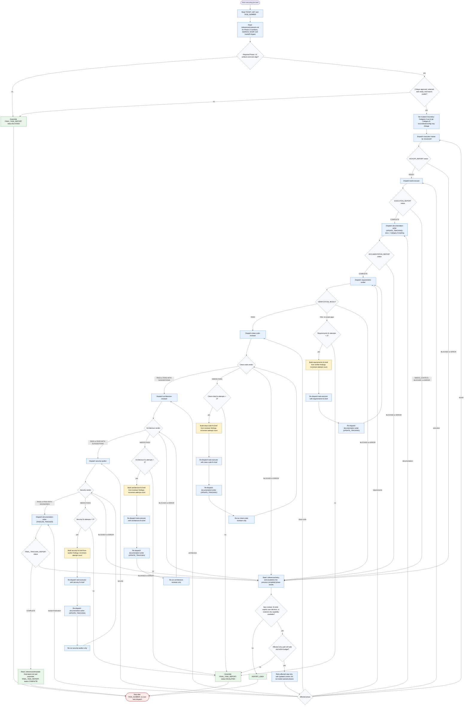

# executing-jira-task

Per-task execution orchestrator for exactly one planned Jira workflow task
identified by `TICKET_KEY` and `TASK_NUMBER`. It may read Phase 1-6 handoff
artifacts, dispatch one specialist at a time, mutate Category B source, tests,
and config through approved execution paths, update Category A workflow tracking
only outside git, and assemble a final task report. It must stop before Jira
kickoff or execution unless critique approval and readiness are confirmed, and
it never continues to another task.

Readiness rule: Jira kickoff and execution are forbidden until the selected
task has valid Phase 1-6 handoff artifacts, explicit critique approval, resolved
or consciously waived questions, a planner-generated branch, and no blocking
contradiction.

Retry rule: requirements verification and each quality gate get at most three
targeted fix attempts. A generic retry is valid only with new context, a fix
brief, an explicit user decision, or restored Jira capability, and it resumes
the affected step without repeating already passed phases.

Final status contract: return exactly one `FINAL_TASK_REPORT` status:
`COMPLETE`, `BLOCKED`, `STOPPED_FOR_USER_INPUT`, or `ESCALATED`. Every final
report includes evidence checked, retry counts, changed files, Category A
tracking paths, final tracker completion or skips, unresolved blockers, and the
next required action.
