# executing-jira-task

Per-task execution orchestrator for exactly one planned Jira workflow task
identified by `TICKET_KEY` and `TASK_NUMBER`. The agent validates readiness,
crosses the first execution mutation boundary only after upstream critique
approval, delegates implementation and review work to one specialist at a time,
keeps only concise reports and verdicts in context, preserves Category A
workflow artifacts outside git history, and stops instead of continuing to the
next task, guessing through ambiguity, or applying unsafe workspace or Jira
state changes.

```mermaid
flowchart TD
  START([Start executing-jira-task]) --> INPUTS[Read TICKET_KEY and TASK_NUMBER]
  INPUTS --> CONTRACTS[Read contracts.md for artifacts, readiness, kickoff, and handoff shapes]
  CONTRACTS --> REQUIRED{Required artifacts exist and align?}
  REQUIRED -->|no| BLOCKED_ARTIFACTS([Blocked: missing or contradictory upstream artifacts])
  REQUIRED -->|yes| READY{Task ready to cross execution boundary?}
  READY -->|no| BLOCKED_READY([Blocked: task complete, prerequisites incomplete, unresolved questions, or branch conflict])
  READY -->|yes| PIPELINE[Read pipeline.md and follow ordered phase cycle]

  PIPELINE --> KICKOFF[Dispatch execution-starter]
  KICKOFF --> KICKOFF_STATUS{KICKOFF_REPORT status}
  KICKOFF_STATUS -->|READY| EXECUTE[Dispatch task-executor]
  KICKOFF_STATUS -->|BLOCKED or ERROR| RECOVERY[Read retry-and-escalation.md]

  EXECUTE --> EXEC_STATUS{EXECUTION_REPORT status}
  EXEC_STATUS -->|COMPLETE| DOCUMENT[Dispatch documentation-writer]
  EXEC_STATUS -->|NEEDS_CONTEXT, BLOCKED, or ERROR| RECOVERY

  DOCUMENT --> CATEGORY_A[Update Category A tracking on disk and keep it out of git history]
  CATEGORY_A --> DOC_STATUS{DOCUMENTATION_REPORT status}
  DOC_STATUS -->|COMPLETE| VERIFY[Dispatch requirements-verifier]
  DOC_STATUS -->|BLOCKED or ERROR| RECOVERY

  VERIFY --> VERIFY_STATUS{VERIFICATION_RESULT}
  VERIFY_STATUS -->|PASS| CLEAN[Dispatch clean-code-reviewer]
  VERIFY_STATUS -->|FAIL: in-scope gaps| REQUIREMENTS_FIX[Build concise requirements fix brief]
  VERIFY_STATUS -->|BLOCKED| RECOVERY
  VERIFY_STATUS -->|ambiguous or planning mistake| ASK_USER([Stopped: ask user for decision])

  REQUIREMENTS_FIX --> EXECUTE_FIX[Re-dispatch task-executor with fix brief]
  EXECUTE_FIX --> DOCUMENT_FIX[Re-dispatch documentation-writer]
  DOCUMENT_FIX --> VERIFY

  CLEAN --> CLEAN_STATUS{Clean-code verdict}
  CLEAN_STATUS -->|PASS or PASS WITH SUGGESTIONS| ARCH[Dispatch architecture-reviewer]
  CLEAN_STATUS -->|NEEDS FIXES| CLEAN_FIX[Build clean-code fix brief]
  CLEAN_STATUS -->|BLOCKED or ERROR| RECOVERY

  ARCH --> ARCH_STATUS{Architecture verdict}
  ARCH_STATUS -->|PASS or PASS WITH SUGGESTIONS| SECURITY[Dispatch security-auditor]
  ARCH_STATUS -->|NEEDS FIXES| ARCH_FIX[Build architecture fix brief]
  ARCH_STATUS -->|BLOCKED or ERROR| RECOVERY

  SECURITY --> SECURITY_STATUS{Security verdict}
  SECURITY_STATUS -->|PASS or PASS WITH ADVISORIES| FINAL[Read template-final-report.md and assemble task report]
  SECURITY_STATUS -->|NEEDS FIXES| SECURITY_FIX[Build security fix brief]
  SECURITY_STATUS -->|BLOCKED or ERROR| RECOVERY

  CLEAN_FIX --> FIX_EXECUTE_CLEAN[Re-dispatch task-executor with clean-code fix brief]
  FIX_EXECUTE_CLEAN --> FIX_DOCUMENT_CLEAN[Re-dispatch documentation-writer]
  FIX_DOCUMENT_CLEAN --> RERUN_CLEAN[Re-run clean-code-reviewer only]
  RERUN_CLEAN --> CLEAN_FIXED{Clean-code fix passed?}
  CLEAN_FIXED -->|yes| ARCH
  CLEAN_FIXED -->|no| RECOVERY

  ARCH_FIX --> FIX_EXECUTE_ARCH[Re-dispatch task-executor with architecture fix brief]
  FIX_EXECUTE_ARCH --> FIX_DOCUMENT_ARCH[Re-dispatch documentation-writer]
  FIX_DOCUMENT_ARCH --> RERUN_ARCH[Re-run architecture-reviewer only]
  RERUN_ARCH --> ARCH_FIXED{Architecture fix passed?}
  ARCH_FIXED -->|yes| SECURITY
  ARCH_FIXED -->|no| RECOVERY

  SECURITY_FIX --> FIX_EXECUTE_SECURITY[Re-dispatch task-executor with security fix brief]
  FIX_EXECUTE_SECURITY --> FIX_DOCUMENT_SECURITY[Re-dispatch documentation-writer]
  FIX_DOCUMENT_SECURITY --> RERUN_SECURITY[Re-run security-auditor only]
  RERUN_SECURITY --> SECURITY_FIXED{Security fix passed?}
  SECURITY_FIXED -->|yes| FINAL
  SECURITY_FIXED -->|no| RECOVERY

  RECOVERY --> RECOVERY_STATUS{Recovery path available?}
  RECOVERY_STATUS -->|retry or resume affected step only| TARGETED_RETRY[Run targeted retry without restarting completed phases]
  TARGETED_RETRY --> AFFECTED{Affected phase}
  AFFECTED -->|kickoff| KICKOFF
  AFFECTED -->|execution| EXECUTE
  AFFECTED -->|documentation| DOCUMENT
  AFFECTED -->|requirements| VERIFY
  AFFECTED -->|clean-code| CLEAN
  AFFECTED -->|architecture| ARCH
  AFFECTED -->|security| SECURITY
  RECOVERY_STATUS -->|needs user or upstream phase| ASK_USER
  RECOVERY_STATUS -->|exhausted or unsafe| ESCALATED([Escalated])

  FINAL --> COMPLETE([Task complete])
  FINAL --> STOP_NEXT[Stop after selected task]

  class REQUIRED,READY,KICKOFF_STATUS,EXEC_STATUS,DOC_STATUS,VERIFY_STATUS,CLEAN_STATUS,ARCH_STATUS,SECURITY_STATUS,CLEAN_FIXED,ARCH_FIXED,SECURITY_FIXED,RECOVERY_STATUS,AFFECTED decision;
  class INPUTS,CONTRACTS,PIPELINE,KICKOFF,EXECUTE,DOCUMENT,CATEGORY_A,VERIFY,CLEAN,ARCH,SECURITY,EXECUTE_FIX,DOCUMENT_FIX,FIX_EXECUTE_CLEAN,FIX_DOCUMENT_CLEAN,RERUN_CLEAN,FIX_EXECUTE_ARCH,FIX_DOCUMENT_ARCH,RERUN_ARCH,FIX_EXECUTE_SECURITY,FIX_DOCUMENT_SECURITY,RERUN_SECURITY,TARGETED_RETRY check;
  class REQUIREMENTS_FIX,CLEAN_FIX,ARCH_FIX,SECURITY_FIX refine;
  class FINAL output;
  class COMPLETE success;
  class BLOCKED_ARTIFACTS,BLOCKED_READY,ASK_USER,ESCALATED,STOP_NEXT stop;
  classDef check fill:#e7f1ff,stroke:#0b5ed7,color:#000;
  classDef decision fill:#f8f9fa,stroke:#495057,color:#000;
  classDef output fill:#e8f5e9,stroke:#2e7d32,color:#000;
  classDef success fill:#e8f5e9,stroke:#2e7d32,color:#000;
  classDef refine fill:#fff3cd,stroke:#856404,color:#000;
  classDef stop fill:#fdecea,stroke:#b02a37,color:#000;
```

Readiness rule: the selected task must have all required planning artifacts,
resolved or consciously waived questions, a planner-generated branch, and no
blocking contradiction before kickoff. Completion is limited to the requested
task and ends as task complete, blocked, escalated, or stopped for user input.
