# Fetching GitHub Issue

The coordinator retrieves exactly one GitHub issue into a validated local
Markdown snapshot. It may normalize issue coordinates, dispatch the delegated
`issue-retriever`, interpret only the retriever's structured summary, and report
handoff state. Raw GitHub data stays out of coordinator context. The delegated
retriever performs read-only GitHub queries, may write at most one unstaged file

```mermaid
flowchart TD
  START([Start: GitHub issue reference provided]) --> INPUT_CHECK{Valid issue reference?}
  INPUT_CHECK -->|ISSUE_URL| DERIVE["Derive OWNER, REPO, and ISSUE_NUMBER from URL"]
  INPUT_CHECK -->|OWNER + REPO + ISSUE_NUMBER| DERIVE
  INPUT_CHECK -->|missing or malformed| BAD_INPUT([FETCH: FAIL - BAD_INPUT - Validation: NOT_RUN])

  DERIVE --> NORMALIZE["Normalize owner and repo lowercase"]
  NORMALIZE --> ARTIFACT_ID["Set ISSUE_SLUG and target docs/<ISSUE_SLUG>.md"]
  ARTIFACT_ID --> DISPATCH["Dispatch issue-retriever with ISSUE_URL or coordinates and reference paths"]

  subgraph RETRIEVER [Delegated issue-retriever boundary]
    RETRIEVER_ENTRY["issue-retriever starts"] --> PRECHECK{GitHub read path available?}
    PRECHECK -->|auth missing| AUTH_STOP([FETCH: FAIL - AUTH - Validation: NOT_RUN])
    PRECHECK -->|tools missing| TOOLS_STOP([FETCH: FAIL - TOOLS_MISSING - Validation: NOT_RUN])
    PRECHECK -->|rate limited| RATE_HANDLE["Inspect GitHub rate-limit response metadata"]
    PRECHECK -->|unexpected error| ERROR_STOP([FETCH: ERROR - UNEXPECTED - Validation: NOT_RUN])
    PRECHECK -->|yes| READ["Run read-only GitHub queries"]

    RATE_HANDLE --> RATE_META{Retry guidance available?}
    RATE_META -->|retry-after or x-ratelimit-reset| RATE_WAIT["Honor GitHub retry timing and preserve rate-limit message"]
    RATE_META -->|secondary limit without timing| SECONDARY_WAIT["Wait at least 60s before retry"]
    RATE_META -->|no explicit timing| LOCAL_RETRY{Local retry budget remains?}
    RATE_WAIT --> LOCAL_RETRY
    SECONDARY_WAIT --> LOCAL_RETRY
    LOCAL_RETRY -->|yes| READ
    LOCAL_RETRY -->|no| RATE_STOP([FETCH: FAIL - RATE_LIMIT - Validation: NOT_RUN])

    READ --> FOUND{Issue found and readable?}
    FOUND -->|not found| NOT_FOUND([FETCH: FAIL - NOT_FOUND - Validation: NOT_RUN])
    FOUND -->|rate limited| RATE_HANDLE
    FOUND -->|unexpected error| ERROR_STOP
    FOUND -->|yes| COLLECT["Collect GitHub issue, child issue, and linked issue data required by the retrieval playbook and snapshot template"]

    COLLECT --> NORMALIZE_MD["Rewrite user-authored ATX headings levels 1-6 outside code fences before template assembly"]
    NORMALIZE_MD --> ASSEMBLE["Assemble docs/<ISSUE_SLUG>.md from snapshot template"]
    ASSEMBLE --> WRITE["Write one unstaged local snapshot"]
    WRITE --> VALIDATE["Validate snapshot against fetch contract, playbook, and template"]
    VALIDATE --> VALIDATION{Validation pass?}
    VALIDATION -->|no after repair loop| VALIDATION_FAIL([FETCH: ERROR - UNEXPECTED - Validation: FAIL])
    VALIDATION -->|yes| DISCOVERY{Required discovery complete?}
    DISCOVERY -->|yes| PASS([FETCH: PASS - Validation: PASS])
    DISCOVERY -->|partial but valid| PARTIAL([FETCH: PARTIAL - Validation: PASS])
  end

  DISPATCH --> RETRIEVER_ENTRY

  BAD_INPUT --> SUMMARY["12-line fetch summary and coordinator report carry FETCH, Validation, Failure category, File written, counts, warnings, and reason"]
  AUTH_STOP --> SUMMARY
  TOOLS_STOP --> SUMMARY
  RATE_STOP --> SUMMARY
  ERROR_STOP --> SUMMARY
  NOT_FOUND --> SUMMARY
  VALIDATION_FAIL --> SUMMARY
  PASS --> SUMMARY
  PARTIAL --> SUMMARY

  SUMMARY --> COORDINATOR["Coordinator interprets structured summary without raw GitHub payloads"]
  COORDINATOR --> RESULT_STATUS{Result status?}
  RESULT_STATUS -->|FETCH: PASS with Validation: PASS| REPORT["Report path, issue identity, counts, warnings, and GitHub-not-modified confirmation"]
  RESULT_STATUS -->|FETCH: PARTIAL with Validation: PASS| DOWNSTREAM{Downstream phase tolerates partial context?}
  RESULT_STATUS -->|FETCH: FAIL with Validation: NOT_RUN| FAILURE_REPORT["Report failure category, reason, recovery action, and GitHub not modified"]
  RESULT_STATUS -->|FETCH: ERROR or Validation: FAIL| FAILURE_REPORT
  RESULT_STATUS -->|inconsistent status pairing| CONTRACT_CHECK["Consult fetch-contract.md before reporting error"]
  CONTRACT_CHECK --> FAILURE_REPORT
  DOWNSTREAM -->|yes| REPORT
  DOWNSTREAM -->|no| PARTIAL_REPORT["Report partial context warning and stop reason"]
  FAILURE_REPORT --> STOP([Stopped for user recovery])
  PARTIAL_REPORT --> STOP
  REPORT --> DONE([Ready for downstream workflow])

  classDef check fill:#e7f1ff,stroke:#0b5ed7,color:#000;
  classDef decision fill:#f8f9fa,stroke:#495057,color:#000;
  classDef output fill:#e8f5e9,stroke:#2e7d32,color:#000;
  classDef success fill:#e8f5e9,stroke:#2e7d32,color:#000;
  classDef stop fill:#fdecea,stroke:#b02a37,color:#000;

  class INPUT_CHECK,PRECHECK,RATE_META,LOCAL_RETRY,FOUND,VALIDATION,DISCOVERY,RESULT_STATUS,DOWNSTREAM decision;
  class DERIVE,NORMALIZE,ARTIFACT_ID,DISPATCH,RETRIEVER_ENTRY,RATE_HANDLE,RATE_WAIT,SECONDARY_WAIT,READ,COLLECT,NORMALIZE_MD,ASSEMBLE,WRITE,VALIDATE,COORDINATOR,CONTRACT_CHECK check;
  class SUMMARY,FAILURE_REPORT,REPORT,PARTIAL_REPORT output;
  class PASS,PARTIAL,DONE success;
  class BAD_INPUT,AUTH_STOP,TOOLS_STOP,RATE_STOP,ERROR_STOP,NOT_FOUND,VALIDATION_FAIL,STOP stop;
```

at `docs/<ISSUE_SLUG>.md`, and must not modify GitHub.

Readiness rule: continue only after `FETCH: PASS` with `Validation: PASS`, or
after `FETCH: PARTIAL` with `Validation: PASS` when the next workflow phase
explicitly tolerates partial context.

Boundary rule: GitHub mutations, local staging, and commits are out of scope;
route them to a separate approved workflow.
