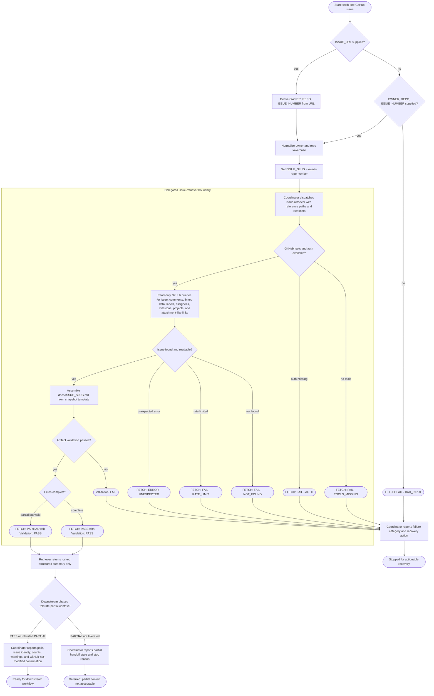

# Fetching GitHub Issue

The coordinator retrieves exactly one GitHub issue into a validated local
Markdown snapshot. It may derive identifiers, dispatch the delegated
`issue-retriever`, interpret only the retriever's structured summary, and report
handoff state. Raw GitHub data stays out of coordinator context. The delegated
retriever performs read-only GitHub queries, may write at most one unstaged file
at `docs/<ISSUE_SLUG>.md`, and must not modify GitHub.

Completion rule: retrieval is complete only when the coordinator receives a
structured summary proving `FETCH: PASS` or tolerated `FETCH: PARTIAL` with
`Validation: PASS`, reports the unstaged snapshot path, and confirms GitHub was
not modified.

Sensitive-action rule: editing, closing, commenting on, assigning, labeling,
staging, or committing is outside this workflow and must route to a separate
approved workflow.
