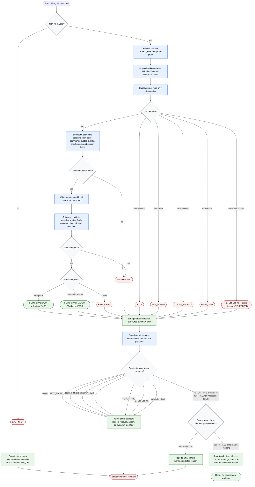

# Fetching Jira Ticket

A Jira retrieval coordinator accepts one `JIRA_URL`, derives workspace, project,
and ticket identity, then delegates read-only Jira access and local snapshot
assembly to `ticket-retriever`. The coordinator keeps raw Jira payloads out of
context, branches only on the retriever's structured summary, and never mutates
Jira, stages, or commits the snapshot.

Readiness rule: continue only after `FETCH: PASS` with `Validation: PASS`, or
after `FETCH: PARTIAL` with `Validation: PASS` when the next workflow phase
explicitly tolerates partial context.

Boundary rule: Jira mutations, local staging, and commits are out of scope;
route them to a separate approved workflow.
