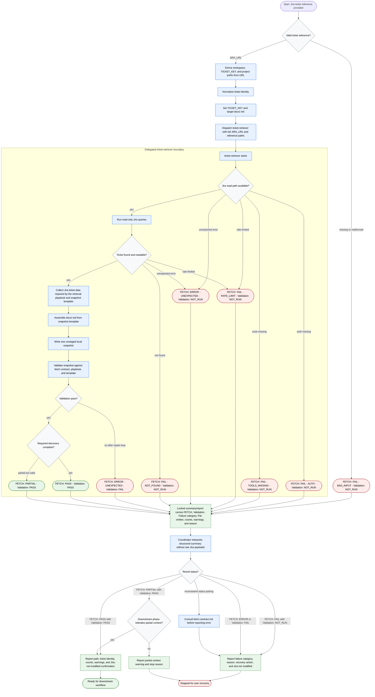

# Fetching Jira Ticket

The coordinator retrieves exactly one Jira ticket into a validated local
Markdown snapshot. It may normalize ticket coordinates, dispatch the delegated
`ticket-retriever`, interpret only the retriever's structured summary, and
report handoff state. Raw Jira payloads stay out of coordinator context. The
delegated retriever performs read-only Jira queries, may write at most one
unstaged file at `docs/<TICKET_KEY>.md`, and must not modify Jira.

Readiness rule: continue only after `FETCH: PASS` with `Validation: PASS`, or
after `FETCH: PARTIAL` with `Validation: PASS` when the next workflow phase
explicitly tolerates partial context.

Boundary rule: Jira mutations, local staging, and commits are out of scope;
route them to a separate approved workflow.
