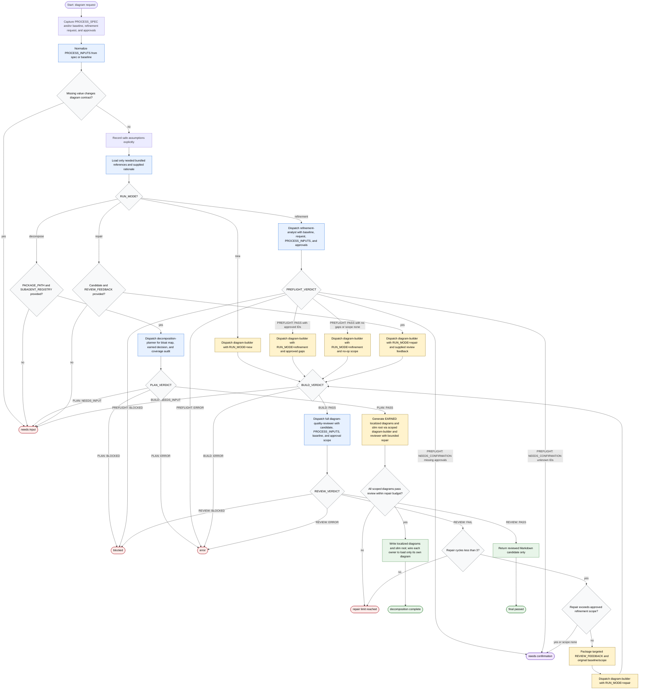

# Generate Flow Diagram

The Generate Flow Diagram workflow is an orchestration contract for a skill orchestrator that turns normalized process inputs into Markdown with one Mermaid flowchart, optionally scoped to the orchestrator or a single subagent. It may inspect supplied process specs, existing flows or diagrams, approved refinement gaps, and optional external rationale; dispatches only `refinement-analyst`, `decomposition-planner`, `diagram-builder`, and `diagram-quality-reviewer`; and stops before unapproved scope expansion or unreviewed candidate release. Every mode except `RUN_MODE=decompose` is read-only and stops before file mutation; `RUN_MODE=decompose` writes localized diagrams and load wiring into the target package only after each candidate passes review.

Readiness rule: return a candidate only after `PREFLIGHT: PASS` when refinement applies, `BUILD: PASS`, and `REVIEW: PASS`; otherwise return the exact terminal state and its recovery details. For `RUN_MODE=decompose`, write into the package only after `PLAN: PASS` and a `REVIEW: PASS` for every generated diagram.

Completion states: final passed, decomposition complete, needs confirmation, blocked, error, needs input, or repair limit reached.
