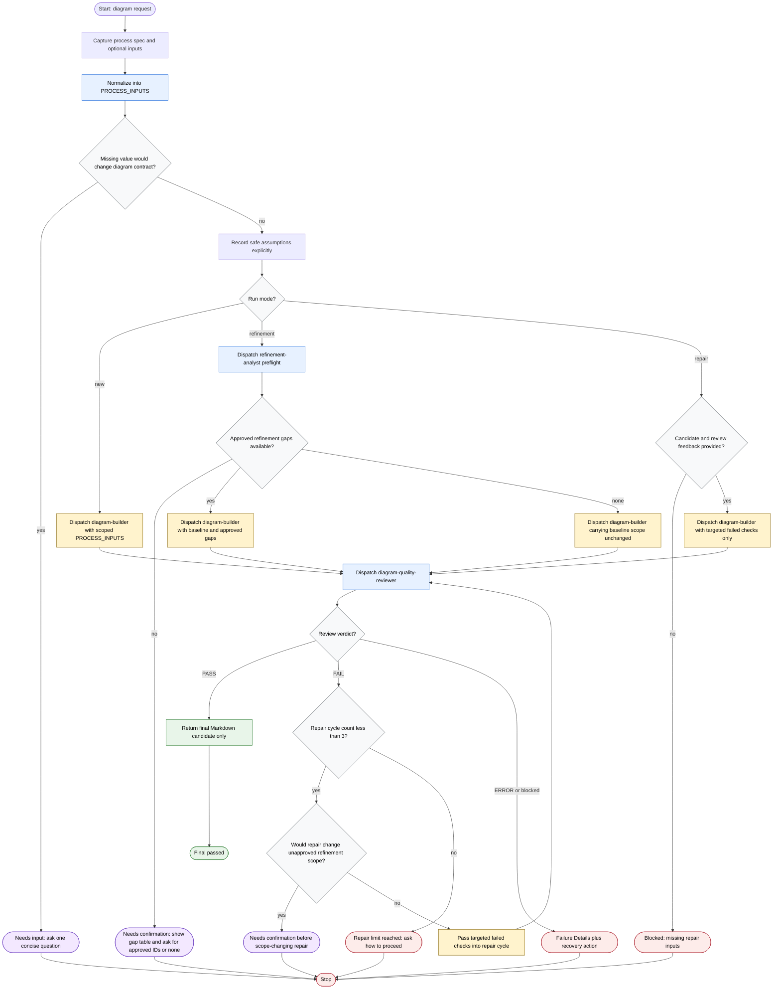

# Generate Flow Diagram

The Generate Flow Diagram workflow is an orchestration layer that turns process specifications into auditable Markdown documents with Mermaid flowcharts. It may normalize inputs, classify the run mode, dispatch scoped subagents, enforce approval and review gates, and return only a reviewed final candidate or required confirmation/failure details. It does not write external state, expose unreviewed drafts, expand refinement scope without approval, or treat external sources as required dependencies.

Readiness rule: return the final Markdown document only after `diagram-quality-reviewer` returns `REVIEW: PASS`; otherwise return the required confirmation, failure details, or repair-limit question.

Completion states: final passed, needs confirmation, blocked, error, needs input, or repair limit reached.
