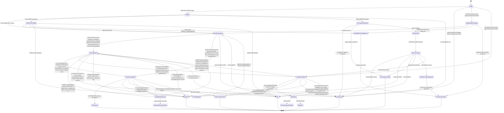

# Flow Diagram

Illustrative rendering only. [`state-machine.md`](./state-machine.md) is the sole normative source for states, guards, transitions and terminals; it wins on drift. Any FSM change updates this diagram and the `SKILL.md` overview in the same change.

```mermaid
stateDiagram-v2
  [*] --> Intake

  Intake --> Classify: PROCESS_INPUTS ready
  Intake --> NeedsInput: missing contract-changing field or invalid resume block
  Intake --> ValidateApprovedGaps: refinement resume with gap reply and resume block
  Intake --> StageCandidates: decompose resume with approval and resume block

  Classify --> BuildCandidate: RUN_MODE new or repair
  Classify --> RefinementPreflight: RUN_MODE refinement
  Classify --> DecomposeInputGate: RUN_MODE decompose
  Classify --> NeedsInput: no classification row

  RefinementPreflight --> BuildCandidate: PREFLIGHT PASS
  RefinementPreflight --> AwaitRefinementApproval: PREFLIGHT NEEDS_CONFIRMATION
  RefinementPreflight --> Blocked: PREFLIGHT BLOCKED
  RefinementPreflight --> Error: PREFLIGHT ERROR

  AwaitRefinementApproval --> NeedsConfirmation: inventory presented

  ValidateApprovedGaps --> BuildCandidate: IDs valid or none
  ValidateApprovedGaps --> AwaitRefinementApproval: unknown IDs and reask budget left
  ValidateApprovedGaps --> NeedsConfirmation: unknown IDs and reask exhausted

  BuildCandidate --> ParserApproval: BUILD PASS and first-reviewer-or-changed-command and no retained decision and mmdc absent and npx present and parser scratch prepared
  ParserApproval --> ReviewCandidate: non-decompose with retained run/command context, record APPROVED yes or ABORT no then resume pending review
  ParserApproval --> StageCandidates: decompose with retained run/command context, record APPROVED yes or ABORT no then resume pending chain
  ParserApproval --> ParserApproval: retained run/command context and REVISE or malformed or unusable and parser_reask_count under 1
  ParserApproval --> NeedsInput: no answer on resume or lost or invalid run/command context, recover inputs and re-preview
  ParserApproval --> Blocked: retained run/command context and revise or malformed or unusable at cap
  ParserApproval --> Blocked: approval-checkpoint BLOCKED or TOOLS_MISSING, not unavailable parser scratch
  ParserApproval --> Error: checkpoint ERROR or unexpected failure
  BuildCandidate --> ReviewCandidate: BUILD PASS and parser gate unnecessary, unavailable scratch means NPX_APPROVED no and inspected-only
  BuildCandidate --> NeedsInput: BUILD NEEDS_INPUT
  BuildCandidate --> Error: BUILD ERROR

  ReviewCandidate --> FinalPassed: REVIEW PASS and not decompose
  ReviewCandidate --> Blocked: REVIEW BLOCKED
  ReviewCandidate --> Error: REVIEW ERROR
  ReviewCandidate --> AwaitRepairApproval: FAIL under approval none with baseline_effect changed or unknown
  ReviewCandidate --> PackageRepair: FAIL and repair_cycles under 3
  ReviewCandidate --> RepairLimitReached: FAIL and repair_cycles at 3

  PackageRepair --> BuildCandidate: failed checks packaged as BUILD_ACTION repair

  AwaitRepairApproval --> NeedsConfirmationRepair: repair question presented

  DecomposeInputGate --> NeedsInput: package or registry incomplete
  DecomposeInputGate --> NoChangesNeeded: empty registry confirmed
  DecomposeInputGate --> DeriveLimits: inputs complete

  DeriveLimits --> PlanDecompose: MUTATION_LIMITS derived

  PlanDecompose --> NeedsInput: PLAN NEEDS_INPUT
  PlanDecompose --> Blocked: PLAN BLOCKED
  PlanDecompose --> Error: PLAN ERROR
  PlanDecompose --> NoChangesNeeded: PLAN PASS and noop
  PlanDecompose --> AwaitDecomposeApproval: PLAN PASS and ask
  PlanDecompose --> StageCandidates: PLAN PASS and auto

  AwaitDecomposeApproval --> NeedsConfirmation: plan and resume block presented

  StageCandidates --> ParserApproval: paths fixed and pending BUILD PASS and first-reviewer-or-changed-list and no retained decision and mmdc absent and npx present and parser scratch prepared
  StageCandidates --> WriteBatch: every candidate REVIEW PASS and digest revalidated
  StageCandidates --> RepairLimitReached: any candidate repair exhausted
  StageCandidates --> NeedsInput: any staged builder BUILD NEEDS_INPUT, write no destination files
  StageCandidates --> Blocked: any staged reviewer REVIEW BLOCKED, write no destination files
  StageCandidates --> Error: any staged builder BUILD ERROR or any staged reviewer REVIEW ERROR or staged result missing/malformed/unknown, write no destination files

  WriteBatch --> DecompositionComplete: WRITE PASS
  WriteBatch --> WriteError: WRITE ERROR

  FinalPassed --> [*]
  DecompositionComplete --> [*]
  NoChangesNeeded --> [*]
  NeedsConfirmation --> [*]
  NeedsConfirmationRepair --> [*]
  NeedsInput --> [*]
  Blocked --> [*]
  Error --> [*]
  WriteError --> [*]
  RepairLimitReached --> [*]
```

## Gate And Branch Summary

| Gate | Guard | Pass path | Stop / alternate |
| --- | --- | --- | --- |
| Contract-missing gate | Missing field changes authority, sensitive actions, outputs, evidence, confirmation, or terminals | `Classify` | `NeedsInput` |
| Classification gate | Precedence table row matches | Mode-specific state | `NeedsInput` |
| Refinement preflight | `PREFLIGHT: PASS` | `BuildCandidate` | Await confirmation, `Blocked`, or `Error` |
| Resume-block gate | Resume reply carries a valid, matching resume block | `ValidateApprovedGaps` or `StageCandidates` | `NeedsInput` |
| Gap-ID validation | IDs ⊆ retained inventory or exact `none` | `BuildCandidate` | One re-ask then `NeedsConfirmation` |
| Build gate | `BUILD: PASS` | `ReviewCandidate`, via `ParserApproval` when its guard applies | `NeedsInput` or `Error` |
| Parser approval | First reviewer or changed preview; no retained decision for exact command/list; mmdc absent, npx present, parser scratch prepared | Bound `APPROVED` or `ABORT` records permission/denial then resumes pending review/staging | Unavailable scratch skips gate with `NPX_APPROVED: no` and `inspected-only`; resumed silence/lost context -> `NeedsInput` and re-preview; one REVISE/malformed/unusable re-ask then `Blocked`; approval-checkpoint BLOCKED/TOOLS_MISSING -> `Blocked`; ERROR -> `Error` |
| Review gate | `REVIEW: PASS` | `FinalPassed` (non-decompose) | Repair, repair-under-`none`, `Blocked`, `Error`, or repair limit |
| Repair budget | `repair_cycles` < 3 | `PackageRepair` → `BuildCandidate` | `RepairLimitReached` |
| Repair-under-`none` | `approval_scope` is exact `none` and any failed check has `baseline_effect` `changed` or `unknown` | — | `NeedsConfirmationRepair` |
| Decompose input gate | Package path + non-empty registry | `DeriveLimits` | `NeedsInput` or `NoChangesNeeded` |
| Plan gate | `PLAN: PASS` and work remains | Await approval or `StageCandidates` if `auto` | No-op, `NeedsInput`, `Blocked`, `Error` |
| All-pass staging | Every staged candidate `REVIEW: PASS` and digest revalidated after repairs | `WriteBatch` | `RepairLimitReached`, `NeedsInput`, `Blocked`, or `Error` (no writes) |
| Write gate | `WRITE: PASS` inside `MUTATION_LIMITS` | `DecompositionComplete` | `WriteError` |

## Terminal States

- Success: `FinalPassed`, `DecompositionComplete`, `NoChangesNeeded`
- Confirmation: `NeedsConfirmation`, `NeedsConfirmationRepair`
- Failure / stop: `NeedsInput`, `Blocked`, `Error`, `WriteError`, `RepairLimitReached`
