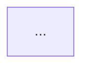
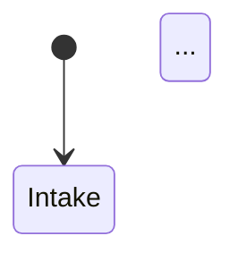
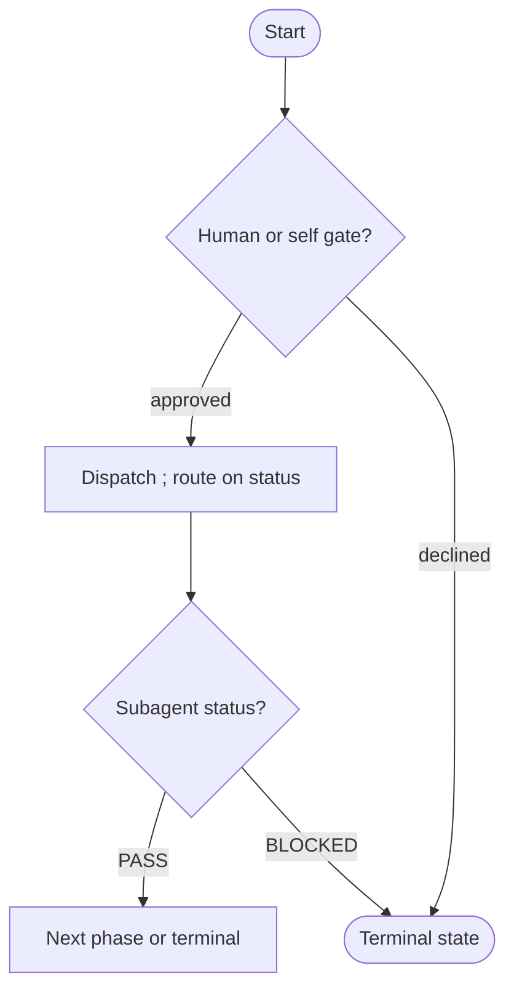
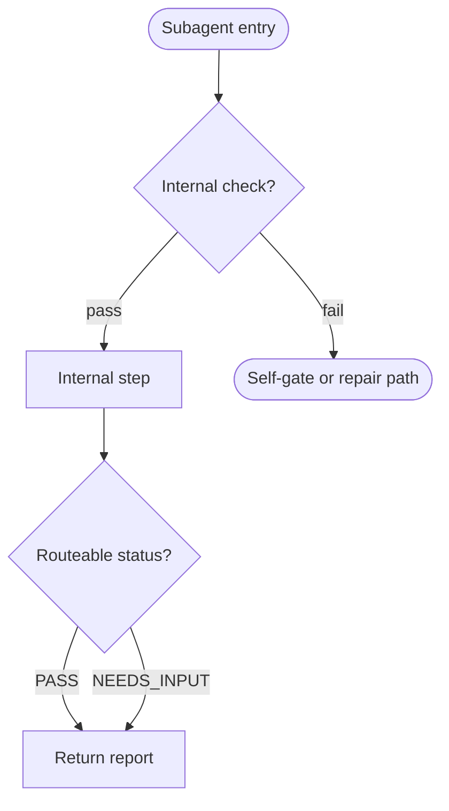

# Output Templates

Load this file only when assembling a user-facing confirmation, final artifact,
decompose result, or run report.

## Refinement Pre-Check Template

```text
## Refinement Pre-Check

| ID | Gap | Type | Why It Matters | Proposed Change |
| -- | --- | ---- | -------------- | --------------- |

Which gap IDs should I include in the revised flow? Reply with IDs like `G1, G3`,
or `none`.

### Resume Block
- Baseline: <baseline title or first line> (<N> nodes)
- Gaps: <G1: one-line summary; G2: ...>
- Approval scope: pending
- Re-asks remaining: <n>

Include this block with your reply so a fresh run can validate and resume.
```

## Decomposition Plan Summary Template

```text
## Decomposition Plan Summary

Root diagram: <ROOT_DIAGRAM_PATH> - before <N> nodes

| Owner | Decision | Recommended action | Files to create or edit | Evidence |
| ----- | -------- | ------------------ | ----------------------- | -------- |

Approve this decomposition plan before I generate or write diagrams? Reply
`approve` to continue, or describe changes to the plan.

### Resume Block
- Package: <PACKAGE_PATH>
- Root diagram: <ROOT_DIAGRAM_PATH> (<N> nodes)
- Plan rows: <owner: decision; ...>
- Re-asks remaining: <n>

Include this block with your reply so a fresh run can validate and resume.
```

## Final Markdown Template

````markdown
# <PROCESS_NAME>

<Short paragraph describing workflow boundary, agent authority, trust model,
allowed actions, boundaries, and mutation limits.>



Or, when the workflow is a finite-state model:



```text
Optional output/report/comment template, if useful.
```

Readiness rule: <optional completion or sensitive-action rule>
````

## Slim Root Template

Use this for `DIAGRAM_SCOPE=orchestrator`.

````markdown
# <PROCESS_NAME> - Orchestration

<Short paragraph: orchestrator authority, dispatch-only role, mutation limits,
and subagent internals live in localized diagrams.>



Localized diagrams: [`<subagent>`](<LOCALIZED_DIAGRAM_RELATIVE_LINK>)
````

## Localized Subagent Diagram Template

Use this for `DIAGRAM_SCOPE=subagent`.

````markdown
# <SUBAGENT_NAME> - Internal Flow

<Short paragraph: this subagent's role and routeable statuses. Orchestration
context lives in the root diagram linked below.>



Orchestration context: [root diagram](<ROOT_DIAGRAM_RELATIVE_LINK>)
````

## Load-Instruction Template

Root load line in package `SKILL.md`:

```markdown
Flow diagram: [`flow-diagram.md`](./flow-diagram.md)
```

Localized subagent load line in the owning subagent file:

```markdown
Flow diagram: [`<subagent-name>-flow-diagram.md`](./<subagent-name>-flow-diagram.md)
```

Derive links relative to the file containing the link. Do not hardcode default
paths when `ROOT_DIAGRAM_PATH` is non-default.

## Decompose Result Template

```text
## Decomposition Result

Root diagram: <ROOT_DIAGRAM_PATH> - before <N> nodes, after <M> nodes

| Owner | Decision | Localized diagram | Action | Load wired |
| ----- | -------- | ----------------- | ------ | ---------- |

- Scope-separation check: pass/fail
- No-duplication check: pass/fail
- Files written: <paths>
- Files failed: <paths or `none`>
- Notes / evidence quotes: ...

## Follow-ups

Vendored mirrors (`.agents/skills/`, `.claude/skills/`) and any skill lockfile
were intentionally not modified. Refresh them with the repository's managing
tool before expecting runtime discovery copies or pins to reflect this package.
```

## Run Report Template

```text
## Run Report

- Run mode and scope: ...
- Assumptions: ...
- Repair cycles used: ...
- Mermaid validation method: parsed (<parser and version>) | inspected-only
- Dispatch method: subagent | inline
- Staging concurrency: parallel | serial | n/a
- External sources fetched: ...
- Decompose approval path: asked | explicit auto | n/a
- Mirror/lockfile follow-up disclosed: yes/no/n/a
```
