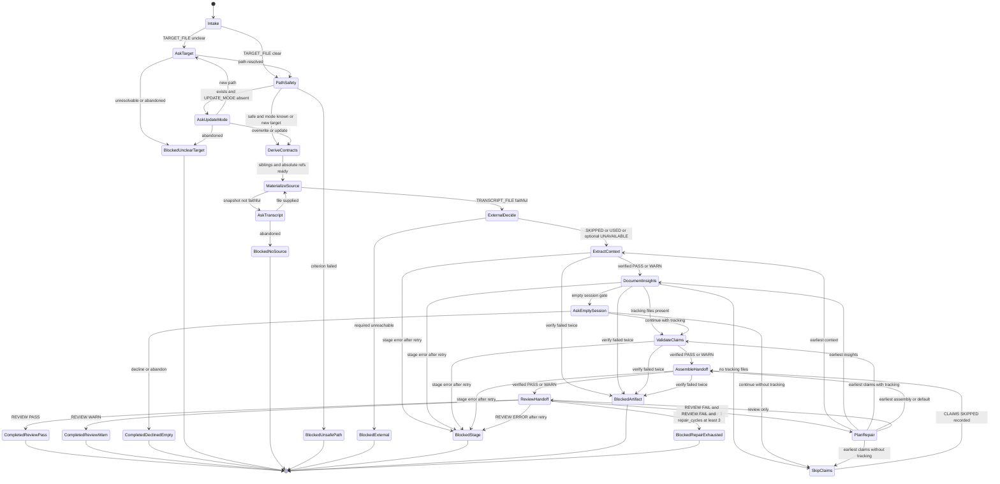

# Generate Handoff Document Flow Diagram

Canonical execution model: finite state machine. Guards, variables, and
terminals are tabulated in [`state-machine.md`](./state-machine.md); this
diagram is illustrative and defers to that table on any mismatch.

## Terminal Strings

| State | Exact string |
| ----- | ------------ |
| `CompletedReviewPass` | `Completed: review pass` |
| `CompletedReviewWarn` | `Completed: review pass with warnings` |
| `CompletedDeclinedEmpty` | `Completed: handoff declined (empty session)` |
| `BlockedUnclearTarget` | `Blocked: unclear target path` |
| `BlockedNoSource` | `Blocked: no usable source transcript` |
| `BlockedUnsafePath` | `Blocked: unsafe writes or missing readable/writable path` |
| `BlockedExternal` | `Blocked: required external dependency unavailable` |
| `BlockedStage` | `Blocked: subagent error, failure, or unexpected skip` |
| `BlockedArtifact` | `Blocked: artifact contract violation` |
| `BlockedRepairExhausted` | `Blocked: repair limit exhausted` |
