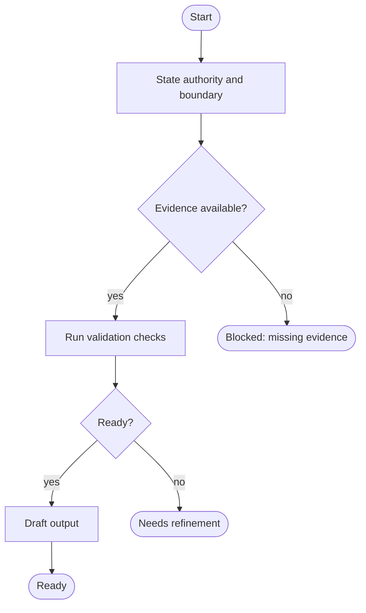

# Mermaid Style Guide

> Load this file when writing or repairing Mermaid. If current syntax details are
> uncertain, fetch the Mermaid source listed in `external-sources.md`.

## Default Diagram Type

Use `flowchart TD` for process flows unless another Mermaid diagram type is
clearly better. `TD` means top-down; `LR` can be used when a horizontal lifecycle
is more readable.

## Shape Conventions

- Start and terminal states: rounded or stadium nodes.
- Process steps: rectangle nodes.
- Decisions: diamond nodes with named outcomes.
- Human gates: distinct class and explicit approve or decline paths.
- Outputs: distinct class and clear artifact name.

## Labeling

Use short, action-oriented node identifiers and readable labels, such as
`COLLECT_CONTEXT`, `VERIFY_CLAIMS`, `ASK_HUMAN`, and `POST_REPORT`. Use `\n` or
quoted labels when one short clarification is needed.

Keep link labels explicit: `yes`, `no`, `approved`, `declined`, `blocked`,
`needs research`, or another named outcome.

## Class Definitions

Use class definitions similar to this template:

```mermaid
classDef guard fill:#fff3cd,stroke:#856404,color:#000;
classDef check fill:#e7f1ff,stroke:#0b5ed7,color:#000;
classDef decision fill:#f8f9fa,stroke:#495057,color:#000;
classDef human fill:#f3e8ff,stroke:#6f42c1,color:#000;
classDef output fill:#e8f5e9,stroke:#2e7d32,color:#000;
classDef stop fill:#fdecea,stroke:#b02a37,color:#000;
```

## Common Syntax Pitfalls

- Avoid lowercase `end` as a node label because it can terminate a subgraph.
- Avoid node IDs that accidentally start a special edge form, such as `o` or `x` immediately after an edge marker.
- Quote labels that contain punctuation likely to confuse Mermaid parsing.
- Define every class before assigning it.
- Assign classes only to nodes that exist.
- Avoid duplicate conflicting node definitions.
- Prefer one edge per line when the flow is complex.

## Minimal Pattern


