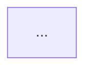

# Output Templates

> Load this file only when assembling the user-facing pre-check or final diagram
> output.

## Refinement Pre-Check Template

Use this when an existing flow has improvable gaps that need user approval before
generation proceeds:

```markdown
## Refinement Pre-Check

| ID | Gap | Type | Why It Matters | Proposed Change |
| -- | --- | ---- | -------------- | --------------- |
| G1 | ... | ... | ... | ... |

Which gap IDs should I include or fix in the revised flow? Reply with IDs like
`G1, G3`, or `none`.
```

## Final Markdown Template

````markdown
# <PROCESS_NAME>

<Short paragraph describing the workflow boundary, agent authority, trust model,
allowed actions, forbidden actions, and mutation limits.>



```text
Optional output/report/comment template, if useful.
```

Readiness rule: <optional completion or sensitive-action rule>
````

## Optional Report Template Pattern

Include a report template only when it helps the workflow user act on the final
state:

```text
Status: ready | blocked | needs refinement | deferred | escalated
Evidence checked:
Risks:
Blockers:
Recommendations:
Unresolved questions:
Human approvals required:
```
