# Improve Skill Definition Flow

This workflow is run by a skill-definition improvement orchestrator. The
orchestrator loads this diagram as the source of truth on every run, applies the
skill personality from `./references/personality.md`, dispatches focused
subagents for raw package work, stops for explicit user approval before
mutation, and validates that approved changes actually improved the package.

Semantic edits to this diagram are owned by `generate-flow-diagram` and must
come from a `REVIEW: PASS` candidate. This skill may only make non-semantic path
or name corrections directly.

```mermaid
flowchart TD
  START([Start: improve existing skill package]) --> INTAKE["Emit banner Phase 1/7 - Intake<br/>Normalize inputs<br/>SKILL_PATH, KNOWN_PROBLEM, TARGET_RUNTIME,<br/>SCOPE_LIMITS, REFERENCE_NEED, APPROVED_GAPS<br/>Derive MUTATION_LIMITS"]
  INTAKE --> PATH_OK{"SKILL_PATH present and locatable?"}

  PATH_OK -->|no| PATH_BLOCK["Blocked handoff<br/>Ask one SKILL_PATH question<br/>Stop until user supplies path"]
  PATH_OK -->|yes| FLOW_AUTHORITY["Emit banner Phase 2/7 - Flow Load<br/>Load ./flow-diagram.md<br/>Set source-of-truth execution contract"]

  FLOW_AUTHORITY --> LOAD_PERSONALITY["Load ./references/personality.md<br/>Set harsh artifact-focused educator posture"]
  LOAD_PERSONALITY --> BOUNDARY["Set orchestration boundary<br/>Retain only verdicts, summaries, paths,<br/>approved gaps, fetched URLs, and user decisions<br/>Delegate raw inspection, editing, and validation"]
  BOUNDARY --> STATUS_CONTRACT["Status routing contract<br/>AUDIT: APPROVAL_REQUIRED, NO_CHANGE, BLOCKED, ERROR<br/>EDIT: PASS, BLOCKED, ERROR<br/>VALIDATION: PASS, FAIL, BLOCKED, ERROR"]

  STATUS_CONTRACT --> AUDIT["Emit banner Phase 3/7 - Audit<br/>Write docs/improve-skill-definition/skill-package-auditor-instructions.md<br/>Dispatch skill-package-auditor with a compact pointer prompt<br/>naming the contract, handoff file, and Output Format<br/>Cleanup: routed success now; final handoff removes leftovers"]
  AUDIT --> AUDIT_STATUS{"AUDIT status?"}

  AUDIT_STATUS -->|NO_CHANGE| FINAL_NO_CHANGE["Emit banner Phase 7/7 - Handoff<br/>Load final-report-template.md<br/>Return no-change handoff with evidence,<br/>personality assessment, rejected optional improvements,<br/>and validation limits"]
  FINAL_NO_CHANGE --> NO_CHANGE([Decision: no change])

  AUDIT_STATUS -->|APPROVAL_REQUIRED| APPROVAL_HANDOFF["Emit banner Phase 4/7 - Approval<br/>Load final-report-template.md<br/>Return approval-required handoff<br/>Include workflow verdict, subagent verdict,<br/>flow verdict, personality assessment,<br/>gap inventory, mutation plan, quality gate plan"]
  APPROVAL_HANDOFF --> PERSONALITY_GATE{"User explicitly approved target personality decision?"}

  PERSONALITY_GATE -->|no| APPROVAL_BLOCK["Blocked handoff<br/>Ask for personality decision plus all, none, or gap ids<br/>Stop until explicit approval"]
  PERSONALITY_GATE -->|yes| APPROVAL_GATE{"User explicitly approved all, none, or gap ids?"}
  APPROVAL_GATE -->|no| APPROVAL_BLOCK
  APPROVAL_GATE -->|yes| APPROVED_NONE{"Approved gap scope is none?"}

  APPROVED_NONE -->|yes| FINAL_NO_CHANGE
  APPROVED_NONE -->|no| SCOPE_GATE{"Approved mutations inside SCOPE_LIMITS and MUTATION_LIMITS?"}

  SCOPE_GATE -->|no| SCOPE_BLOCK["Blocked handoff<br/>Ask one scope question<br/>Stop until user decides"]
  SCOPE_GATE -->|yes| EDIT["Emit banner Phase 5/7 - Edit<br/>Write docs/improve-skill-definition/skill-definition-editor-instructions.md<br/>Dispatch skill-definition-editor with a compact pointer prompt<br/>naming the contract, handoff file, and Output Format<br/>Cleanup: routed success now; final handoff removes leftovers"]

  AUDIT_STATUS -->|BLOCKED| AUDIT_BLOCK["Blocked handoff<br/>Include blocker, completed checks,<br/>smallest recovery action"]
  AUDIT_STATUS -->|ERROR| AUDIT_ERROR["Retain audit error summary"]

  EDIT --> EDIT_STATUS{"EDIT status?"}
  EDIT_STATUS -->|PASS| VALIDATE["Emit banner Phase 6/7 - Validate<br/>Write docs/improve-skill-definition/skill-package-validator-instructions.md<br/>Dispatch skill-package-validator with a compact pointer prompt<br/>naming the contract, handoff file, and Output Format<br/>Cleanup: routed success now; final handoff removes leftovers"]
  EDIT_STATUS -->|BLOCKED| EDIT_BLOCK["Blocked handoff<br/>Include edit blocker and smallest user decision"]
  EDIT_STATUS -->|ERROR| EDIT_ERROR["Retain edit error summary"]

  VALIDATE --> VALIDATION_STATUS{"VALIDATION status?"}
  VALIDATION_STATUS -->|PASS| FINAL_CHANGED["Emit banner Phase 7/7 - Handoff<br/>Load final-report-template.md<br/>Return changed handoff with material issues,<br/>files changed, validation, resources, and risks"]
  FINAL_CHANGED --> CHANGED([Decision: changed])

  VALIDATION_STATUS -->|FAIL| RETRY_GATE{"Targeted repair cycles used fewer than 3?"}
  RETRY_GATE -->|yes| REPAIR["Emit banner Phase 5/7 - Edit<br/>Write docs/improve-skill-definition/skill-definition-editor-instructions.md<br/>Re-dispatch skill-definition-editor with a compact pointer prompt<br/>naming the contract, handoff file, and Output Format<br/>Cleanup: routed success now; final handoff removes leftovers"]
  RETRY_GATE -->|no| FAIL_BLOCK["Blocked handoff<br/>Validation still failing after three repairs<br/>Include failed checks, attempted repairs, and resume condition"]

  REPAIR --> REPAIR_STATUS{"Repair EDIT status?"}
  REPAIR_STATUS -->|PASS| VALIDATE
  REPAIR_STATUS -->|BLOCKED| REPAIR_BLOCK["Blocked handoff<br/>Include repair blocker and smallest user decision"]
  REPAIR_STATUS -->|ERROR| REPAIR_ERROR["Retain repair error summary"]

  VALIDATION_STATUS -->|BLOCKED| VALIDATION_BLOCK["Blocked handoff<br/>Include validation blocker and recovery action"]
  VALIDATION_STATUS -->|ERROR| VALIDATION_ERROR["Retain validation error summary"]

  PATH_BLOCK --> FINAL_BLOCKED
  APPROVAL_BLOCK --> FINAL_BLOCKED
  SCOPE_BLOCK --> FINAL_BLOCKED
  AUDIT_BLOCK --> FINAL_BLOCKED
  EDIT_BLOCK --> FINAL_BLOCKED
  FAIL_BLOCK --> FINAL_BLOCKED
  REPAIR_BLOCK --> FINAL_BLOCKED
  VALIDATION_BLOCK --> FINAL_BLOCKED
  FINAL_BLOCKED["Emit banner Phase 7/7 - Handoff<br/>Load final-report-template.md<br/>Return blocked handoff with reason,<br/>question, completed checks, and resume condition"] --> BLOCKED([Decision: blocked])

  AUDIT_ERROR --> FINAL_ERROR
  EDIT_ERROR --> FINAL_ERROR
  REPAIR_ERROR --> FINAL_ERROR
  VALIDATION_ERROR --> FINAL_ERROR
  FINAL_ERROR["Emit banner Phase 7/7 - Handoff<br/>Load final-report-template.md<br/>Return error handoff with failed condition,<br/>known context, and recovery"] --> ERROR([Decision: error])

  classDef guard fill:#fff3cd,stroke:#856404,color:#000;
  classDef check fill:#e7f1ff,stroke:#0b5ed7,color:#000;
  classDef decision fill:#f8f9fa,stroke:#495057,color:#000;
  classDef human fill:#f3e8ff,stroke:#6f42c1,color:#000;
  classDef output fill:#e8f5e9,stroke:#2e7d32,color:#000;
  classDef success fill:#e8f5e9,stroke:#2e7d32,color:#000;
  classDef stop fill:#fdecea,stroke:#b02a37,color:#000;

  class FLOW_AUTHORITY,LOAD_PERSONALITY,BOUNDARY,STATUS_CONTRACT guard;
  class AUDIT,EDIT,VALIDATE,REPAIR check;
  class PATH_OK,AUDIT_STATUS,PERSONALITY_GATE,APPROVAL_GATE,APPROVED_NONE,SCOPE_GATE,EDIT_STATUS,VALIDATION_STATUS,RETRY_GATE,REPAIR_STATUS decision;
  class PATH_BLOCK,APPROVAL_HANDOFF,APPROVAL_BLOCK,SCOPE_BLOCK,AUDIT_BLOCK,EDIT_BLOCK,FAIL_BLOCK,REPAIR_BLOCK,VALIDATION_BLOCK human;
  class FINAL_NO_CHANGE,FINAL_CHANGED,FINAL_BLOCKED,FINAL_ERROR output;
  class NO_CHANGE,CHANGED success;
  class BLOCKED,ERROR,AUDIT_ERROR,EDIT_ERROR,REPAIR_ERROR,VALIDATION_ERROR stop;
```

Handoff-file dispatch: Each subagent dispatch in the AUDIT, EDIT, VALIDATE, and REPAIR action nodes follows a write-dispatch-cleanup pattern. The orchestrator first writes the full per-subagent payload to `docs/improve-skill-definition/<subagent-name>-instructions.md`, then dispatches the subagent with a compact pointer prompt that names only the subagent contract file, that handoff file, and the expected Output Format. The orchestrator deletes the handoff file in the same dispatch step for routed-forward success statuses, leaves retryable failure payloads in place until the next dispatch overwrites them, and removes any remaining `docs/improve-skill-definition/<subagent-name>-instructions.md` files before a terminal user-facing handoff. The `docs/improve-skill-definition/` directory is the conventional location for these per-subagent handoff files, keeping the orchestrator context small while subagents receive the complete payload from disk.

Phase transition banners: Every action node above instructs the orchestrator to emit the canonical forty-hyphen `Phase N/7 - <Name>` banner before its other actions, matching the format defined in `../../docs/best-practices/phase-transition-banner.md`. REPAIR re-emits the `Phase 5/7 - Edit` banner so each repair cycle is visible in the user output stream, and the subsequent re-validate re-emits `Phase 6/7 - Validate`. Banners are an orchestrator concern; subagents do not emit them.

Readiness rule: A final handoff is ready only after
`./references/final-report-template.md` is loaded and the outcome is one of
`approval required`, `changed`, `no change`, `blocked`, or `error`. No mutation
begins until the user explicitly approves both the target personality decision
and the gap scope. A `VALIDATION: FAIL` may trigger at most three targeted
editor/validator repair cycles; after the third failed validation, return
`blocked` with remaining findings and attempted repairs.

Quality gate rule: validation must check approved-gap closure, flow
source-of-truth coherence, diagram delegation, personality consistency,
subagent necessity, standalone packaging, path validity, and mutation
boundaries.
