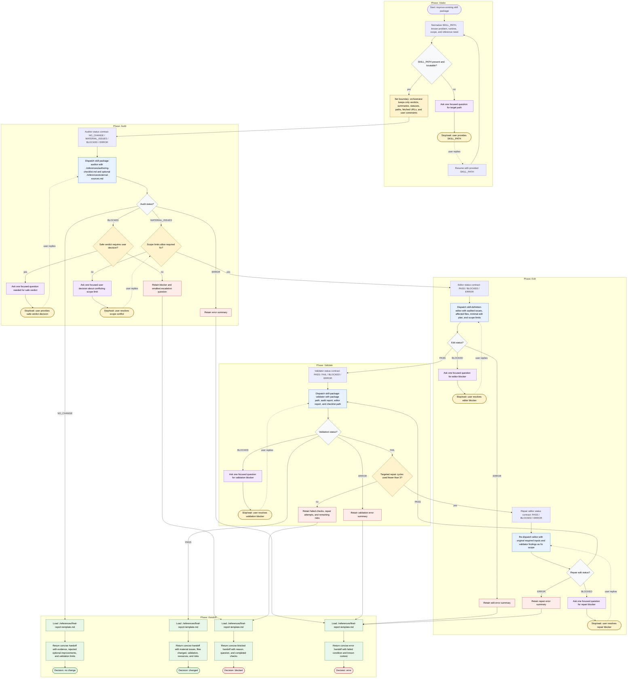

# Improve Skill Definition Flow

This workflow is run by a skill-definition improvement orchestrator. The
orchestrator normalizes inputs, dispatches focused package subagents, and
synthesizes concise decisions. It may read local bundled contracts, dispatch
`skill-package-auditor`, `skill-definition-editor`, and
`skill-package-validator`, ask one focused user question when blocked, and
return a final handoff. Raw inspection, editing, validation, and external-source
lookup stay inside subagents or bundled references. Edits occur only through
`skill-definition-editor` after evidence-backed material issues and scope gate
approval.

Readiness rule: A final handoff is ready only after
`./references/final-report-template.md` is loaded and the outcome is one of
`changed`, `no change`, `blocked`, or `error`. User-question branches stop and
wait for the requested answer before resuming the relevant phase; they are not
the same operation as returning a blocked handoff. Failed validation may trigger
at most three targeted editor and validator repair cycles. If validation still
returns `FAIL` after the third cycle, report a blocked decision with remaining
findings and attempted repairs.
