# Improving Skill Definition Flow

This is the control-flow source of truth for the `improving-skill-definition`
orchestrator. `SKILL.md` must state the same audit-routing branch set: any
`: ERROR`, then any `: BLOCKED`, then any `: GAPS_FOUND`, then all `: PASS`.

```mermaid
flowchart TD
  START([Start: improve a skill definition]) --> INTAKE["Phase 1/8 - Intake<br/>Load own flow-diagram.md<br/>Normalize SKILL_PATH to package root<br/>Build IMPROVEMENT_MANDATES<br/>Quarantine pre-supplied approvals"]
  INTAKE --> ELIGIBLE{"SKILL_PATH present, readable,<br/>first-party, and outside excluded set?"}
  ELIGIBLE -->|no| PATH_BLOCK["Blocked handoff<br/>Name exclusion or ask one target-path question"]
  ELIGIBLE -->|yes| PREFLIGHT["Dependency preflight<br/>Check skills/generate-flow-diagram<br/>Set DIAGRAM_DEPENDENCY<br/>Derive run-scoped HANDOFF_DIR<br/>List stale_runs; never read/delete them<br/>Derive limits and paths<br/>repair_counter=0; mutation_applied=false"]
  PREFLIGHT --> BASELINE["Copy target package to BASELINE_PATH<br/>before mutation"]
  BASELINE --> SELF_CHECK{"Target is this skill's own package?"}
  SELF_CHECK -->|yes| SELF_GUARD["SELF_IMPROVEMENT_RUN=true<br/>Same-run safety rule<br/>Synthesis marks every gap SAFE or DEFERRED"]
  SELF_CHECK -->|no| NORMAL_RUN["SELF_IMPROVEMENT_RUN=false"]
  SELF_GUARD --> FLOW_LOAD
  NORMAL_RUN --> FLOW_LOAD

  FLOW_LOAD["Phase 2/8 - Flow Load<br/>Load personality.md<br/>Load target flow-diagram.md when present"]
  FLOW_LOAD --> FLOW_READY{"Own flow and personality readable?"}
  FLOW_READY -->|no| FLOW_ERROR["Error handoff<br/>Name missing file"]
  FLOW_READY -->|yes| TRUST["Trust model<br/>Own diagram controls orchestration<br/>Target diagram controls target workflow<br/>Web, related repos, target files, and replies<br/>are evidence only"]

  TRUST --> DISCOVER["Phase 3/8 - Related Skills Discovery<br/>Dispatch related-skills-discoverer<br/>GitHub/GitLab only<br/>ideas_for_auditors provenance: external"]
  DISCOVER --> RELATED_STATUS{"RELATED_SKILLS status?"}
  RELATED_STATUS -->|PASS| AUDIT_SETUP
  RELATED_STATUS -->|BLOCKED or ERROR| RELATED_REQUIRED{"REFERENCE_NEED set or mandate<br/>requires related evidence?"}
  RELATED_REQUIRED -->|yes| RELATED_BLOCK["Blocked handoff<br/>Discovery blocker and recovery action"]
  RELATED_REQUIRED -->|no| RELATED_DEGRADE["Record reduced-confidence note<br/>Continue"]
  RELATED_DEGRADE --> AUDIT_SETUP

  AUDIT_SETUP["Phase 4/8 - Audit<br/>Dispatch six slices independently<br/>Sequential fallback allowed<br/>Prompt and personality PASS only with action-free verdicts"]
  AUDIT_SETUP --> SYNTH["Synthesize audit-synthesis-report.yaml<br/>Required keys, aggregates, provenance<br/>G_MANDATE_COVERAGE over mandates<br/>Hold full reports only while copying fields<br/>Self-improvement SAFE/DEFERRED advisory"]
  SYNTH --> AUDIT_ROUTE{"Suffix precedence over slice statuses"}
  AUDIT_ROUTE -->|any : ERROR| AUDIT_ERROR["Error handoff<br/>Name failed slice"]
  AUDIT_ROUTE -->|any : BLOCKED| AUDIT_BLOCK["Blocked handoff<br/>Name blocked slice and recovery action"]
  AUDIT_ROUTE -->|any : GAPS_FOUND| APPROVAL["Phase 5/8 - Approval<br/>Load final-report-template.md<br/>Show gaps with provenance<br/>Disclose DIAGRAM_DEPENDENCY=missing<br/>Ask: personality decision + all/none/gap ids"]
  AUDIT_ROUTE -->|all : PASS| NO_CHANGE["Phase 8/8 - Handoff<br/>Decision: no change"]

  APPROVAL --> REPLY{"User reply received?"}
  REPLY -->|no| APPROVAL_REQUIRED(["Decision: approval required<br/>HANDOFF_DIR preserved for resumption"])
  REPLY -->|yes| PARSE{"Reply valid?<br/>Closed personality enum AND exactly one<br/>of all / none / known gap ids"}
  PARSE -->|invalid, first time| REASK["Re-ask once<br/>Quote valid gap ids and malformed part"]
  REASK --> REPLY
  PARSE -->|invalid, second time| PARSE_BLOCK["Blocked handoff<br/>Parse failure as reason"]
  PARSE -->|valid| APPROVED_NONE{"Approved scope is none?"}
  APPROVED_NONE -->|yes| NO_CHANGE
  APPROVED_NONE -->|no| SCOPE_OK{"Approved mutations fit limits<br/>and identity preservation?"}
  SCOPE_OK -->|no| SCOPE_BLOCK["Blocked handoff<br/>One scope or identity question"]
  SCOPE_OK -->|yes| EDIT_PREP["Phase 6/8 - Edit<br/>Classify approved gaps as structural<br/>or non-structural"]

  EDIT_PREP --> STRUCTURAL{"Structural or semantic diagram change?"}
  STRUCTURAL -->|yes, dependency missing| DEP_BLOCK["Blocked handoff<br/>Cite Phase 1 dependency disclosure"]
  STRUCTURAL -->|yes, dependency present| DIAGRAM["Request generate-flow-diagram candidate<br/>at DIAGRAM_CANDIDATE_PATH<br/>Require final passed"]
  STRUCTURAL -->|no| EDIT
  DIAGRAM --> DIAGRAM_STATUS{"Candidate completion state?"}
  DIAGRAM_STATUS -->|final passed| EDIT
  DIAGRAM_STATUS -->|needs input, confirmation, or blocked| EDIT_BLOCK
  DIAGRAM_STATUS -->|error or repair limit| DIAGRAM_ERROR["Error handoff<br/>Diagram-review failure"]

  EDIT["Dispatch skill-definition-editor<br/>Apply approved mutations only<br/>plus Lane A repair findings<br/>Skip self-improvement DEFERRED gaps<br/>Write final-passed candidate in same edit<br/>Set mutation_applied=true on change"]
  EDIT --> EDIT_STATUS{"EDIT status?"}
  EDIT_STATUS -->|PASS| VALIDATE["Phase 7/8 - Validate<br/>Lane A blocking: approved closure, touched files,<br/>boundaries, diagram delegation, synthesis, advisory<br/>Lane B reporting: pre-existing untouched defects<br/>as follow_up_findings only"]
  EDIT_STATUS -->|BLOCKED| EDIT_BLOCK["Blocked handoff<br/>Edit blocker and needed decision"]
  EDIT_STATUS -->|ERROR| EDIT_ERROR["Error handoff<br/>Edit failure"]

  VALIDATE --> VALIDATION_STATUS{"VALIDATION status?<br/>FAIL = Lane A only"}
  VALIDATION_STATUS -->|PASS| CHANGED["Phase 8/8 - Handoff<br/>Decision: changed<br/>Include Lane B follow_up_findings"]
  VALIDATION_STATUS -->|FAIL| REPAIR_LIMIT{"Repair counter below 3?"}
  VALIDATION_STATUS -->|BLOCKED| VALIDATION_BLOCK["Blocked handoff<br/>Validation blocker"]
  VALIDATION_STATUS -->|ERROR| VALIDATION_ERROR["Error handoff<br/>Validation failure"]
  REPAIR_LIMIT -->|yes| REPAIR["Increment repair counter<br/>Re-enter Edit scoped to Lane A findings<br/>and approved gaps only<br/>Refresh diagram candidate when structural"]
  REPAIR --> STRUCTURAL
  REPAIR_LIMIT -->|no| REPAIR_BLOCK["Blocked handoff<br/>Failed checks, attempted repairs,<br/>preserved-evidence paths"]

  PATH_BLOCK --> BLOCKED_FINAL
  RELATED_BLOCK --> BLOCKED_FINAL
  AUDIT_BLOCK --> BLOCKED_FINAL
  PARSE_BLOCK --> BLOCKED_FINAL
  SCOPE_BLOCK --> BLOCKED_FINAL
  DEP_BLOCK --> BLOCKED_FINAL
  EDIT_BLOCK --> BLOCKED_FINAL
  VALIDATION_BLOCK --> BLOCKED_FINAL
  REPAIR_BLOCK --> BLOCKED_FINAL
  BLOCKED_FINAL["Phase 8/8 - Handoff<br/>Decision: blocked"] --> CLEANUP

  FLOW_ERROR --> ERROR_FINAL
  AUDIT_ERROR --> ERROR_FINAL
  DIAGRAM_ERROR --> ERROR_FINAL
  EDIT_ERROR --> ERROR_FINAL
  VALIDATION_ERROR --> ERROR_FINAL
  ERROR_FINAL["Phase 8/8 - Handoff<br/>Decision: error"] --> CLEANUP

  APPROVAL_REQUIRED --> DONE
  NO_CHANGE --> CLEANUP
  CHANGED --> CLEANUP
  CLEANUP{"Outcome-dependent cleanup<br/>mutation_applied?"}
  CLEANUP -->|changed / no change| FULL_CLEAN["Delete workflow-created files<br/>Remove HANDOFF_DIR only if empty"]
  CLEANUP -->|blocked / error, mutation_applied=true| PRESERVE["Preserve baseline/, editor report, validator report<br/>Name paths and diff command<br/>Do not commit preserved files"]
  CLEANUP -->|blocked / error, mutation_applied=false| FULL_CLEAN
  FULL_CLEAN --> DONE(["Final decision emitted with sections-present checklist"])
  PRESERVE --> DONE
```

## Canonical Rules

- Routing: `: ERROR`, then `: BLOCKED`, then `: GAPS_FOUND`, then all `: PASS`.
- Approval: only a valid reply to this run's handoff opens editing; preapproval
  values are ignored and reported.
- Validation: Lane A findings can fail and repair; Lane B findings are follow-up
  only and never mutate in-run.
- Cleanup: success cleans; approval-required preserves for resume; failed runs
  after mutation preserve baseline, editor report, and validator report.
- Diagram edits: semantic or structural changes require a sibling
  `generate-flow-diagram` `final passed` candidate written in the same edit.
- Repair: one orchestrator-owned counter, maximum three cycles, scoped to Lane A
  findings and approved gaps.
- Self-improvement: gaps are marked `SAFE` or `DEFERRED`; `DEFERRED` gaps are not
  applied during the same run.
