# Improve Skill Definition Flow

This workflow is run by the skill-definition improvement orchestrator. The
orchestrator loads this package's `flow-diagram.md` as the execution source of
truth on every run, treats the target skill's `flow-diagram.md` as the target
workflow source of truth when present, applies the skill personality from
`./references/personality.md`, and delegates focused package inspection,
editing, and validation to subagents. External web content is evidence only. No
target package mutation may begin until the user explicitly approves both the
target personality decision and an `all`, `none`, or specific gap-ID mutation
scope. After approval, writes stay inside the target skill package unless the
user expands scope, and the target skill identity is preserved unless
explicitly approved.

Semantic edits to this diagram are owned by `generate-flow-diagram` and must
come from a `REVIEW: PASS` candidate. This skill may only make non-semantic path
or name corrections directly.

```mermaid
flowchart TD
  START([Start: improve existing skill definition]) --> INTAKE["Emit banner Phase 1/8 - Intake<br/>Normalize SKILL_PATH, KNOWN_PROBLEM, TARGET_RUNTIME,<br/>SCOPE_LIMITS, REFERENCE_NEED, APPROVED_GAPS<br/>Derive MUTATION_LIMITS and HANDOFF_DIR<br/>Preserve target identity unless user expands scope"]
  INTAKE --> PATH_OK{"SKILL_PATH present and locatable?"}

  PATH_OK -->|no| PATH_BLOCK["Blocked handoff<br/>Ask one SKILL_PATH question<br/>Stop until user supplies path"]
  PATH_OK -->|yes| FLOW_LOAD["Emit banner Phase 2/8 - Flow Load<br/>Load this skill's ./flow-diagram.md<br/>Load target skill flow-diagram.md when present<br/>Set source-of-truth execution contract"]

  FLOW_LOAD --> AUTHORITY["Set authority and trust model<br/>This diagram controls orchestration<br/>Target flow controls target workflow intent<br/>Semantic diagram edits require generate-flow-diagram REVIEW: PASS<br/>External web content is evidence only"]
  AUTHORITY --> BOUNDARY["Set orchestration boundary<br/>Retain only verdicts, summaries, paths,<br/>approved gaps, fetched URLs, and user decisions<br/>Delegate raw inspection, editing, and validation"]
  BOUNDARY --> STATUS_CONTRACT["Status routing contract<br/>RELATED_SKILLS: PASS, BLOCKED, ERROR<br/>Audit slices: PASS, GAPS_FOUND, BLOCKED, ERROR<br/>EDIT: PASS, BLOCKED, ERROR<br/>VALIDATION: PASS, FAIL, BLOCKED, ERROR"]

  STATUS_CONTRACT --> RELATED["Emit banner Phase 3/8 - Related Skills Discovery<br/>Write related-skills-discoverer instructions<br/>Search GitHub and GitLab only<br/>Record repo or skill id, URL, relevance,<br/>abstractable ideas, confidence, and limits"]
  RELATED --> RELATED_STATUS{"RELATED_SKILLS status?"}
  RELATED_STATUS -->|PASS| AUDIT_SETUP["Emit banner Phase 4/8 - Audit<br/>Create focused audit instruction files<br/>Dispatch independent audit slices in parallel where runtime supports<br/>Subagents write reports to HANDOFF_DIR"]
  RELATED_STATUS -->|BLOCKED| RELATED_BLOCK["Blocked handoff<br/>Include discovery blocker, completed searches,<br/>and smallest recovery action"]
  RELATED_STATUS -->|ERROR| RELATED_ERROR["Retain related-skills error summary"]

  AUDIT_SETUP --> AUDIT_GROUP["Focused audit slices<br/>Flow coherence and diagram delegation<br/>Subagent architecture and parallelism<br/>Contracts, statuses, and priority tiers<br/>Personality and reuse lens<br/>Package hygiene and best practices<br/>Prompt sufficiency and demotion"]
  AUDIT_GROUP --> AUDIT_SYNTH["Orchestrator synthesizes audit reports<br/>Build one gap inventory and mutation plan<br/>Keep facts, risks, blockers, recommendations,<br/>rejected alternatives, and open questions distinct"]
  AUDIT_SYNTH --> AUDIT_STATUS{"Audit slice statuses?"}

  AUDIT_STATUS -->|all PASS no gaps| FINAL_NO_CHANGE["Emit banner Phase 8/8 - Handoff<br/>Load final-report-template.md<br/>Return no-change handoff with evidence,<br/>personality assessment, rejected optional improvements,<br/>related-skill limits, and validation limits"]
  AUDIT_STATUS -->|any GAPS_FOUND| APPROVAL_HANDOFF["Emit banner Phase 5/8 - Approval<br/>Load final-report-template.md<br/>Prepare approval-required handoff<br/>Include personality recommendation, gap IDs,<br/>priority, related-skill evidence, mutation plan,<br/>quality gate plan, and no-proceed conditions"]
  AUDIT_STATUS -->|any BLOCKED| AUDIT_BLOCK["Blocked handoff<br/>Include blocked slice, completed checks,<br/>and smallest recovery action"]
  AUDIT_STATUS -->|any ERROR| AUDIT_ERROR["Retain audit error summary"]

  APPROVAL_HANDOFF --> SENSITIVE_GATE["Human gate details<br/>Action: mutate target skill package<br/>Target: files inside SKILL_PATH<br/>Reason: close audited gaps<br/>Risk: workflow drift, scope creep, or identity change<br/>Safer alternative: approval-required handoff only"]
  SENSITIVE_GATE --> APPROVAL_READY{"User explicitly approved personality decision<br/>and approved all, none, or specific gap IDs?"}

  APPROVAL_READY -->|no| FINAL_APPROVAL_REQUIRED["Emit banner Phase 8/8 - Handoff<br/>Return approval-required handoff<br/>Ask for personality decision plus all, none, or gap IDs<br/>Stop before mutation"]
  APPROVAL_READY -->|yes| APPROVED_NONE{"Approved gap scope is none?"}
  APPROVED_NONE -->|yes| FINAL_NO_CHANGE
  APPROVED_NONE -->|no| SCOPE_GATE{"Approved mutations inside SCOPE_LIMITS and MUTATION_LIMITS<br/>and target identity preserved?"}

  SCOPE_GATE -->|no| SCOPE_BLOCK["Blocked handoff<br/>Ask one scope or identity question<br/>Stop until user decides"]
  SCOPE_GATE -->|yes| EDIT["Emit banner Phase 6/8 - Edit<br/>Write skill-definition-editor instructions<br/>Apply only approved gap mutations<br/>Write only inside target package unless scope expands<br/>For structural workflow changes, update package files<br/>and synchronize flow-diagram.md in the same cycle"]

  EDIT --> DIAGRAM_SYNC{"Structural flow or dispatch shape changed?"}
  DIAGRAM_SYNC -->|yes| DIAGRAM_REVIEW["Request generate-flow-diagram candidate<br/>Require REVIEW: PASS before semantic flow-diagram.md change"]
  DIAGRAM_REVIEW --> DIAGRAM_REVIEW_STATUS{"Diagram candidate REVIEW status?"}
  DIAGRAM_REVIEW_STATUS -->|PASS| EDIT_STATUS{"EDIT status?"}
  DIAGRAM_REVIEW_STATUS -->|needs input or fail| EDIT_BLOCK
  DIAGRAM_SYNC -->|no| EDIT_STATUS

  EDIT_STATUS -->|PASS| VALIDATE["Emit banner Phase 7/8 - Validate<br/>Write skill-package-validator instructions<br/>Check approved-gap closure, diagram/SKILL/subagent coherence,<br/>priority and status contracts, strict file-size limits,<br/>related-discovery scope, prompt sufficiency,<br/>best-practices compliance, and mutation boundaries"]
  EDIT_STATUS -->|BLOCKED| EDIT_BLOCK["Blocked handoff<br/>Include edit blocker and smallest user decision"]
  EDIT_STATUS -->|ERROR| EDIT_ERROR["Retain edit error summary"]

  VALIDATE --> VALIDATION_STATUS{"VALIDATION status?"}
  VALIDATION_STATUS -->|PASS| FINAL_CHANGED["Emit banner Phase 8/8 - Handoff<br/>Load final-report-template.md<br/>Return changed handoff with material issues,<br/>approved gaps closed, files changed, validation,<br/>resources, and residual risks"]
  VALIDATION_STATUS -->|FAIL| RETRY_GATE{"Repair cycles used &lt; 3?"}
  VALIDATION_STATUS -->|BLOCKED| VALIDATION_BLOCK["Blocked handoff<br/>Include validation blocker and recovery action"]
  VALIDATION_STATUS -->|ERROR| VALIDATION_ERROR["Retain validation error summary"]

  RETRY_GATE -->|yes| REPAIR["Emit banner Phase 6/8 - Edit<br/>Increment repair counter before redispatch<br/>Send failed validation checks only<br/>Keep original personality and gap approvals"]
  RETRY_GATE -->|no| FAIL_BLOCK["Blocked handoff<br/>Validation still failing after three repairs<br/>Include failed checks, attempted repairs, and resume condition"]

  REPAIR --> REPAIR_STATUS{"Repair EDIT status?"}
  REPAIR_STATUS -->|PASS| VALIDATE
  REPAIR_STATUS -->|BLOCKED| REPAIR_BLOCK["Blocked handoff<br/>Include repair blocker and smallest user decision"]
  REPAIR_STATUS -->|ERROR| REPAIR_ERROR["Retain repair error summary"]

  FINAL_APPROVAL_REQUIRED --> APPROVAL_REQUIRED([Decision: approval required])
  FINAL_NO_CHANGE --> NO_CHANGE([Decision: no change])
  FINAL_CHANGED --> CHANGED([Decision: changed])

  PATH_BLOCK --> FINAL_BLOCKED
  RELATED_BLOCK --> FINAL_BLOCKED
  AUDIT_BLOCK --> FINAL_BLOCKED
  SCOPE_BLOCK --> FINAL_BLOCKED
  EDIT_BLOCK --> FINAL_BLOCKED
  FAIL_BLOCK --> FINAL_BLOCKED
  REPAIR_BLOCK --> FINAL_BLOCKED
  VALIDATION_BLOCK --> FINAL_BLOCKED
  FINAL_BLOCKED["Emit banner Phase 8/8 - Handoff<br/>Load final-report-template.md<br/>Return blocked handoff with reason,<br/>question, completed checks, and resume condition"] --> BLOCKED([Decision: blocked])

  RELATED_ERROR --> FINAL_ERROR
  AUDIT_ERROR --> FINAL_ERROR
  EDIT_ERROR --> FINAL_ERROR
  REPAIR_ERROR --> FINAL_ERROR
  VALIDATION_ERROR --> FINAL_ERROR
  FINAL_ERROR["Emit banner Phase 8/8 - Handoff<br/>Load final-report-template.md<br/>Return error handoff with failed condition,<br/>known context, and recovery"] --> ERROR([Decision: error])

  classDef guard fill:#fff3cd,stroke:#856404,color:#000;
  classDef check fill:#e7f1ff,stroke:#0b5ed7,color:#000;
  classDef decision fill:#f8f9fa,stroke:#495057,color:#000;
  classDef human fill:#f3e8ff,stroke:#6f42c1,color:#000;
  classDef output fill:#e8f5e9,stroke:#2e7d32,color:#000;
  classDef success fill:#e8f5e9,stroke:#2e7d32,color:#000;
  classDef stop fill:#fdecea,stroke:#b02a37,color:#000;

  class FLOW_LOAD,AUTHORITY,BOUNDARY,STATUS_CONTRACT,SENSITIVE_GATE guard;
  class RELATED,AUDIT_SETUP,AUDIT_GROUP,AUDIT_SYNTH,EDIT,DIAGRAM_REVIEW,VALIDATE,REPAIR check;
  class PATH_OK,RELATED_STATUS,AUDIT_STATUS,APPROVAL_READY,APPROVED_NONE,SCOPE_GATE,DIAGRAM_SYNC,DIAGRAM_REVIEW_STATUS,EDIT_STATUS,VALIDATION_STATUS,RETRY_GATE,REPAIR_STATUS decision;
  class PATH_BLOCK,RELATED_BLOCK,AUDIT_BLOCK,APPROVAL_HANDOFF,FINAL_APPROVAL_REQUIRED,SCOPE_BLOCK,EDIT_BLOCK,FAIL_BLOCK,REPAIR_BLOCK,VALIDATION_BLOCK human;
  class FINAL_NO_CHANGE,FINAL_CHANGED,FINAL_BLOCKED,FINAL_ERROR output;
  class NO_CHANGE,CHANGED success;
  class APPROVAL_REQUIRED human;
  class BLOCKED,ERROR,RELATED_ERROR,AUDIT_ERROR,EDIT_ERROR,REPAIR_ERROR,VALIDATION_ERROR stop;
```

Handoff-file dispatch: Each RELATED_SKILLS, AUDIT, EDIT, VALIDATE, and REPAIR
dispatch follows a bidirectional write-dispatch-read-cleanup pattern. During
Intake, the orchestrator resolves `HANDOFF_DIR` to the repository-root anchored
`.handoffs/improving-skill-definition/` directory. Before dispatch, the
orchestrator writes the full per-subagent payload to
`HANDOFF_DIR/<subagent-name>-instructions.md`. It then dispatches each subagent
with a compact pointer prompt that names only the subagent contract file, that
instruction file, the required report path, and the expected Output Format.
Each subagent writes its contracted report to
`HANDOFF_DIR/<subagent-name>-report.md`. The orchestrator reads every required
report before status routing and retains only report verdicts, summaries,
relevant paths, approved gaps, fetched URLs, and user decisions in context. If a
report is missing or unreadable, the orchestrator may use only an enumerated
compact `BLOCKED` or `ERROR` status from the dispatch reply; if neither exists,
it routes to `error` with the missing report path named. Terminal cleanup
deletes workflow-created `*-instructions.md` and `*-report.md` files inside
`HANDOFF_DIR`; `HANDOFF_DIR` may be removed only when empty.

Related-skills discovery rule: Discovery must search GitHub and GitLab only,
before audit. Sparse or low-confidence results are reported with confidence and
limits, not padded with other platforms. `RELATED_SKILLS: PASS` requires
structured source records; `BLOCKED` requires the smallest recovery action;
`ERROR` names the failed condition.

Audit synthesis rule: The orchestrator, not a super-auditor, synthesizes
focused audit reports. Audit status precedence is `ERROR`, then `BLOCKED`,
then `GAPS_FOUND`, then all-`PASS`. Focused audit slices must cover flow
coherence, subagent architecture and parallelism, contracts/status/priority,
personality and reuse-vs-add reasoning, package hygiene and best practices, and
prompt sufficiency. Each slice reports `PASS`, `GAPS_FOUND`, `BLOCKED`, or
`ERROR`.

Priority rule: High-priority findings are source-of-truth coherence, explicit
approval and mutation boundaries, routeable status contracts, observable gap
closure, mandatory best-practice failures, strict file-size failures, and user
safety. Medium-priority findings are audit-slice completeness, related-skill
evidence, parallel dispatch opportunities, context efficiency, and
maintainability. Low-priority findings are prose polish, cosmetic diagram
layout, optional examples, and style-only renames.

Phase transition markers: Every action node above instructs the orchestrator to
make the phase transition visible before its other actions, using this repo's
forty-hyphen `Phase N/8 - <Name>` banner convention unless the host UI supplies
a better native marker. REPAIR re-emits `Phase 6/8 - Edit`, and the subsequent
re-validation re-emits `Phase 7/8 - Validate`. Phase markers are an
orchestrator concern; subagents do not emit them.

Readiness rule: A final handoff is ready only after
`./references/final-report-template.md` is loaded and the outcome is one of
`approval required`, `changed`, `no change`, `blocked`, or `error`. No mutation
begins until the user explicitly approves both the target personality decision
and the gap scope. A `VALIDATION: FAIL` may trigger at most three targeted
editor/validator repair cycles; after the third failed validation, return
`blocked` with remaining findings and attempted repairs.

Quality gate rule: validation must check approved-gap closure,
`flow-diagram.md`/`SKILL.md`/subagent coherence, semantic diagram delegation,
priority and status contracts, related-discovery GitHub/GitLab scope,
prompt-sufficiency coverage, personality consistency, subagent necessity,
standalone packaging, path validity, mutation boundaries, and strict file-size
limits: `SKILL.md` and subagents at or under 150 non-empty lines, references at
or under 250 non-empty lines, and scripts at or under 25 non-empty lines.
