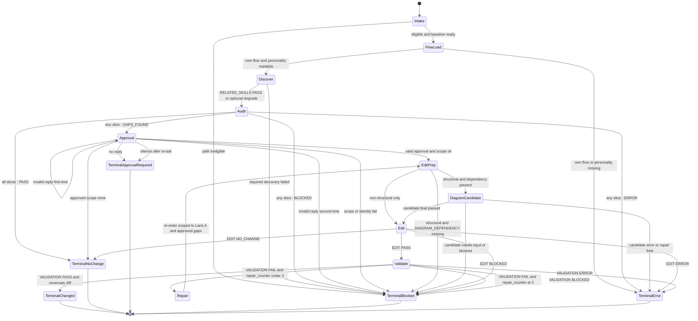

# Improving Skill Definition Flow

Illustrative rendering of the `improving-skill-definition` finite-state machine (`stateDiagram-v2`). The normative source for states, transitions, guards, and terminals is [`state-machine.md`](./state-machine.md); this diagram must not introduce behavior, and the state machine wins on any drift. Any FSM change updates this diagram and the `SKILL.md` overview in the same edit.

## Rules Summary (normative text lives in `state-machine.md`)

- Routing: `: ERROR`, then `: BLOCKED`, then `: GAPS_FOUND`, then all `: PASS`.
- Audit dispatch: the six auditors are an independent read-only fan-out; the join waits for all six reports and synthesis merges in registry order, so concurrent and serial dispatch are equivalent.
- Approval: only a valid reply to this run's handoff opens editing; preapproval values are ignored and reported.
- Validation: Lane A findings can fail and repair; Lane B findings are follow-up only and never mutate in-run.
- Cleanup: success cleans; approval-required preserves for resume; failed runs after mutation preserve baseline, editor report, and validator report.
- Diagram edits: semantic or structural changes require a `final passed` candidate from sibling `skills/generate-flow-diagram` (supports `stateDiagram-v2`) written in the same edit; if the sibling is missing, author Mermaid manually and validate with `scripts/check-mermaid.sh` when available.
- Repair: one orchestrator-owned counter, maximum three cycles, scoped to Lane A findings and approved gaps.
- Self-improvement: gaps are marked `SAFE` or `DEFERRED`; `DEFERRED` gaps are not applied during the same run. Exception: when `SELF_IMPROVEMENT_RUN=true` and the user approves structural redefine gaps (execution SoT / state-machine rewrite), those approved gaps are marked `SAFE` so they can land in the same run.
