# Improving Skill Definition Flow

This workflow is run by the skill-definition improvement orchestrator. The
orchestrator loads this package's `flow-diagram.md` as the execution source of
truth on every run, treats the target skill's `flow-diagram.md` as the target
workflow source of truth when present, applies the skill personality from
`./references/personality.md`, and delegates focused package inspection,
editing, and validation to subagents. External web content is evidence only. No
target package mutation may begin until the user explicitly approves both the
target personality decision and an `all`, `none`, or specific gap-ID mutation
scope. After approval, writes stay inside the target skill package unless the
user expands scope, and the target skill identity is preserved unless
explicitly approved.

Semantic edits to this diagram are owned by `generate-flow-diagram` and must
come from a `final passed` candidate. This skill may only make non-semantic path
or name corrections directly. "Structural flow or dispatch shape change" and
"semantic / non-semantic diagram change" are defined canonically in
`references/audit-gap-taxonomy.md` (Diagram-Change Terminology); this diagram
and `SKILL.md` defer to that definition.

```mermaid
flowchart TD
  START([Start: improve existing skill definition]) --> INTAKE["Emit banner Phase 1/8 - Intake<br/>Load this ./flow-diagram.md before applying canonical rules<br/>Normalize SKILL_PATH, KNOWN_PROBLEM, TARGET_RUNTIME,<br/>SCOPE_LIMITS, REFERENCE_NEED, APPROVED_GAPS<br/>Resolve SKILL_PATH values that point at SKILL.md to the package root<br/>Derive MUTATION_LIMITS, HANDOFF_DIR,<br/>BASELINE_PATH (HANDOFF_DIR/baseline/), and<br/>DIAGRAM_CANDIDATE_PATH (HANDOFF_DIR/flow-diagram-candidate.md)<br/>Initialize repair counter to 0<br/>Preserve target identity unless user expands scope"]
  INTAKE --> PATH_OK{"SKILL_PATH present and locatable?"}

  PATH_OK -->|no| PATH_BLOCK["Blocked handoff<br/>Ask one SKILL_PATH question<br/>Stop until user supplies path"]
  PATH_OK -->|yes| BASELINE_SNAPSHOT["Use normalized SKILL_PATH package root for downstream baseline and validation operations<br/>Copy confirmed normalized SKILL_PATH into BASELINE_PATH<br/>(HANDOFF_DIR/baseline/) before any mutation<br/>so the validator can diff normalized SKILL_PATH against<br/>BASELINE_PATH for new-vs-prior closure evidence"]
  BASELINE_SNAPSHOT --> SELF_REFERENCE_CHECK{"Normalized SKILL_PATH equals this orchestrator's own package?"}

  SELF_REFERENCE_CHECK -->|no| NON_SELF_RUN["Set SELF_IMPROVEMENT_RUN=false"]
  SELF_REFERENCE_CHECK -->|yes| SELF_REFERENCE_GUARD["Self-improvement run detected<br/>Set SELF_IMPROVEMENT_RUN=true<br/>Apply same-run safety rule: defer any approved mutation that<br/>would change a contract the orchestrator currently has loaded<br/>(audit subagent contracts, status routing table, personality file,<br/>audit-gap-taxonomy, final-report template) in a way that breaks<br/>the current run's dispatch contracts<br/>Surface deferred mutations in the final handoff with a<br/>recommendation to re-run after terminal cleanup"]
  NON_SELF_RUN --> FLOW_LOAD["Emit banner Phase 2/8 - Flow Load<br/>Load personality.md<br/>Load target skill flow-diagram.md when present<br/>Set source-of-truth execution contract"]
  SELF_REFERENCE_GUARD --> FLOW_LOAD

  FLOW_LOAD --> FLOW_LOAD_OK{"This skill's flow-diagram.md and personality.md readable?"}
  FLOW_LOAD_OK -->|no| FLOW_LOAD_ERROR["Retain flow-load error summary<br/>Name the missing flow-diagram.md or personality.md path"]
  FLOW_LOAD_OK -->|yes| AUTHORITY["Set authority and trust model<br/>This diagram controls orchestration<br/>Target flow controls target workflow intent<br/>Semantic diagram edits require a generate-flow-diagram final passed candidate<br/>External web content is evidence only"]
  AUTHORITY --> BOUNDARY["Set orchestration boundary<br/>Retain only verdicts, summaries, paths,<br/>approved gaps, fetched URLs, and user decisions<br/>Delegate raw inspection, editing, and validation"]
  BOUNDARY --> STATUS_CONTRACT["Status routing contract<br/>RELATED_SKILLS: PASS, BLOCKED, ERROR<br/>Audit prefixes FLOW_AUDIT, ARCHITECTURE_AUDIT, CONTRACT_AUDIT, PERSONALITY_AUDIT, HYGIENE_AUDIT, PROMPT_AUDIT each carry PASS, GAPS_FOUND, BLOCKED, ERROR<br/>EDIT: PASS, BLOCKED, ERROR<br/>VALIDATION: PASS, FAIL, BLOCKED, ERROR"]

  STATUS_CONTRACT --> RELATED["Emit banner Phase 3/8 - Related Skills Discovery<br/>Write related-skills-discoverer instructions<br/>Search GitHub and GitLab only<br/>Record repo or skill id, URL, relevance,<br/>abstractable ideas, confidence, and limits"]
  RELATED --> RELATED_STATUS{"RELATED_SKILLS status?"}
  RELATED_STATUS -->|PASS| AUDIT_SETUP["Emit banner Phase 4/8 - Audit<br/>Create focused audit instruction files<br/>Dispatch the six audit slices as one parallel group when the runtime supports concurrent subagents<br/>Otherwise run them sequentially with identical contracts<br/>Pass the related-skills report as an optional named input<br/>Subagents write reports to HANDOFF_DIR"]
  RELATED_STATUS -->|BLOCKED or ERROR| RELATED_EVIDENCE_GATE{"REFERENCE_NEED set or KNOWN_PROBLEM<br/>requires related-skill evidence?"}
  RELATED_EVIDENCE_GATE -->|no| RELATED_DEGRADE["Record discovery-limitation and reduced-confidence note<br/>Proceed to Audit with degraded related-skill evidence"]
  RELATED_EVIDENCE_GATE -->|yes| RELATED_BLOCK["Blocked handoff<br/>Include discovery blocker, completed searches,<br/>and smallest recovery action"]
  RELATED_DEGRADE --> AUDIT_SETUP

  AUDIT_SETUP --> AUDIT_GROUP["Focused audit slices (independent parallel group)<br/>Flow coherence and diagram delegation<br/>Subagent architecture and parallelism<br/>Contracts, statuses, and priority tiers<br/>Personality and reuse lens<br/>Package hygiene and best practices<br/>Prompt sufficiency and demotion"]
  AUDIT_GROUP --> AUDIT_SYNTH["Orchestrator synthesizes audit reports (covers G_MANDATE_COVERAGE)<br/>Build version, from, to, intent, audit_status_summary,<br/>overall_verdict, gap_inventory, mutation_plan,<br/>quality_gate_plan, out_of_scope_findings,<br/>and required aggregate keys<br/>Include architecture_advisory when SELF_IMPROVEMENT_RUN=true<br/>Write synthesis to HANDOFF_DIR/audit-synthesis-report.yaml (AUDIT_REPORT_PATH)<br/>Keep facts, risks, blockers, recommendations,<br/>rejected alternatives, and open questions distinct"]
  AUDIT_SYNTH --> AUDIT_STATUS{"Audit slice statuses?"}

  AUDIT_STATUS -->|all audit prefixes PASS no gaps| FINAL_NO_CHANGE["Emit banner Phase 8/8 - Handoff<br/>Load final-report-template.md<br/>Return no-change handoff with evidence,<br/>personality assessment, rejected optional improvements,<br/>related-skill limits, and validation limits"]
  AUDIT_STATUS -->|any audit prefix GAPS_FOUND| APPROVAL_HANDOFF["Emit banner Phase 5/8 - Approval<br/>Load final-report-template.md<br/>Prepare approval-required handoff<br/>Include personality recommendation, gap IDs,<br/>priority, related-skill evidence, mutation plan,<br/>quality gate plan, and no-proceed conditions"]
  AUDIT_STATUS -->|any audit prefix BLOCKED| AUDIT_BLOCK["Blocked handoff<br/>Include blocked slice, completed checks,<br/>and smallest recovery action"]
  AUDIT_STATUS -->|any audit prefix ERROR| AUDIT_ERROR["Retain audit error summary"]

  APPROVAL_HANDOFF --> SENSITIVE_GATE["Human gate details<br/>Action: mutate target skill package<br/>Target: files inside SKILL_PATH<br/>Reason: close audited gaps<br/>Risk: workflow drift, scope creep, or identity change<br/>Safer alternative: approval-required handoff only"]
  SENSITIVE_GATE --> APPROVAL_READY{"User explicitly approved personality decision<br/>and approved all, none, or specific gap IDs?"}

  APPROVAL_READY -->|no| FINAL_APPROVAL_REQUIRED["Emit banner Phase 8/8 - Handoff<br/>Return approval-required handoff<br/>Ask for personality decision plus all, none, or gap IDs<br/>Stop before mutation"]
  APPROVAL_READY -->|yes| APPROVED_NONE{"Approved gap scope is none?"}
  APPROVED_NONE -->|yes| FINAL_NO_CHANGE
  APPROVED_NONE -->|no| SCOPE_GATE{"Approved mutations inside SCOPE_LIMITS and MUTATION_LIMITS<br/>and target identity preserved?"}

  SCOPE_GATE -->|no| SCOPE_BLOCK["Blocked handoff<br/>Ask one scope or identity question<br/>Stop until user decides"]
  SCOPE_GATE -->|yes| EDIT_PREP["Emit banner Phase 6/8 - Edit<br/>Determine whether approved gaps change flow structure or dispatch shape<br/>(structural change is defined in audit-gap-taxonomy.md)"]

  EDIT_PREP --> DIAGRAM_SYNC{"Approved or repair changes alter<br/>flow structure or dispatch shape?"}
  DIAGRAM_SYNC -->|yes| DIAGRAM_REVIEW["Request generate-flow-diagram candidate (first-party sibling skill)<br/>Write candidate to HANDOFF_DIR/flow-diagram-candidate.md (DIAGRAM_CANDIDATE_PATH)<br/>Require a final passed candidate before the editor applies any semantic flow-diagram.md change"]
  DIAGRAM_SYNC -->|no| EDIT_APPLY
  DIAGRAM_REVIEW --> DIAGRAM_REVIEW_STATUS{"Diagram candidate completion state?"}
  DIAGRAM_REVIEW_STATUS -->|final passed| EDIT_APPLY
  DIAGRAM_REVIEW_STATUS -->|needs confirmation or needs input| EDIT_BLOCK
  DIAGRAM_REVIEW_STATUS -->|blocked| EDIT_BLOCK
  DIAGRAM_REVIEW_STATUS -->|error or repair limit reached| DIAGRAM_REVIEW_ERROR["Retain diagram-review error summary"]

  EDIT_APPLY["Write skill-definition-editor instructions<br/>Apply only approved gap mutations inside the target package<br/>For self-improvement, skip approved gaps marked DEFERRED in architecture_advisory<br/>When a final passed candidate exists at DIAGRAM_CANDIDATE_PATH,<br/>the editor writes it into flow-diagram.md in the SAME edit<br/>Editor returns BLOCKED if a structural gap is approved without an available final passed candidate<br/>During repair, scope the edit to failed validation checks only"]
  EDIT_APPLY --> EDIT_STATUS{"EDIT status?"}
  EDIT_STATUS -->|PASS| VALIDATE["Emit banner Phase 7/8 - Validate (covers G_GAP_CLOSURE, G_FLOW_SYNC, G_BEST_PRACTICES_COMPLIANCE)<br/>Write skill-package-validator instructions<br/>Check approved-gap closure, diagram/SKILL/subagent coherence,<br/>audit-synthesis schema and advisory enforcement,<br/>priority and status contracts, strict file-size limits,<br/>related-discovery scope, prompt sufficiency,<br/>best-practices compliance, and mutation boundaries"]
  EDIT_STATUS -->|BLOCKED| EDIT_BLOCK["Blocked handoff<br/>Include edit blocker and smallest user decision"]
  EDIT_STATUS -->|ERROR| EDIT_ERROR["Retain edit error summary"]

  VALIDATE --> VALIDATION_STATUS{"VALIDATION status?"}
  VALIDATION_STATUS -->|PASS| FINAL_CHANGED["Emit banner Phase 8/8 - Handoff<br/>Load final-report-template.md<br/>Return changed handoff with material issues,<br/>approved gaps closed, files changed, validation,<br/>resources, and residual risks"]
  VALIDATION_STATUS -->|FAIL| RETRY_GATE{"Repair counter &lt; 3?"}
  VALIDATION_STATUS -->|BLOCKED| VALIDATION_BLOCK["Blocked handoff<br/>Include validation blocker and recovery action"]
  VALIDATION_STATUS -->|ERROR| VALIDATION_ERROR["Retain validation error summary"]

  RETRY_GATE -->|yes| REPAIR_PREP["Emit banner Phase 6/8 - Edit<br/>Increment orchestrator-held repair counter<br/>Scope edit to failed validation checks only<br/>Keep original personality and gap approvals"]
  RETRY_GATE -->|no| FAIL_BLOCK["Blocked handoff<br/>Validation still failing after three repairs<br/>Include failed checks, attempted repairs, and resume condition"]
  REPAIR_PREP --> DIAGRAM_SYNC

  FINAL_APPROVAL_REQUIRED --> APPROVAL_REQUIRED([Decision: approval required])
  FINAL_NO_CHANGE --> NO_CHANGE([Decision: no change])
  FINAL_CHANGED --> CHANGED([Decision: changed])

  PATH_BLOCK --> FINAL_BLOCKED
  RELATED_BLOCK --> FINAL_BLOCKED
  AUDIT_BLOCK --> FINAL_BLOCKED
  SCOPE_BLOCK --> FINAL_BLOCKED
  EDIT_BLOCK --> FINAL_BLOCKED
  FAIL_BLOCK --> FINAL_BLOCKED
  VALIDATION_BLOCK --> FINAL_BLOCKED
  FINAL_BLOCKED["Emit banner Phase 8/8 - Handoff<br/>Load final-report-template.md<br/>Return blocked handoff with reason,<br/>question, completed checks, and resume condition"] --> BLOCKED([Decision: blocked])

  FLOW_LOAD_ERROR --> FINAL_ERROR
  AUDIT_ERROR --> FINAL_ERROR
  EDIT_ERROR --> FINAL_ERROR
  DIAGRAM_REVIEW_ERROR --> FINAL_ERROR
  VALIDATION_ERROR --> FINAL_ERROR
  FINAL_ERROR["Emit banner Phase 8/8 - Handoff<br/>Load final-report-template.md<br/>Return error handoff with failed condition,<br/>known context, and recovery"] --> ERROR([Decision: error])

  classDef guard fill:#fff3cd,stroke:#856404,color:#000;
  classDef check fill:#e7f1ff,stroke:#0b5ed7,color:#000;
  classDef decision fill:#f8f9fa,stroke:#495057,color:#000;
  classDef human fill:#f3e8ff,stroke:#6f42c1,color:#000;
  classDef output fill:#e8f5e9,stroke:#2e7d32,color:#000;
  classDef success fill:#e8f5e9,stroke:#2e7d32,color:#000;
  classDef stop fill:#fdecea,stroke:#b02a37,color:#000;

  class FLOW_LOAD,AUTHORITY,BOUNDARY,STATUS_CONTRACT,SENSITIVE_GATE,SELF_REFERENCE_GUARD guard;
  class BASELINE_SNAPSHOT,RELATED,RELATED_DEGRADE,AUDIT_SETUP,AUDIT_GROUP,AUDIT_SYNTH,EDIT_PREP,EDIT_APPLY,DIAGRAM_REVIEW,VALIDATE,REPAIR_PREP check;
  class PATH_OK,SELF_REFERENCE_CHECK,FLOW_LOAD_OK,RELATED_STATUS,RELATED_EVIDENCE_GATE,AUDIT_STATUS,APPROVAL_READY,APPROVED_NONE,SCOPE_GATE,DIAGRAM_SYNC,DIAGRAM_REVIEW_STATUS,EDIT_STATUS,VALIDATION_STATUS,RETRY_GATE decision;
  class PATH_BLOCK,RELATED_BLOCK,AUDIT_BLOCK,APPROVAL_HANDOFF,FINAL_APPROVAL_REQUIRED,SCOPE_BLOCK,EDIT_BLOCK,FAIL_BLOCK,VALIDATION_BLOCK human;
  class FINAL_NO_CHANGE,FINAL_CHANGED,FINAL_BLOCKED,FINAL_ERROR output;
  class NO_CHANGE,CHANGED success;
  class APPROVAL_REQUIRED human;
  class BLOCKED,ERROR,FLOW_LOAD_ERROR,AUDIT_ERROR,EDIT_ERROR,DIAGRAM_REVIEW_ERROR,VALIDATION_ERROR stop;
```

Handoff-file dispatch: Each RELATED_SKILLS, AUDIT, EDIT, VALIDATE, and REPAIR
dispatch follows a bidirectional write-dispatch-read-cleanup pattern. During
Intake, the orchestrator resolves `HANDOFF_DIR` to the repository-root anchored
`.handoffs/improving-skill-definition/` directory. Before dispatch, the
orchestrator writes the full per-subagent payload to
`HANDOFF_DIR/<subagent-name>-instructions.yaml` per the YAML handoff contract
in `docs/best-practices/handoff-file-dispatch.md`. It then dispatches each
subagent with a compact pointer prompt that names only the subagent contract
file, that instruction file, the required report path, and the expected YAML
keys. Each subagent writes its contracted report to
`HANDOFF_DIR/<subagent-name>-report.yaml`. The orchestrator parses every
required YAML report before status routing and retains only report verdicts,
summaries, relevant paths, approved gaps, fetched URLs, and user decisions in
context. If a report is missing or unreadable, the orchestrator may use only
an enumerated compact `BLOCKED` or `ERROR` status from the dispatch reply; if
neither exists, it routes to `error` with the missing report path named.
Terminal cleanup deletes all workflow-created files inside `HANDOFF_DIR`,
including `*-instructions.yaml`, `*-report.yaml`, and any `run-context.yaml`,
plus `*-candidate.md` and `baseline/` (the flow-diagram candidate stays
Markdown because it is the staged Mermaid diagram content the editor writes
verbatim into `flow-diagram.md`, not an inter-agent message); `HANDOFF_DIR`
may be removed only when empty.

Related-skills discovery rule (canonical home; `SKILL.md` Status Routing
Contract and Execution step 3 are documented pointers here): Discovery must
search GitHub and GitLab only, before audit. Sparse or low-confidence results
are reported with confidence and limits, not padded with other platforms.
`RELATED_SKILLS: PASS` requires structured source records; `BLOCKED` requires
the smallest recovery action; `ERROR` names the failed condition. Evidence-only
discovery failures degrade and continue: on `BLOCKED` or `ERROR` the
orchestrator proceeds to Audit carrying a recorded discovery-limitation and
reduced-confidence note, unless `REFERENCE_NEED` is set or `KNOWN_PROBLEM`
specifically requires related-skill evidence, in which case it routes to the
blocked handoff instead.

Audit parallelism rule (canonical home; `SKILL.md` Execution step 4 is a
documented pointer here): The six focused audit slices are an independent
parallel group with separable inputs and reports and no ordering dependency
among them.
The orchestrator dispatches them concurrently when the runtime supports parallel
subagents and otherwise runs them sequentially with identical contracts; the
result is the same gap inventory either way. The related-skills report is an
optional named input to each slice, not a blocking dependency.

Audit synthesis rule: The orchestrator, not a super-auditor, synthesizes
focused audit reports. Audit status precedence is based on suffixes from
prefix-qualified audit statuses: any audit prefix `ERROR`, then any audit
prefix `BLOCKED`, then any audit prefix `GAPS_FOUND`, then all audit prefixes
`PASS`. Focused audit slices must cover flow
coherence, subagent architecture and parallelism, contracts/status/priority,
personality and reuse-vs-add reasoning, package hygiene and best practices, and
prompt sufficiency. Each slice reports a prefix-qualified audit status
(`FLOW_AUDIT: PASS`, `CONTRACT_AUDIT: GAPS_FOUND`, etc.); the orchestrator
aggregates suffixes only for precedence and branch labels. The orchestrator
writes the synthesized result to
`HANDOFF_DIR/audit-synthesis-report.yaml` (the `AUDIT_REPORT_PATH` consumed by
the editor and validator); this synthesis artifact is complete only when it
contains the non-conditional required top-level schema keys `version`, `from`,
`to`, `intent`, `audit_status_summary`, `overall_verdict`, `gap_inventory`,
`mutation_plan`, `quality_gate_plan`, `out_of_scope_findings`, and the required
aggregate keys from `references/audit-synthesis-schema.md`. When
`SELF_IMPROVEMENT_RUN=true`, it must also contain `architecture_advisory` with a
caveat and one `SAFE` or `DEFERRED` entry for every inventory gap.

Diagram-sync rule (canonical home; `SKILL.md` step 9 and
`subagents/skill-definition-editor.md` instruction 9 are documented hoists that
point here): When approved or repair-cycle changes alter flow structure or
dispatch shape, the orchestrator obtains a `generate-flow-diagram` `final passed`
candidate at `DIAGRAM_CANDIDATE_PATH` BEFORE the editor applies, and the editor
writes that candidate into `flow-diagram.md` in the same edit cycle. The editor
returns `EDIT: BLOCKED` if an approved structural gap has no available
`final passed` candidate, so a structural edit can never report `EDIT: PASS`
with a stale diagram. Repair cycles re-enter through the same `DIAGRAM_SYNC`
decision, so a structural repair also refreshes the diagram before
re-validation.

Diagram-candidate rule: `generate-flow-diagram` is a first-party sibling skill
(`skills/generate-flow-diagram`), not one of this skill's registry subagents. It
returns one of the boundary completion states `final passed`, `needs confirmation`,
`needs input`, `blocked`, `error`, or `repair limit reached`. Its candidate is
written to `HANDOFF_DIR/flow-diagram-candidate.md` (`DIAGRAM_CANDIDATE_PATH`),
and only a `final passed` candidate may drive a semantic `flow-diagram.md`
change. A `DIAGRAM_REVIEW` `error` or `repair limit reached` routes to the error
handoff; `needs confirmation`, `needs input`, or `blocked` routes to the edit
blocked handoff.

Baseline-snapshot rule (canonical home; `SKILL.md` step 1 and
`subagents/skill-package-validator.md` are documented hoists that point here):
`BASELINE_PATH` is `HANDOFF_DIR/baseline/`; after `PATH_OK` confirms `SKILL_PATH` is present and locatable, the orchestrator resolves `SKILL_PATH` values that point at a `SKILL.md` file to that file's package root. The normalized runtime value remains named `SKILL_PATH` and is the package root for downstream baseline and validation operations.
The orchestrator copies the normalized `SKILL_PATH` package root into `BASELINE_PATH` before any mutation; the validator may diff the normalized `SKILL_PATH` package root against `BASELINE_PATH` for new-vs-prior closure evidence; terminal cleanup removes `BASELINE_PATH` alongside other workflow-created files.

Self-reference rule (canonical home; `SKILL.md` is a documented hoist that
points here): `SELF_REFERENCE_CHECK` detects self-improvement runs (`SKILL_PATH`
equals this orchestrator's package); on yes, the `SELF_REFERENCE_GUARD` applies
the same-run safety rule above, audit synthesis records `SAFE` or `DEFERRED`
for every inventory gap, and the editor may mutate only approved gaps marked
`SAFE`; on no, normal Phase 2 Flow Load proceeds.

Gate ID mapping: `VALIDATE` covers `G_GAP_CLOSURE`, `G_FLOW_SYNC`, and
`G_BEST_PRACTICES_COMPLIANCE`; `AUDIT_SYNTH` covers `G_MANDATE_COVERAGE`; and
every `FINAL_*` handoff node (`FINAL_NO_CHANGE`, `FINAL_APPROVAL_REQUIRED`,
`FINAL_CHANGED`, `FINAL_BLOCKED`, `FINAL_ERROR`) covers `G_HANDOFF_COMPLETENESS`.

Priority rule: Priority tiers are canonical in
`references/audit-gap-taxonomy.md` (Priority Tiers); this diagram and `SKILL.md`
defer to it and must not restate the tiers.

Status-contract rule: The subagent status enums are canonical in the `SKILL.md`
Status Routing Contract table. The `STATUS_CONTRACT` node in the diagram above is
an intentional in-diagram summary that points to that table for at-a-glance
routing; the table governs if the two ever disagree.

Repair-counter rule: The repair counter is orchestrator-held run state,
initialized to 0 during Intake and incremented at `REPAIR_PREP` before each
re-dispatch. `RETRY_GATE` allows a repair only while the counter is below 3.

Phase transition markers: Every action node above instructs the orchestrator to
make the phase transition visible before its other actions, using this repo's
forty-hyphen `Phase N/8 - <Name>` banner convention unless the host UI supplies
a better native marker. `REPAIR_PREP` re-emits `Phase 6/8 - Edit`, and the
subsequent re-validation re-emits `Phase 7/8 - Validate`. Phase markers are an
orchestrator concern; subagents do not emit them.

Readiness rule: A final handoff is ready only after
`./references/final-report-template.md` is loaded and the outcome is one of
`approval required`, `changed`, `no change`, `blocked`, or `error`. No mutation
begins until the user explicitly approves both the target personality decision
and the gap scope. A `VALIDATION: FAIL` may trigger at most three targeted
editor/validator repair cycles; after the third failed validation, return
`blocked` with remaining findings and attempted repairs.

Quality gate rule: validation must check approved-gap closure,
`flow-diagram.md`/`SKILL.md`/subagent coherence, semantic diagram delegation,
priority and status contracts, related-discovery GitHub/GitLab scope,
prompt-sufficiency coverage, personality consistency, subagent necessity,
standalone packaging, path validity, mutation boundaries, and strict file-size
limits per `references/audit-gap-taxonomy.md` (File Size Caps). Scripts must be
simple, direct, and human-readable, with no minified, compressed, obfuscated,
or obstructed logic.
