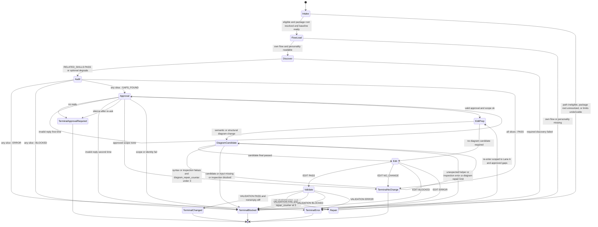

# Improving Skill Definition Flow

Illustrative rendering of the `improving-skill-definition` finite-state machine (`stateDiagram-v2`). The normative source for states, transitions, guards, and terminals is [`state-machine.md`](./state-machine.md); this diagram must not introduce behavior, and the state machine wins on any drift. Any FSM change updates this diagram and the `SKILL.md` overview in the same edit.

```mermaid
stateDiagram-v2
  [*] --> Intake

  Intake --> FlowLoad: eligible and package root resolved and baseline ready
  Intake --> TerminalBlocked: path ineligible, package root unresolved, or limits underivable

  FlowLoad --> Discover: own flow and personality readable
  FlowLoad --> TerminalError: own flow or personality missing

  Discover --> Audit: RELATED_SKILLS PASS or optional degrade
  Discover --> TerminalBlocked: required discovery failed

  Audit --> TerminalError: any slice : ERROR
  Audit --> TerminalBlocked: any slice : BLOCKED
  Audit --> Approval: any slice : GAPS_FOUND
  Audit --> TerminalNoChange: all slices : PASS

  Approval --> TerminalApprovalRequired: no reply
  Approval --> Approval: invalid reply first time
  Approval --> TerminalBlocked: invalid reply second time
  Approval --> TerminalApprovalRequired: silence after re-ask
  Approval --> TerminalNoChange: approved scope none
  Approval --> TerminalBlocked: scope or identity fail
  Approval --> EditPrep: valid approval and scope ok

  EditPrep --> DiagramCandidate: semantic or structural diagram change
  EditPrep --> Edit: no diagram candidate required

  DiagramCandidate --> Edit: candidate final passed
  DiagramCandidate --> DiagramCandidate: syntax or inspection failure and diagram_repair_counter under 3
  DiagramCandidate --> TerminalBlocked: candidate or input missing or inspection blocked
  DiagramCandidate --> TerminalError: unexpected helper or inspection error or diagram repair limit

  Edit --> Validate: EDIT PASS
  Edit --> TerminalNoChange: EDIT NO_CHANGE
  Edit --> TerminalBlocked: EDIT BLOCKED
  Edit --> TerminalError: EDIT ERROR

  Validate --> TerminalChanged: VALIDATION PASS and nonempty diff
  Validate --> Repair: VALIDATION FAIL and repair_counter under 3
  Validate --> TerminalBlocked: VALIDATION FAIL and repair_counter at 3
  Validate --> TerminalBlocked: VALIDATION BLOCKED
  Validate --> TerminalError: VALIDATION ERROR

  Repair --> EditPrep: re-enter scoped to Lane A and approved gaps

  TerminalChanged --> [*]
  TerminalNoChange --> [*]
  TerminalApprovalRequired --> [*]
  TerminalBlocked --> [*]
  TerminalError --> [*]
```
