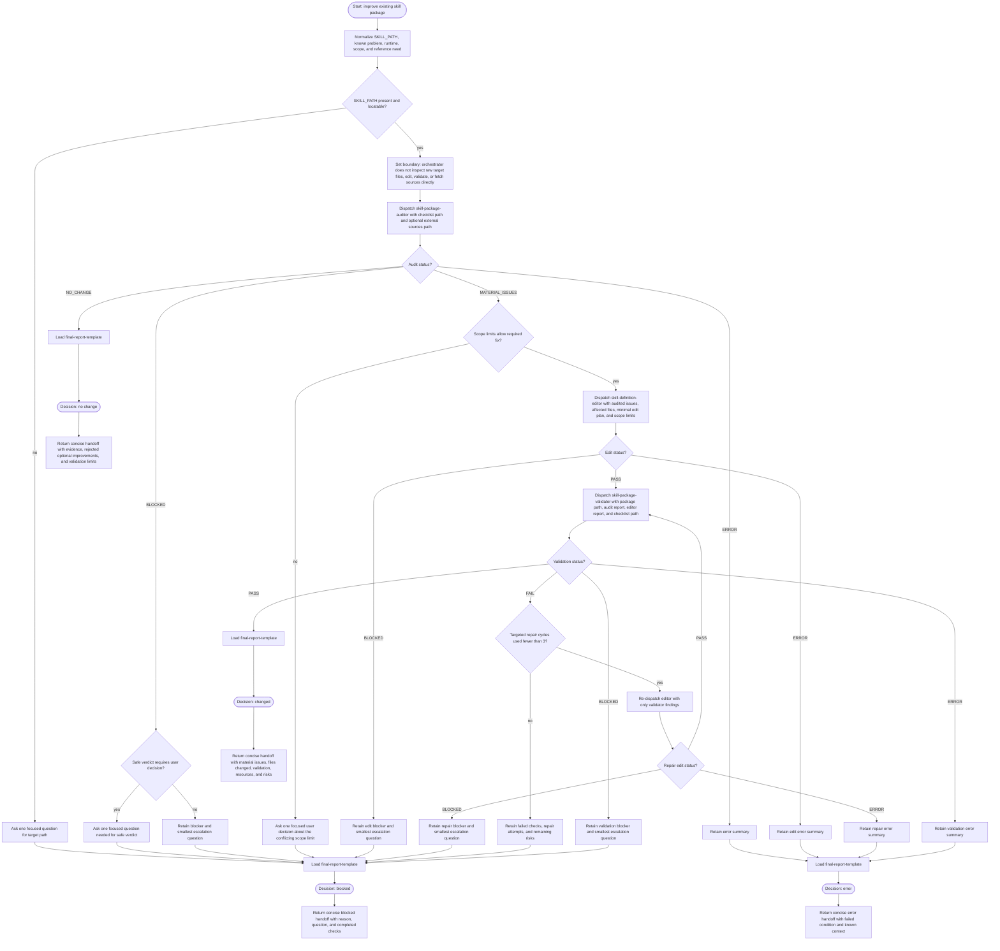

# Improving Skill Definitions Flow

This workflow is run by a skill-definition improvement orchestrator. The
orchestrator normalizes inputs, dispatches focused subagents, and keeps only
statuses, findings, file paths, fetched URLs, and concise summaries. Raw package
inspection, editing, validation, and external-source lookup happen inside
subagents or bundled references. Edits occur only after an evidence-backed
material issue, and the package must remain standalone with relative bundled
paths.

