# Improving Test Suites

This flow shows how the orchestrator in [`SKILL.md`](./SKILL.md) turns
`TARGET_TEST_FILES` into the smallest useful test harness while delegating raw
inspection, edits, source fetching, and validation to co-located subagents.
Mutations stay bounded to tests and directly related test helpers unless the
user explicitly approves production-code fixes.

```mermaid
flowchart TD
  START([Start: improve target test suite]) --> NORMALIZE[Normalize dispatch packet: TARGET_TEST_FILES, USER_GOAL, TEST_COMMAND, SCOPE_LIMITS, REFERENCE_NEED]
  NORMALIZE --> HAS_TARGET{TARGET_TEST_FILES present or inferable?}
  HAS_TARGET -->|no| ASK_TARGET[Ask one focused clarification for target test files]
  ASK_TARGET --> BLOCKED([Blocked: missing required target])
  HAS_TARGET -->|yes| LOAD_ORCH[Load ./references/orchestration-protocol.md]

  LOAD_ORCH --> VALUE[Dispatch ./subagents/test-value-reviewer.md]
  VALUE --> VALUE_REPORT[Receive compact value report: protected behaviors, gaps, risks, suggested reviewers]
  VALUE_REPORT --> EXT_NEED{External testing, framework, or security source materially needed?}
  EXT_NEED -->|yes| FETCH_SCOPE{Allowed by user docs or ./references/external-sources.md?}
  EXT_NEED -->|no| ROUTE_API{API, schema, auth, security, or unsafe input risk?}
  FETCH_SCOPE -->|yes| FETCH[Delegate allowed source fetching and record URLs]
  FETCH_SCOPE -->|no| ASK_SOURCE[Ask before unsupported external source use]
  FETCH --> ROUTE_API
  ASK_SOURCE --> BLOCKED

  ROUTE_API -->|yes| API_REVIEW[Dispatch ./subagents/api-security-reviewer.md]
  ROUTE_API -->|no| ROUTE_MAINT{Long, mock-heavy, fixture-heavy, duplicated, hard to scan, or framework-specific?}
  API_REVIEW --> API_REPORT[Receive compact API/security report]
  API_REPORT --> ROUTE_MAINT

  ROUTE_MAINT -->|yes| MAINT_REVIEW[Dispatch ./subagents/test-maintainability-reviewer.md]
  ROUTE_MAINT -->|no| SYNTHESIZE[Synthesize MINIMAL_HARNESS_DECISION from compact reports and ./references/test-quality-heuristics.md]
  MAINT_REVIEW --> MAINT_REPORT[Receive compact maintainability report]
  MAINT_REPORT --> SYNTHESIZE

  SYNTHESIZE --> NEED_INFO{Subagent returned BLOCKED or NEEDS_CLARIFICATION?}
  NEED_INFO -->|yes| ASK_CHOICE[Ask user for the required scope, command, or decision]
  ASK_CHOICE --> BLOCKED
  NEED_INFO -->|no| SAFE_EDIT{Safe test or helper edit justified?}

  SAFE_EDIT -->|no| NO_CHANGE([No safe change: return final handoff with rationale])
  SAFE_EDIT -->|yes| MUTATION_SCOPE{Edit stays within tests and directly related helpers?}
  MUTATION_SCOPE -->|yes| REFACTOR[Dispatch ./subagents/test-refactorer.md with bounded edit packet]
  MUTATION_SCOPE -->|no| REQUEST_PROD_APPROVAL[Ask user to approve production-code fix with target, reason, risk, reversibility, and safer alternative]

  REQUEST_PROD_APPROVAL --> PROD_APPROVAL{User approves production-code fix?}
  PROD_APPROVAL -->|approved| PROD_ALLOWED[Record approval and include approved production scope in refactor packet]
  PROD_APPROVAL -->|declined| BUG_EXPOSED([Production bug exposed: handoff without production edit])
  PROD_ALLOWED --> REFACTOR

  REFACTOR --> REFACTOR_REPORT[Receive changed files, skipped edits, risks, and assumptions]
  REFACTOR_REPORT --> NEED_VALIDATION{TEST_COMMAND supplied or validation command safely inferable?}
  NEED_VALIDATION -->|no| ASK_COMMAND[Ask for validation command or scope-limited validation choice]
  ASK_COMMAND --> BLOCKED
  NEED_VALIDATION -->|yes| VALIDATE[Dispatch ./subagents/test-validator.md to run scoped validation]

  VALIDATE --> VALIDATION_RESULT{Validation result}
  VALIDATION_RESULT -->|pass| FINAL_CHANGED[Load ./references/final-handoff-template.md and report changed/pass]
  VALIDATION_RESULT -->|blocked| LOAD_REPAIR[Load ./references/repair-protocol.md]
  VALIDATION_RESULT -->|error| ERROR_STATE([Error: return validator error and recovery context])
  VALIDATION_RESULT -->|fail| LOAD_REPAIR

  LOAD_REPAIR --> REPAIR_COUNT{Targeted repair cycles under 3?}
  REPAIR_COUNT -->|yes| REPAIR[Dispatch focused repair to test-refactorer using validator output]
  REPAIR --> VALIDATE
  REPAIR_COUNT -->|no| VALIDATION_FAILED([Validation failed after repair: return failures, changed files, risks])

  FINAL_CHANGED --> DONE([Changed/pass])
  NO_CHANGE --> DONE_NO_CHANGE([Complete: no safe change])
  BUG_EXPOSED --> DONE_BUG([Complete: production bug exposed])
  VALIDATION_FAILED --> DONE_FAILED([Complete: validation failed after repair])
  ERROR_STATE --> DONE_ERROR([Complete: error])
  BLOCKED --> DONE_BLOCKED([Complete: blocked])

  classDef guard fill:#fff3cd,stroke:#856404,color:#000;
  classDef check fill:#e7f1ff,stroke:#0b5ed7,color:#000;
  classDef decision fill:#f8f9fa,stroke:#495057,color:#000;
  classDef human fill:#f3e8ff,stroke:#6f42c1,color:#000;
  classDef output fill:#e8f5e9,stroke:#2e7d32,color:#000;
  classDef success fill:#e8f5e9,stroke:#2e7d32,color:#000;
  classDef refine fill:#fff3cd,stroke:#856404,color:#000;
  classDef stop fill:#fdecea,stroke:#b02a37,color:#000;

  class HAS_TARGET,EXT_NEED,FETCH_SCOPE,ROUTE_API,ROUTE_MAINT,NEED_INFO,SAFE_EDIT,MUTATION_SCOPE,PROD_APPROVAL,NEED_VALIDATION,VALIDATION_RESULT,REPAIR_COUNT decision;
  class NORMALIZE,LOAD_ORCH,VALUE,API_REVIEW,MAINT_REVIEW,SYNTHESIZE,REFACTOR,VALIDATE,REPAIR,FETCH check;
  class ASK_TARGET,ASK_SOURCE,ASK_CHOICE,REQUEST_PROD_APPROVAL,ASK_COMMAND human;
  class VALUE_REPORT,API_REPORT,MAINT_REPORT,REFACTOR_REPORT,PROD_ALLOWED,FINAL_CHANGED output;
  class DONE,DONE_NO_CHANGE success;
  class LOAD_REPAIR guard;
  class BLOCKED,NO_CHANGE,BUG_EXPOSED,VALIDATION_FAILED,ERROR_STATE,DONE_BUG,DONE_FAILED,DONE_ERROR,DONE_BLOCKED stop;
```

Readiness rule: return a final handoff only after the orchestrator records
changed files or no-op rationale, validation status, URLs used, risks, scope
limits, and any user approvals or blocked decisions.
