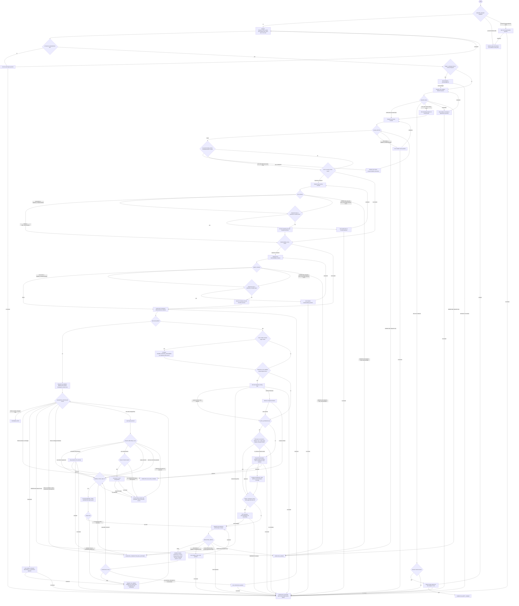

# Flow Diagram: `improving-test-suites`

This diagram is a summary. [`references/orchestration-protocol.md`](./references/orchestration-protocol.md) is the single normative routing source and overrides summary drift.

Diagram regenerated from protocol tables; edge-for-row check passed, including optional-review unrecoverable `ERROR` to `COMPLETE_ERROR`.

## Reading Conventions

- **Dispatch-retry rule.** Every edge labeled `ERROR after dispatch retry` means: on the first `ERROR` from that dispatch, retry the same dispatch once if `REPAIR_TOTAL < 3` (incrementing it); route along the drawn edge only when the retry also errors or no budget remains.
- **Ask-gate bound.** Every `ASK_*` node has the two drawn exits plus an implicit loop bound: the third occurrence of the same question at the same gate routes to `FINAL_BLOCKED`.
- **Resume packets.** Every entry into `FINAL_BLOCKED` writes a schema-valid resume packet.

## Terminal States

| Status | Meaning | Required handoff extras |
| ------ | ------- | ----------------------- |
| `CHANGED_PASS` | Approved or rails-checked edits applied, evidence-based conformance passed, counted validation passed against baseline | Coverage map with verification method per behavior; before/after collected counts |
| `COMPLETE_NO_SAFE_CHANGE` | No safe edit justified, plan declined, or pre-existing failures with no changes | No-op rationale or decline record; pre-existing risk notes |
| `COMPLETE_PRODUCTION_BUG_EXPOSED` | A production bug surfaced and the production fix was declined or out of scope | Behavior, failing evidence, why no unapproved production edit was made |
| `VALIDATION_FAILED` | Changed-file validation failed and repair was exhausted or not warranted | Repairs attempted count, baseline-diffed cause, raw-log path, workspace state, keep-or-revert record |
| `COMPLETE_ERROR` | A dispatch errored twice in a row or an unrecoverable optional-review error occurred | Error source and recovery context |
| `COMPLETE_BLOCKED` | An ask gate had no answer channel, an ask loop hit its bound, or headless rails failed | Schema-valid resume packet including all approvals |
| `COMPLETE_EMPTY_TARGET` | Resolved files contain zero collectable tests and the user chose to end | Empty-target evidence; pointer that creating a new harness is out of scope |

## Gate Inventory

Human gates, in order: stage-1 workspace acknowledgment; empty-target retarget-or-end; value/API/maintainability clarification; dual authority; plan approval with amendment re-gating; stage-2 workspace acknowledgment; refactor clarification; conformance user-decision; validation clarification; production-fix authority during repair; keep-or-revert after pre-existing failure with changes. Every gate has two exits, a schema-valid blocked resume packet, and a two-answered-retries loop bound.
