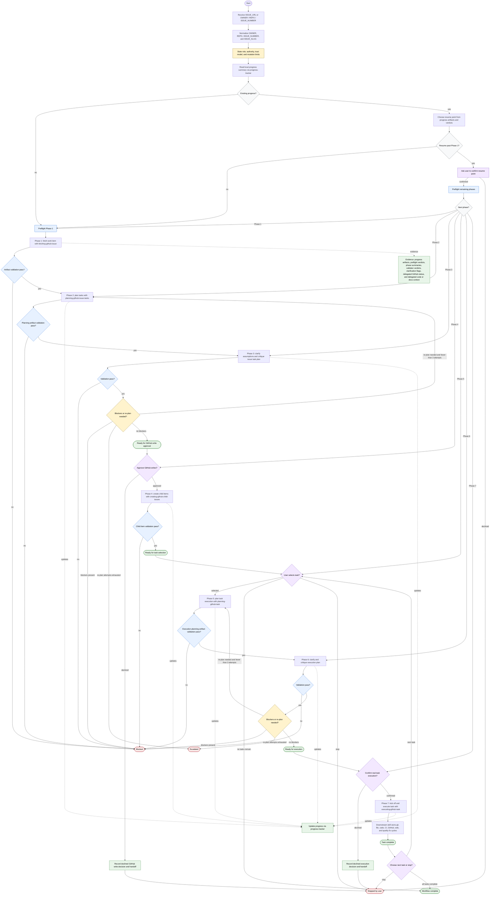

# Orchestrating GitHub Workflow

The GitHub issue workflow orchestrator thinks, decides, asks user gates, and dispatches helpers. It may derive normalized identifiers, read progress summaries, choose resume points, preflight phases, invoke downstream skills, surface summaries, and update progress through `progress-tracker`. It retains only decision-relevant summaries, current workflow state, confirmations, and failure reports. GitHub, file, git, code, CI, web, and platform mutations are delegated, and platform writes happen only through downstream skills after required user approval.

Readiness rule: advance only when the current phase artifact validates and its gate rule is satisfied. GitHub writes require explicit approval before Phase 4, task execution requires explicit confirmation before Phase 7, and task choice is always user-controlled after Phase 4 and after each completed task.

Completion states: ready for next phase, ready for GitHub write approval, ready for task selection, ready for execution, task complete, workflow complete, blocked, needs re-plan, escalated, or stopped by user.
