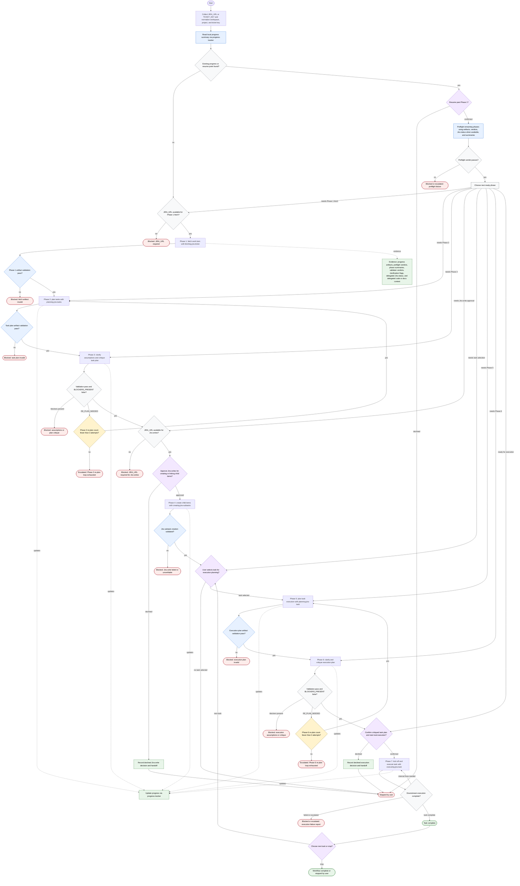

# Orchestrating Jira Workflow

The Jira ticket workflow orchestrator thinks, decides, and dispatches helpers. It may normalize identifiers, read progress through `progress-tracker`, choose resume points, preflight phases, invoke downstream skills, dispatch utility subagents, surface summaries, ask gates, and update progress. It retains only decision-relevant summaries, current workflow state, user confirmations, and failure reports, while treating downstream phase skills and validators as authoritative for their artifacts. Jira, file, git, code, CI, web, and platform mutations are delegated, and Jira writes or execution mutations happen only through downstream skills after the required human gates.

Readiness rule: advance only when the current phase artifact validates and the gate rule for the next phase is satisfied. Jira writes require explicit approval before Phase 4, task execution requires user task selection and confirmation before Phase 7, and re-plan loops escalate after three attempts.

Completion states: ready for next phase, ready for Jira write approval, ready for task selection, ready for execution, task complete, workflow complete, blocked, needs re-plan, escalated, or stopped by user.
