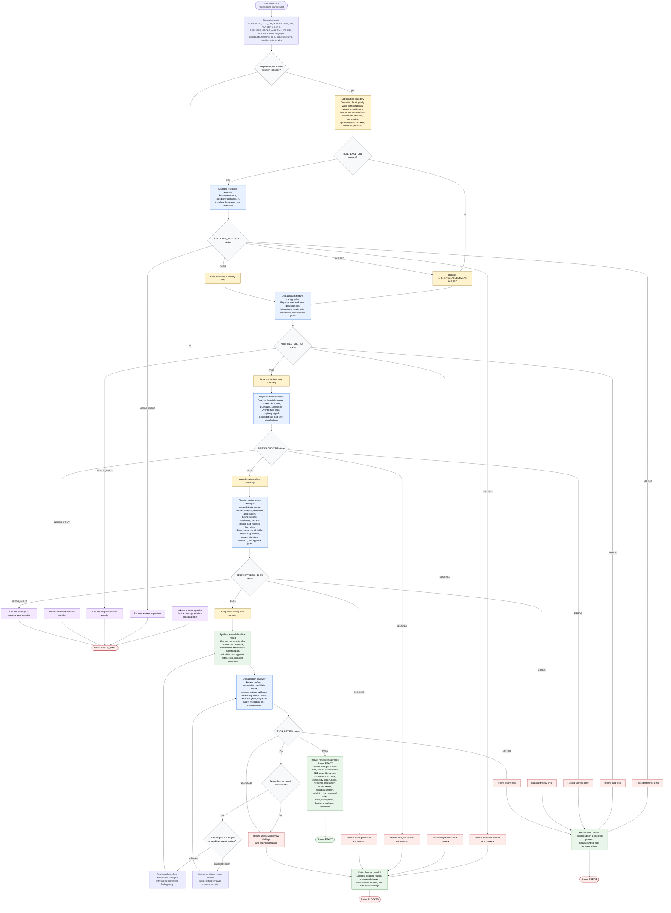

# Planning Codebase Restructuring Flow

This workflow is a planning-only architecture review orchestrated by
`planning-codebase-restructuring`. The orchestrator owns input normalization,
mutation-boundary enforcement, subagent dispatch, status routing, candidate
report synthesis, review repair loops, and final handoff. Raw repository
inspection, domain analysis, reference assessment, target-architecture
strategy, and plan review stay inside focused subagents that return concise
statuses, summaries, blockers, paths, and open questions.

Readiness rule: return `Status: READY` only after required inputs are resolved,
the mutation boundary is set, all required subagent phases return `PASS` or
the optional reference phase is recorded as `SKIPPED`, a candidate final report
is assembled from summaries only, and `plan-reviewer` returns
`PLAN_REVIEW: PASS`.

Repair rule: `PLAN_REVIEW: FAIL` may trigger at most two targeted repair
cycles. Repairs either re-dispatch the smallest responsible subagent with the
reviewer finding or revise only the candidate report section using already
reviewed summaries. After two failed cycles, return `Status: BLOCKED`.
