# Planning Codebase Restructuring Flow

This workflow is a planning-only architecture review orchestrated by
`planning-codebase-restructuring`. The orchestrator owns input normalization,
mutation-boundary enforcement, optional reference degradation, evidence
precedence, subagent dispatch, summary-contract validation, status routing,
candidate report synthesis, review repair loops, and final handoff. Raw
repository inspection, domain analysis, reference assessment,
target-architecture strategy, and plan review stay inside focused subagents
that return concise statuses, summaries, blockers, paths, and open questions.
No repository mutation is performed unless a later human approval gate
explicitly authorizes the exact action, target, risk, validation, and rollback
path.

```mermaid
flowchart TD
  START([Start: codebase restructuring plan request]) --> INTAKE["Normalize inputs<br/>CODEBASE_PATH_OR_REPOSITORY_URL, TARGET_SCOPE,<br/>BUSINESS_GOALS_AND_PAIN_POINTS, optional domain language,<br/>constraints, reference URL, success criteria, mutation authorization,<br/>and whether any reference is user-required"]
  INTAKE --> REQUIRED{"Required inputs present<br/>or safely inferable?"}
  REQUIRED -->|no| ASK_INPUT["Ask one concise question<br/>for the missing decision-changing input"]
  ASK_INPUT --> NEEDS_INPUT([Status: NEEDS_INPUT])
  REQUIRED -->|yes| BOUNDARY["Set mutation boundary<br/>Default to planning-only when authorization is absent or ambiguous<br/>Hold scope, assumptions, constraints, statuses, validated summaries,<br/>approval gates, blockers, and open questions"]

  BOUNDARY --> HAS_REF{"REFERENCE_URL present?"}
  HAS_REF -->|no| REF_SKIPPED["Record REFERENCE_ASSESSMENT: SKIPPED<br/>Use local-only planning context"]
  HAS_REF -->|yes| REF_REQUIRED{"Reference explicitly required<br/>for the plan?"}
  REF_REQUIRED -->|yes| REF["Dispatch reference-assessor<br/>Assess relevance, credibility, freshness, fit,<br/>transferable patterns, limitations, and access"]
  REF_REQUIRED -->|no| REF
  REF --> REF_STATUS{"REFERENCE_ASSESSMENT status"}
  REF_STATUS -->|PASS| REF_CONTRACT["Validate reference summary contract<br/>schema-conforming, concise, limitations included,<br/>currentness noted, and no local-evidence override"]
  REF_CONTRACT --> REF_VALID{"Reference summary usable?"}
  REF_VALID -->|yes| REF_SUMMARY["Keep validated reference summary only"]
  REF_VALID -->|no| REF_REPAIR_LIMIT{"Reference summary repair attempts used < 1?"}
  REF_REPAIR_LIMIT -->|yes| REF_REPAIR["Re-dispatch reference-assessor<br/>for targeted summary-contract repair"]
  REF_REPAIR --> REF_STATUS
  REF_REPAIR_LIMIT -->|no| REF_BAD_KIND{"Reference required?"}
  REF_BAD_KIND -->|yes| REF_BLOCKED["Record required reference blocker and recovery"]
  REF_BAD_KIND -->|no| REF_DEGRADED["Record optional reference limitation<br/>Continue with local-only planning"]
  REF_STATUS -->|SKIPPED| REF_SKIPPED
  REF_STATUS -->|NEEDS_INPUT| REF_QUESTION["Ask one reference question"]
  REF_QUESTION --> NEEDS_INPUT
  REF_STATUS -->|BLOCKED| REF_BLOCK_KIND{"Reference required?"}
  REF_BLOCK_KIND -->|yes| REF_BLOCKED
  REF_BLOCK_KIND -->|no| REF_DEGRADED
  REF_STATUS -->|ERROR| REF_ERROR_KIND{"Reference required?"}
  REF_ERROR_KIND -->|yes| REF_ERROR["Record required reference error"]
  REF_ERROR_KIND -->|no| REF_DEGRADED

  REF_SKIPPED --> CARTOGRAPHER
  REF_SUMMARY --> CARTOGRAPHER
  REF_DEGRADED --> CARTOGRAPHER
  CARTOGRAPHER["Dispatch architecture-cartographer<br/>Map structure, workflows, dependencies,<br/>integrations, safety nets, constraints, and evidence paths"] --> MAP_STATUS{"ARCHITECTURE_MAP status"}
  MAP_STATUS -->|PASS| MAP_CONTRACT["Validate architecture map summary contract<br/>schema-conforming, concise, evidence-backed,<br/>path-based, and not a raw dump"]
  MAP_CONTRACT --> MAP_VALID{"Architecture map summary usable?"}
  MAP_VALID -->|yes| MAP_SUMMARY["Keep validated architecture map summary"]
  MAP_VALID -->|no| MAP_REPAIR_LIMIT{"Map summary repair attempts used < 1?"}
  MAP_REPAIR_LIMIT -->|yes| MAP_REPAIR["Re-dispatch architecture-cartographer<br/>for targeted summary-contract repair"]
  MAP_REPAIR --> MAP_STATUS
  MAP_REPAIR_LIMIT -->|no| MAP_BLOCKED["Record map blocker and recovery"]
  MAP_STATUS -->|NEEDS_INPUT| MAP_QUESTION["Ask one scope or access question"]
  MAP_QUESTION --> NEEDS_INPUT
  MAP_STATUS -->|BLOCKED| MAP_BLOCKED
  MAP_STATUS -->|ERROR| MAP_ERROR["Record map error"]

  MAP_SUMMARY --> DOMAIN["Dispatch domain-analyst<br/>Analyze domain language, context candidates,<br/>DDD gaps, Screaming Architecture gaps,<br/>complexity signals, contradictions, and zero-state findings"]
  DOMAIN --> DOMAIN_STATUS{"DOMAIN_ANALYSIS status"}
  DOMAIN_STATUS -->|PASS| DOMAIN_CONTRACT["Validate domain analysis summary contract<br/>schema-conforming, concise, evidence-backed,<br/>zero-state findings included, and not speculative"]
  DOMAIN_CONTRACT --> DOMAIN_VALID{"Domain analysis summary usable?"}
  DOMAIN_VALID -->|yes| DOMAIN_SUMMARY["Keep validated domain analysis summary"]
  DOMAIN_VALID -->|no| DOMAIN_REPAIR_LIMIT{"Domain summary repair attempts used < 1?"}
  DOMAIN_REPAIR_LIMIT -->|yes| DOMAIN_REPAIR["Re-dispatch domain-analyst<br/>for targeted summary-contract repair"]
  DOMAIN_REPAIR --> DOMAIN_STATUS
  DOMAIN_REPAIR_LIMIT -->|no| DOMAIN_BLOCKED["Record analysis blocker and recovery"]
  DOMAIN_STATUS -->|NEEDS_INPUT| DOMAIN_QUESTION["Ask one domain-boundary question"]
  DOMAIN_QUESTION --> NEEDS_INPUT
  DOMAIN_STATUS -->|BLOCKED| DOMAIN_BLOCKED
  DOMAIN_STATUS -->|ERROR| DOMAIN_ERROR["Record analysis error"]

  DOMAIN_SUMMARY --> PRECEDENCE["Evidence precedence gate<br/>Local repository evidence, business goals, constraints,<br/>success criteria, and mutation boundary outrank external references"]
  PRECEDENCE --> REF_FIT{"Transferable reference pattern fit<br/>confirmed against local map and domain analysis?"}
  REF_FIT -->|yes| REF_AUTHORIZED["Allow confirmed reference patterns<br/>as secondary strategy input"]
  REF_FIT -->|no| REF_LIMITS_ONLY["Keep reference patterns as limitations only<br/>Plan from local evidence"]
  REF_FIT -->|not applicable| REF_LIMITS_ONLY

  REF_AUTHORIZED --> STRATEGY
  REF_LIMITS_ONLY --> STRATEGY
  STRATEGY["Dispatch restructuring-strategist<br/>Use validated architecture map, validated domain analysis,<br/>reference assessment only as allowed by evidence precedence,<br/>business goals, constraints, success criteria, and mutation boundary<br/>Return target model, folder proposal, guardrails,<br/>impact, migration, validation, and approval gates"] --> STRATEGY_STATUS{"RESTRUCTURING_PLAN status"}
  STRATEGY_STATUS -->|PASS| STRATEGY_CONTRACT["Validate restructuring plan summary contract<br/>schema-conforming, concise, evidence-backed,<br/>approval gates present, migration safe, and not a raw dump"]
  STRATEGY_CONTRACT --> STRATEGY_VALID{"Restructuring plan summary usable?"}
  STRATEGY_VALID -->|yes| STRATEGY_SUMMARY["Keep validated restructuring plan summary"]
  STRATEGY_VALID -->|no| STRATEGY_REPAIR_LIMIT{"Strategy summary repair attempts used < 1?"}
  STRATEGY_REPAIR_LIMIT -->|yes| STRATEGY_REPAIR["Re-dispatch restructuring-strategist<br/>for targeted summary-contract repair"]
  STRATEGY_REPAIR --> STRATEGY_STATUS
  STRATEGY_REPAIR_LIMIT -->|no| STRATEGY_BLOCKED["Record strategy blocker and recovery"]
  STRATEGY_STATUS -->|NEEDS_INPUT| STRATEGY_QUESTION["Ask one strategy or approval-gate question"]
  STRATEGY_QUESTION --> NEEDS_INPUT
  STRATEGY_STATUS -->|BLOCKED| STRATEGY_BLOCKED
  STRATEGY_STATUS -->|ERROR| STRATEGY_ERROR["Record strategy error"]

  STRATEGY_SUMMARY --> ALL_SUMMARIES["Confirm candidate inputs<br/>All consumed summaries are validated, concise,<br/>schema-conforming, evidence-backed, and safe to quote"]
  ALL_SUMMARIES --> CANDIDATE["Synthesize candidate final report<br/>Use validated summaries only plus concise path evidence,<br/>evidence-backed findings, migration plan,<br/>validation plan, approval gates, risks, and open questions"]
  CANDIDATE --> REVIEW["Dispatch plan-reviewer<br/>Review preflight, validated summaries, candidate report,<br/>success criteria, evidence traceability, scope control,<br/>approval gates, migration safety, validation, and completeness"]
  REVIEW --> REVIEW_STATUS{"PLAN_REVIEW status"}
  REVIEW_STATUS -->|PASS| FINAL["Deliver reviewed final report<br/>Status: READY<br/>Include preflight, current map, domain observations,<br/>DDD gaps, Screaming Architecture proposal,<br/>complexity opportunities, reference assessment when present,<br/>migration strategy, validation plan, approval gates,<br/>risks, assumptions, blockers, and open questions"]
  FINAL --> READY([Status: READY])

  REVIEW_STATUS -->|FAIL| REPAIR_COUNT["Increment review_repair_count once<br/>for this failed review cycle"]
  REPAIR_COUNT --> REPAIR_LIMIT{"review_repair_count <= 2?"}
  REPAIR_LIMIT -->|no| REVIEW_BLOCKED["Record unresolved review findings<br/>and attempted repairs"]
  REPAIR_LIMIT -->|yes| REPAIR_SCOPE{"Fix belongs to smallest responsible subagent<br/>or candidate report section?"}
  REPAIR_SCOPE -->|subagent| REDISPATCH["Re-dispatch smallest responsible subagent<br/>with targeted reviewer findings only"]
  REDISPATCH --> REPAIR_STATUS{"Targeted repair status"}
  REPAIR_STATUS -->|PASS| REPAIR_CONTRACT["Validate repaired summary contract<br/>concise, schema-conforming, evidence-backed,<br/>and scoped to reviewer finding"]
  REPAIR_CONTRACT --> REPAIR_VALID{"Repaired summary usable?"}
  REPAIR_VALID -->|yes| CANDIDATE
  REPAIR_VALID -->|no| REVIEW_BLOCKED
  REPAIR_STATUS -->|NEEDS_INPUT| REPAIR_QUESTION["Ask one repair question"]
  REPAIR_QUESTION --> NEEDS_INPUT
  REPAIR_STATUS -->|BLOCKED| REVIEW_BLOCKED
  REPAIR_STATUS -->|ERROR| REVIEW_ERROR["Record review repair error"]
  REPAIR_SCOPE -->|candidate report| REVISE_CANDIDATE["Revise candidate report section<br/>using existing validated summaries only<br/>and targeted reviewer findings only"]
  REVISE_CANDIDATE --> REVIEW
  REVIEW_STATUS -->|BLOCKED| REVIEW_BLOCKED
  REVIEW_STATUS -->|ERROR| REVIEW_ERROR

  REF_BLOCKED --> BLOCKED_FINAL
  MAP_BLOCKED --> BLOCKED_FINAL
  DOMAIN_BLOCKED --> BLOCKED_FINAL
  STRATEGY_BLOCKED --> BLOCKED_FINAL
  REVIEW_BLOCKED --> BLOCKED_FINAL
  BLOCKED_FINAL["Return blocked handoff<br/>Smallest stopping reason, completed phases,<br/>next decision needed, repair counts,<br/>and safe partial findings"] --> BLOCKED([Status: BLOCKED])

  REF_ERROR --> ERROR_FINAL
  MAP_ERROR --> ERROR_FINAL
  DOMAIN_ERROR --> ERROR_FINAL
  STRATEGY_ERROR --> ERROR_FINAL
  REVIEW_ERROR --> ERROR_FINAL
  ERROR_FINAL["Return error handoff<br/>Failed condition, completed phases,<br/>known context, and recovery action"] --> ERROR([Status: ERROR])

  classDef guard fill:#fff3cd,stroke:#856404,color:#000;
  classDef check fill:#e7f1ff,stroke:#0b5ed7,color:#000;
  classDef decision fill:#f8f9fa,stroke:#495057,color:#000;
  classDef human fill:#f3e8ff,stroke:#6f42c1,color:#000;
  classDef output fill:#e8f5e9,stroke:#2e7d32,color:#000;
  classDef success fill:#e8f5e9,stroke:#2e7d32,color:#000;
  classDef stop fill:#fdecea,stroke:#b02a37,color:#000;

  class BOUNDARY,REF_SKIPPED,REF_SUMMARY,REF_DEGRADED,MAP_SUMMARY,DOMAIN_SUMMARY,REF_AUTHORIZED,REF_LIMITS_ONLY,STRATEGY_SUMMARY,ALL_SUMMARIES guard;
  class REF,CARTOGRAPHER,DOMAIN,STRATEGY,REVIEW,REF_CONTRACT,MAP_CONTRACT,DOMAIN_CONTRACT,STRATEGY_CONTRACT,PRECEDENCE,REPAIR_CONTRACT check;
  class REQUIRED,HAS_REF,REF_REQUIRED,REF_STATUS,REF_VALID,REF_REPAIR_LIMIT,REF_BAD_KIND,REF_BLOCK_KIND,REF_ERROR_KIND,MAP_STATUS,MAP_VALID,MAP_REPAIR_LIMIT,DOMAIN_STATUS,DOMAIN_VALID,DOMAIN_REPAIR_LIMIT,REF_FIT,STRATEGY_STATUS,STRATEGY_VALID,STRATEGY_REPAIR_LIMIT,REVIEW_STATUS,REPAIR_LIMIT,REPAIR_SCOPE,REPAIR_STATUS,REPAIR_VALID decision;
  class ASK_INPUT,REF_QUESTION,MAP_QUESTION,DOMAIN_QUESTION,STRATEGY_QUESTION,REPAIR_QUESTION human;
  class CANDIDATE,FINAL,BLOCKED_FINAL,ERROR_FINAL,REVISE_CANDIDATE output;
  class READY success;
  class NEEDS_INPUT,BLOCKED,ERROR,REF_BLOCKED,MAP_BLOCKED,DOMAIN_BLOCKED,STRATEGY_BLOCKED,REVIEW_BLOCKED,REF_ERROR,MAP_ERROR,DOMAIN_ERROR,STRATEGY_ERROR,REVIEW_ERROR stop;
```

Readiness rule: return `Status: READY` only after required inputs are resolved,
the mutation boundary is set, required subagent phases return `PASS`, the
optional reference phase is either `SKIPPED`, validated, or explicitly degraded
to a local-only limitation, all consumed summaries pass the summary contract, a
candidate final report is assembled from validated summaries only, and
`plan-reviewer` returns `PLAN_REVIEW: PASS`.

Reference rule: local repository evidence, business goals, constraints, success
criteria, and the mutation boundary outrank external reference patterns.
Inaccessible, stale, or malformed optional references are recorded as
limitations and planning continues with local evidence. A `REFERENCE_REQUIRED`
reference that cannot be accessed, validated, or summarized routes to
`Status: BLOCKED` or `Status: ERROR` according to the failed condition. The
evidence precedence gate sets `EVIDENCE_PRECEDENCE_DECISION` to
`reference authorized`, `limitations only`, or `not applicable`.

Repair rule: each `PLAN_REVIEW: FAIL` increments `review_repair_count` exactly
once. At most two review repair cycles are allowed. Repairs either re-dispatch
the smallest responsible subagent with targeted reviewer findings and route its
`PASS | NEEDS_INPUT | BLOCKED | ERROR` status explicitly, or revise only the
candidate report section using existing validated summaries. When a subagent is
re-dispatched, pass the targeted reviewer findings as `REPAIR_FINDINGS`. After
two failed review repair cycles, return `Status: BLOCKED`.
