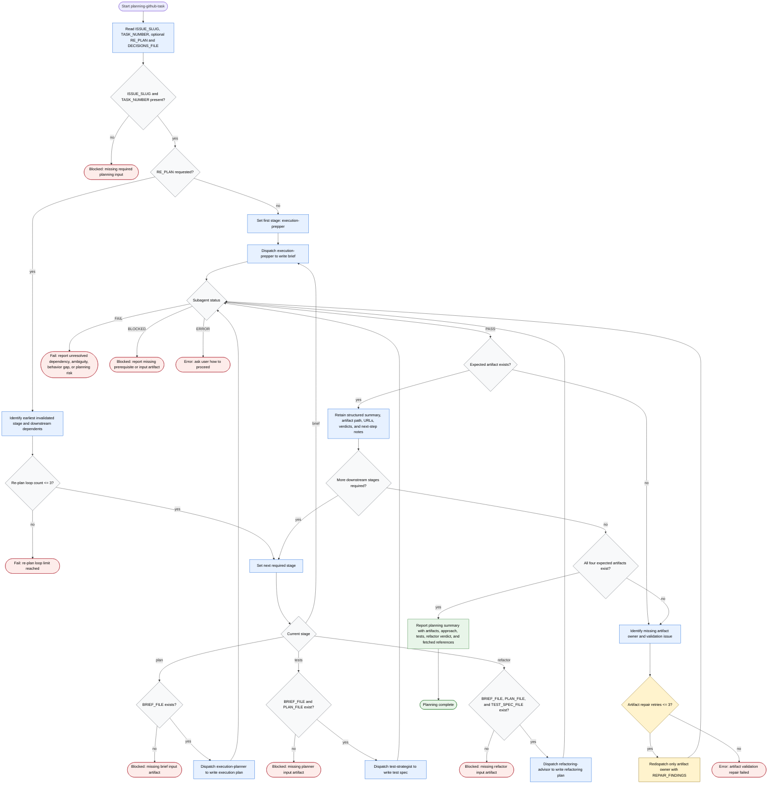

# planning-github-task

Planning coordinator for exactly one GitHub issue task from
`docs/<ISSUE_SLUG>-tasks.md`. The agent normalizes required inputs, delegates
task-plan readiness checks to `execution-prepper`, dispatches focused planning
subagents one at a time, writes only four workflow-planning artifacts under
`docs/`, retains structured summaries instead of raw subagent context, and stops
on unresolved dependencies, ambiguity, behavior gaps, planning risk, missing
artifacts, or unexpected errors. The workflow is intentionally shared with
`planning-jira-task`; only the platform identifier, optional source snapshot,
and artifact path placeholders differ.

Planning summary output:

- Task: `TASK_NUMBER` and parsed task title.
- Artifacts: `docs/<ISSUE_SLUG>-task-<TASK_NUMBER>-brief.md`, `docs/<ISSUE_SLUG>-task-<TASK_NUMBER>-execution-plan.md`, `docs/<ISSUE_SLUG>-task-<TASK_NUMBER>-test-spec.md`, and `docs/<ISSUE_SLUG>-task-<TASK_NUMBER>-refactoring-plan.md`.
- Report fields: approach summary, test coverage shape, refactoring verdict, completion state, and exact References fetched URLs or `none`.

Readiness rule: `execution-prepper` is the only stage that reads raw task-plan
content and verifies dependencies, questions, decisions, and required task
fields. Downstream stages consume artifact paths and summaries. Planning is
complete only after all four expected artifacts exist and every dispatched
owner has returned `PASS`; otherwise the coordinator reports `blocked`, `fail`,
or `error` without implementing code, deleting artifacts, or mutating unrelated
files.
