# planning-jira-task

Coordinates planning for exactly one Jira task from `docs/<TICKET_KEY>-tasks.md`.
The workflow validates prerequisites, dispatches focused planning subagents one
at a time, writes only the four allowed planning artifacts under `docs/`, retains
structured summaries instead of raw subagent context, and stops on blocked,
failed, or error statuses. It does not implement code, delete artifacts, or
commit workflow-state files.

```mermaid
flowchart TD
  START([Start planning-jira-task]) --> INPUTS[Receive TICKET_KEY, TASK_NUMBER, optional RE_PLAN, optional DECISIONS_FILE]
  INPUTS --> REQUIRED_INPUTS{TICKET_KEY and TASK_NUMBER present?}
  REQUIRED_INPUTS -->|no| BLOCKED_INPUTS([Blocked: missing required planning input])
  REQUIRED_INPUTS -->|yes| LOAD_TASK[Load docs/&lt;TICKET_KEY&gt;-tasks.md and optional ticket snapshot or decisions file]
  LOAD_TASK --> TASK_EXISTS{Task section exists with required fields?}
  TASK_EXISTS -->|no| BLOCKED_TASK([Blocked: missing or incomplete upstream task artifact])
  TASK_EXISTS -->|yes| CHECK_PREREQS[Validate dependencies, questions, priority, DoD, and Decisions Log overrides]

  CHECK_PREREQS --> READY{Dependencies complete, questions resolved or waived, and decisions recorded?}
  READY -->|no| FAIL_PREREQ([Fail: unresolved dependency, ambiguity, missing waiver, or unrecorded decision])
  READY -->|yes| REPLAN_CHECK{RE_PLAN requested?}

  REPLAN_CHECK -->|no| START_STAGE[Start at execution-prepper]
  REPLAN_CHECK -->|yes| INVALIDATED[Find earliest invalidated stage from critique scope]
  INVALIDATED --> REPLAN_LIMIT{Re-plan loop count <= 3?}
  REPLAN_LIMIT -->|no| FAIL_REPLAN([Fail: re-plan loop limit reached])
  REPLAN_LIMIT -->|yes| ROUTE_STAGE{Current invalidated stage}

  ROUTE_STAGE -->|brief| BRIEF_INPUT
  ROUTE_STAGE -->|plan| PLAN_INPUT
  ROUTE_STAGE -->|tests| TEST_INPUT
  ROUTE_STAGE -->|refactor| REFACTOR_INPUT

  START_STAGE --> BRIEF_INPUT{Required input artifact exists for prep?}
  BRIEF_INPUT -->|no| BLOCKED_BRIEF([Blocked: missing task source artifact])
  BRIEF_INPUT -->|yes| PREPPER[Dispatch execution-prepper to write brief artifact]
  PREPPER --> PREPPER_STATUS{execution-prepper status}
  PREPPER_STATUS -->|PASS| VALIDATE_BRIEF[Confirm docs/&lt;TICKET_KEY&gt;-task-&lt;TASK_NUMBER&gt;-brief.md exists]
  PREPPER_STATUS -->|FAIL| FAIL_PREP([Fail: prep found unresolved planning issue])
  PREPPER_STATUS -->|BLOCKED| BLOCKED_PREP([Blocked: prep missing prerequisite or input artifact])
  PREPPER_STATUS -->|ERROR| ERROR_PREP([Error: ask user how to proceed])

  VALIDATE_BRIEF --> BRIEF_OK{Brief artifact valid?}
  BRIEF_OK -->|no, retry 1 to 3| PREPPER_REPAIR[Redispatch execution-prepper with validation issue]
  PREPPER_REPAIR --> PREPPER_STATUS
  BRIEF_OK -->|no, retries exhausted| ERROR_VALIDATE_BRIEF([Error: brief validation repair exhausted])
  BRIEF_OK -->|yes| PLAN_INPUT{BRIEF_FILE exists?}

  PLAN_INPUT -->|no| BLOCKED_PLAN_INPUT([Blocked: missing brief before planning])
  PLAN_INPUT -->|yes| PLANNER[Dispatch execution-planner to write execution plan]
  PLANNER --> PLANNER_STATUS{execution-planner status}
  PLANNER_STATUS -->|PASS| VALIDATE_PLAN[Confirm docs/&lt;TICKET_KEY&gt;-task-&lt;TASK_NUMBER&gt;-execution-plan.md exists]
  PLANNER_STATUS -->|FAIL| FAIL_PLAN([Fail: approach, scope, or planning risk])
  PLANNER_STATUS -->|BLOCKED| BLOCKED_PLAN([Blocked: planner missing prerequisite or input artifact])
  PLANNER_STATUS -->|ERROR| ERROR_PLAN([Error: ask user how to proceed])

  VALIDATE_PLAN --> PLAN_OK{Execution plan artifact valid?}
  PLAN_OK -->|no, retry 1 to 3| PLANNER_REPAIR[Redispatch execution-planner with validation issue]
  PLANNER_REPAIR --> PLANNER_STATUS
  PLAN_OK -->|no, retries exhausted| ERROR_VALIDATE_PLAN([Error: plan validation repair exhausted])
  PLAN_OK -->|yes| TEST_INPUT{BRIEF_FILE and PLAN_FILE exist?}

  TEST_INPUT -->|no| BLOCKED_TEST_INPUT([Blocked: missing brief or plan before test strategy])
  TEST_INPUT -->|yes| TESTER[Dispatch test-strategist to write test spec]
  TESTER --> TESTER_STATUS{test-strategist status}
  TESTER_STATUS -->|PASS| VALIDATE_TEST[Confirm docs/&lt;TICKET_KEY&gt;-task-&lt;TASK_NUMBER&gt;-test-spec.md exists]
  TESTER_STATUS -->|FAIL| FAIL_TEST([Fail: behavior gap or insufficient test strategy])
  TESTER_STATUS -->|BLOCKED| BLOCKED_TEST([Blocked: tester missing prerequisite or input artifact])
  TESTER_STATUS -->|ERROR| ERROR_TEST([Error: ask user how to proceed])

  VALIDATE_TEST --> TEST_OK{Test spec artifact valid?}
  TEST_OK -->|no, retry 1 to 3| TESTER_REPAIR[Redispatch test-strategist with validation issue]
  TESTER_REPAIR --> TESTER_STATUS
  TEST_OK -->|no, retries exhausted| ERROR_VALIDATE_TEST([Error: test validation repair exhausted])
  TEST_OK -->|yes| REFACTOR_INPUT{BRIEF_FILE, PLAN_FILE, and TEST_SPEC_FILE exist?}

  REFACTOR_INPUT -->|no| BLOCKED_REFACTOR_INPUT([Blocked: missing planning artifact before refactoring advice])
  REFACTOR_INPUT -->|yes| REFACTOR[Dispatch refactoring-advisor to write refactoring plan]
  REFACTOR --> REFACTOR_STATUS{refactoring-advisor status}
  REFACTOR_STATUS -->|PASS| VALIDATE_REFACTOR[Confirm docs/&lt;TICKET_KEY&gt;-task-&lt;TASK_NUMBER&gt;-refactoring-plan.md exists]
  REFACTOR_STATUS -->|FAIL| FAIL_REFACTOR([Fail: refactoring risk or design concern])
  REFACTOR_STATUS -->|BLOCKED| BLOCKED_REFACTOR([Blocked: advisor missing prerequisite or input artifact])
  REFACTOR_STATUS -->|ERROR| ERROR_REFACTOR([Error: ask user how to proceed])

  VALIDATE_REFACTOR --> REFACTOR_OK{Refactoring plan artifact valid?}
  REFACTOR_OK -->|no, retry 1 to 3| REFACTOR_REPAIR[Redispatch refactoring-advisor with validation issue]
  REFACTOR_REPAIR --> REFACTOR_STATUS
  REFACTOR_OK -->|no, retries exhausted| ERROR_VALIDATE_REFACTOR([Error: refactor validation repair exhausted])
  REFACTOR_OK -->|yes| FINAL_ARTIFACTS{All four expected artifacts exist?}

  FINAL_ARTIFACTS -->|no| ERROR_FINAL_ARTIFACTS([Error: final artifact validation failed])
  FINAL_ARTIFACTS -->|yes| REPORT[Report task title, artifact paths, approach, test coverage, refactoring verdict, and fetched URLs]
  REPORT --> COMPLETE([Planning complete])

  class REQUIRED_INPUTS,TASK_EXISTS,READY,REPLAN_CHECK,REPLAN_LIMIT,ROUTE_STAGE,BRIEF_INPUT,PREPPER_STATUS,BRIEF_OK,PLAN_INPUT,PLANNER_STATUS,PLAN_OK,TEST_INPUT,TESTER_STATUS,TEST_OK,REFACTOR_INPUT,REFACTOR_STATUS,REFACTOR_OK,FINAL_ARTIFACTS decision;
  class LOAD_TASK,CHECK_PREREQS,VALIDATE_BRIEF,VALIDATE_PLAN,VALIDATE_TEST,VALIDATE_REFACTOR check;
  class PREPPER,PREPPER_REPAIR,PLANNER,PLANNER_REPAIR,TESTER,TESTER_REPAIR,REFACTOR,REFACTOR_REPAIR guard;
  class INPUTS,REPORT output;
  class COMPLETE success;
  class FAIL_PREREQ,FAIL_PREP,FAIL_PLAN,FAIL_TEST,FAIL_REFACTOR,FAIL_REPLAN refine;
  class BLOCKED_INPUTS,BLOCKED_TASK,BLOCKED_BRIEF,BLOCKED_PREP,BLOCKED_PLAN_INPUT,BLOCKED_PLAN,BLOCKED_TEST_INPUT,BLOCKED_TEST,BLOCKED_REFACTOR_INPUT,BLOCKED_REFACTOR,ERROR_PREP,ERROR_VALIDATE_BRIEF,ERROR_PLAN,ERROR_VALIDATE_PLAN,ERROR_TEST,ERROR_VALIDATE_TEST,ERROR_REFACTOR,ERROR_VALIDATE_REFACTOR,ERROR_FINAL_ARTIFACTS stop;

  classDef guard fill:#fff3cd,stroke:#856404,color:#000;
  classDef check fill:#e7f1ff,stroke:#0b5ed7,color:#000;
  classDef decision fill:#f8f9fa,stroke:#495057,color:#000;
  classDef output fill:#e8f5e9,stroke:#2e7d32,color:#000;
  classDef success fill:#e8f5e9,stroke:#2e7d32,color:#000;
  classDef refine fill:#fff3cd,stroke:#856404,color:#000;
  classDef stop fill:#fdecea,stroke:#b02a37,color:#000;
```

Planning summary output:

- Task: `TASK_NUMBER` and parsed task title.
- Artifacts: `docs/<TICKET_KEY>-task-<TASK_NUMBER>-brief.md`, `docs/<TICKET_KEY>-task-<TASK_NUMBER>-execution-plan.md`, `docs/<TICKET_KEY>-task-<TASK_NUMBER>-test-spec.md`, and `docs/<TICKET_KEY>-task-<TASK_NUMBER>-refactoring-plan.md`.
- Report fields: approach summary, test coverage shape, refactoring verdict, completion state, and exact References fetched URLs or `none`.

Readiness rule: planning is complete only after all four owned artifacts exist
and the final report includes the task number/title, artifact paths, approach
summary, test coverage shape, refactoring verdict, and exact fetched reference
URLs or `none`. If any stage returns `FAIL`, `BLOCKED`, or `ERROR`, the
coordinator stops without implementing code or mutating unrelated artifacts.
