# Planning Work Item Tasks

The Phase 2 planning orchestrator detects the platform, then converts an
authoritative local Phase 1 snapshot at `docs/<KEY>.md` into staged planning
artifacts and a final task plan at `docs/<KEY>-tasks.md`. It coordinates bundled
contracts and planning subagents, preserves raw stage artifacts on disk, passes
`PLAYBOOK_PATH` to every subagent, and keeps only workflow state, verdicts,
paths, counts, retry counts, issue lists, and user decisions in context. It does
not implement tasks, create child items, mutate source code, deploy, roll back,
bypass CI, bypass validation, or mutate package definitions; requests for those
actions fail scope preflight.

```mermaid
flowchart TD
  START(["Start Phase 2 planning"]) --> INPUTS["Capture TICKET_KEY, the work-item key,<br/>optional RE_PLAN, and optional DECISIONS"]
  INPUTS --> REQUIRED{"Work-item key present?"}
  REQUIRED -->|"no"| FAIL_INPUT["Set PREFLIGHT failure<br/>Reason: work-item key required"]
  REQUIRED -->|"yes"| SCOPE{"Request stays within Phase 2 planning authority?"}
  SCOPE -->|"no"| FAIL_SCOPE["Set PREFLIGHT failure<br/>Reason: out-of-scope or sensitive action requested"]
  SCOPE -->|"yes"| MODE{"RE_PLAN is true?"}

  MODE -->|"no"| LOAD_NORMAL["Load execution guide and output contract"]
  LOAD_NORMAL --> PREFLIGHT
  MODE -->|"yes"| DECISIONS{"DECISIONS requiring plan changes provided?"}
  DECISIONS -->|"no"| FAIL_DECISIONS["Set PREFLIGHT failure<br/>Reason: re-plan decisions required"]
  DECISIONS -->|"yes"| LOAD_REPLAN["Load re-plan cycle,<br/>execution guide, and output contract"]
  LOAD_REPLAN --> DERIVE_STAGE["Derive earliest affected stage from DECISIONS"]
  DERIVE_STAGE --> NEED_PREFLIGHT{"Snapshot changed or must be revalidated?"}
  NEED_PREFLIGHT -->|"yes"| PREFLIGHT
  NEED_PREFLIGHT -->|"no"| SELECT_STAGE

  PREFLIGHT["Dispatch stage-validator<br/>STAGE=preflight<br/>FILE_PATH=docs/&lt;KEY&gt;.md"] --> PREFLIGHT_GATE{"Snapshot exists and satisfies contract?"}
  PREFLIGHT_GATE -->|"no"| FAIL_PREFLIGHT["Set PREFLIGHT failure<br/>Reason: missing or invalid Phase 1 snapshot"]
  PREFLIGHT_GATE -->|"ERROR"| FAIL_PREFLIGHT_ERROR["Set PREFLIGHT failure<br/>Reason: preflight validator error"]
  PREFLIGHT_GATE -->|"yes"| SELECT_STAGE

  SELECT_STAGE{"Normal path or earliest affected stage derived from DECISIONS"}
  SELECT_STAGE -->|"normal or Stage 1"| STAGE1
  SELECT_STAGE -->|"Stage 2"| STAGE2
  SELECT_STAGE -->|"Stage 3"| STAGE3

  STAGE1["Dispatch task-planner<br/>INPUT=docs/&lt;KEY&gt;.md<br/>OUTPUT=docs/&lt;KEY&gt;-stage-1-detailed.md"] --> PLAN1{"task-planner verdict"}
  PLAN1 -->|"PASS"| VALIDATE1["Dispatch stage-validator<br/>STAGE=1<br/>Check detailed structure, task sufficiency,<br/>and current-item justification when only one execution task exists"]
  PLAN1 -->|"FAIL/BLOCKED/ERROR"| FAIL_STAGE1_PRODUCER["Set STAGE_1 failure<br/>Reason: task-planner failed"]
  VALIDATE1 --> GATE1{"Stage 1 validation verdict"}
  GATE1 -->|"PASS"| STAGE2
  GATE1 -->|"FAIL"| RETRY1{"Failed cycles fewer than 3?"}
  GATE1 -->|"ERROR"| FAIL_STAGE1_ERROR["Set STAGE_1 failure<br/>Reason: validator error"]
  RETRY1 -->|"yes"| REPAIR1["Redispatch task-planner only<br/>with Stage 1 validator issues"]
  REPAIR1 --> PLAN1
  RETRY1 -->|"no"| FAIL_STAGE1_LIMIT["Set STAGE_1 failure<br/>Reason: retry limit reached"]

  STAGE2["Dispatch dependency-prioritizer<br/>INPUT=docs/&lt;KEY&gt;-stage-1-detailed.md<br/>OUTPUT=docs/&lt;KEY&gt;-stage-2-prioritized.md"] --> PLAN2{"dependency-prioritizer verdict"}
  PLAN2 -->|"PASS"| VALIDATE2["Dispatch stage-validator<br/>STAGE=2<br/>Check stage-2 structure, preservation expectations,<br/>dependency ordering, and branch-contract preconditions"]
  PLAN2 -->|"FAIL/BLOCKED/ERROR"| FAIL_STAGE2_PRODUCER["Set STAGE_2 failure<br/>Reason: dependency-prioritizer failed"]
  VALIDATE2 --> GATE2{"Stage 2 validation verdict"}
  GATE2 -->|"PASS"| STAGE3
  GATE2 -->|"FAIL"| RETRY2{"Failed cycles fewer than 3?"}
  GATE2 -->|"ERROR"| FAIL_STAGE2_ERROR["Set STAGE_2 failure<br/>Reason: validator error"]
  RETRY2 -->|"yes"| REPAIR2["Redispatch dependency-prioritizer only<br/>with Stage 2 validator issues"]
  REPAIR2 --> PLAN2
  RETRY2 -->|"no"| FAIL_STAGE2_LIMIT["Set STAGE_2 failure<br/>Reason: retry limit reached"]

  STAGE3["Dispatch task-validator<br/>SNAPSHOT=docs/&lt;KEY&gt;.md<br/>PLAN=docs/&lt;KEY&gt;-stage-2-prioritized.md<br/>OUTPUT=docs/&lt;KEY&gt;-tasks.md"] --> PLAN3{"task-validator verdict"}
  PLAN3 -->|"PASS"| VALIDATE3["Dispatch stage-validator<br/>STAGE=3"]
  PLAN3 -->|"FAIL/BLOCKED/ERROR"| FAIL_STAGE3_PRODUCER["Set STAGE_3 failure<br/>Reason: task-validator failed"]
  VALIDATE3 --> GATE3{"Stage 3 validation verdict"}
  GATE3 -->|"PASS"| POSTPIPELINE
  GATE3 -->|"FAIL"| RETRY3{"Failed cycles fewer than 3?"}
  GATE3 -->|"ERROR"| FAIL_STAGE3_ERROR["Set STAGE_3 failure<br/>Reason: validator error"]
  RETRY3 -->|"yes"| REPAIR3["Redispatch task-validator only<br/>with Stage 3 validator issues"]
  REPAIR3 --> PLAN3
  RETRY3 -->|"no"| FAIL_STAGE3_LIMIT["Set STAGE_3 failure<br/>Reason: retry limit reached"]

  POSTPIPELINE["Dispatch stage-validator<br/>STAGE=postpipeline<br/>FILE_PATH=docs/&lt;KEY&gt;-tasks.md<br/>Check final section order and deterministic branch-name contract"] --> POST_GATE{"Postpipeline validation verdict"}
  POST_GATE -->|"PASS"| PASS_HANDOFF["Return PLANNING: PASS handoff<br/>work-item key and File=docs/&lt;KEY&gt;-tasks.md<br/>tasks, branches, questions, warnings,<br/>failure category, reason, preserved artifacts"]
  POST_GATE -->|"FAIL"| RETRY_POST{"Failed cycles fewer than 3?"}
  POST_GATE -->|"ERROR"| FAIL_POST_ERROR["Set POSTPIPELINE failure<br/>Reason: validator error"]
  RETRY_POST -->|"yes"| REPAIR_POST["Redispatch Stage 3 only<br/>with postpipeline validator issues"]
  REPAIR_POST --> PLAN3
  RETRY_POST -->|"no"| FAIL_POST_LIMIT["Set POSTPIPELINE failure<br/>Reason: retry limit reached"]

  FAIL_INPUT --> FAIL_HANDOFF
  FAIL_SCOPE --> FAIL_HANDOFF
  FAIL_DECISIONS --> FAIL_HANDOFF
  FAIL_PREFLIGHT --> FAIL_HANDOFF
  FAIL_PREFLIGHT_ERROR --> FAIL_HANDOFF
  FAIL_STAGE1_PRODUCER --> FAIL_HANDOFF
  FAIL_STAGE1_ERROR --> FAIL_HANDOFF
  FAIL_STAGE1_LIMIT --> FAIL_HANDOFF
  FAIL_STAGE2_PRODUCER --> FAIL_HANDOFF
  FAIL_STAGE2_ERROR --> FAIL_HANDOFF
  FAIL_STAGE2_LIMIT --> FAIL_HANDOFF
  FAIL_STAGE3_PRODUCER --> FAIL_HANDOFF
  FAIL_STAGE3_ERROR --> FAIL_HANDOFF
  FAIL_STAGE3_LIMIT --> FAIL_HANDOFF
  FAIL_POST_ERROR --> FAIL_HANDOFF
  FAIL_POST_LIMIT --> FAIL_HANDOFF
  FAIL_HANDOFF["Return PLANNING: FAIL handoff<br/>work-item key, file path or not written,<br/>task count, branch count, question count,<br/>warnings, failure category, reason, preserved artifacts"] --> STOP(["Planning stopped"])
  PASS_HANDOFF --> DONE(["PLANNING: PASS"])

  classDef decision fill:#f8f9fa,stroke:#495057,color:#000;
  classDef check fill:#e7f1ff,stroke:#0b5ed7,color:#000;
  classDef action fill:#fff3cd,stroke:#856404,color:#000;
  classDef output fill:#e8f5e9,stroke:#2e7d32,color:#000;
  classDef stop fill:#fdecea,stroke:#b02a37,color:#000;
  classDef success fill:#e8f5e9,stroke:#2e7d32,color:#000;

  class REQUIRED,SCOPE,MODE,DECISIONS,NEED_PREFLIGHT,PREFLIGHT_GATE,SELECT_STAGE,PLAN1,GATE1,RETRY1,PLAN2,GATE2,RETRY2,PLAN3,GATE3,RETRY3,POST_GATE,RETRY_POST decision;
  class PREFLIGHT,VALIDATE1,VALIDATE2,VALIDATE3,POSTPIPELINE check;
  class INPUTS,LOAD_NORMAL,LOAD_REPLAN,DERIVE_STAGE,STAGE1,STAGE2,STAGE3,REPAIR1,REPAIR2,REPAIR3,REPAIR_POST action;
  class PASS_HANDOFF,FAIL_HANDOFF output;
  class FAIL_INPUT,FAIL_SCOPE,FAIL_DECISIONS,FAIL_PREFLIGHT,FAIL_PREFLIGHT_ERROR,FAIL_STAGE1_PRODUCER,FAIL_STAGE1_ERROR,FAIL_STAGE1_LIMIT,FAIL_STAGE2_PRODUCER,FAIL_STAGE2_ERROR,FAIL_STAGE2_LIMIT,FAIL_STAGE3_PRODUCER,FAIL_STAGE3_ERROR,FAIL_STAGE3_LIMIT,FAIL_POST_ERROR,FAIL_POST_LIMIT,STOP stop;
  class DONE success;
```

Readiness rule: return `PLANNING: PASS` only after required preflight, Stage 1,
Stage 2, Stage 3, and postpipeline validations pass for the selected path.
Re-plan starts from the earliest affected stage, skips preflight unless the
snapshot changed or must be revalidated, reruns downstream stages, and leaves
critique-driven re-plan loop limits to the parent orchestrator.

Retry rule: for Stage 1, Stage 2, Stage 3, and postpipeline validation failures,
redispatch only the producer of the failing artifact with the validator issue
list and stop after 3 failed cycles for the same gate. Postpipeline repair
redispatches Stage 3, then reruns Stage 3 validation before postpipeline
validation.

Handoff rule: every terminal handoff includes file path or `not written`, task
count, unique branch count, cross-cutting question count, validation warning
count, failure category, reason, the work-item key, and preserved artifact
paths. During re-plan, preserve branch names for unchanged tasks and regenerate
them only when task number, title, or current-item mode changes.
