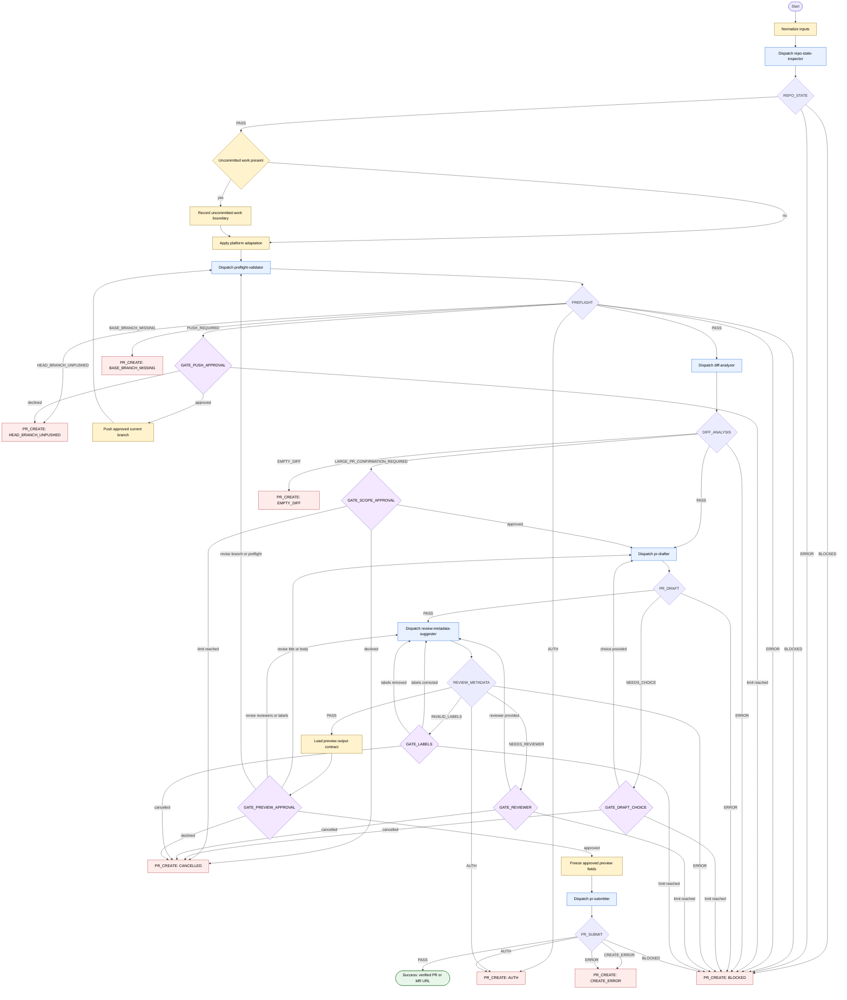

# PR Creator Skill Flow

The `skills/pr-creator` orchestrator creates a review-ready PR or MR from the
current branch by delegating repository inspection, platform adaptation,
preflight validation, diff analysis, drafting, review metadata, and submission to
focused subagents. The orchestrator may normalize inputs, ask focused questions,
recover only failing gates, and load local contracts. It must not push without
`GATE_PUSH_APPROVAL` and must not create a PR or MR without
`GATE_PREVIEW_APPROVAL`.

## Contract References

- `skills/pr-creator/SKILL.md`
- `skills/pr-creator/subagents/repo-state-inspector.md`
- `skills/pr-creator/subagents/preflight-validator.md`
- `skills/pr-creator/subagents/diff-analyzer.md`
- `skills/pr-creator/subagents/pr-drafter.md`
- `skills/pr-creator/subagents/review-metadata-suggester.md`
- `skills/pr-creator/subagents/pr-submitter.md`
- `skills/pr-creator/references/execution-contracts.md`
- `skills/pr-creator/references/platform-adaptation.md`
- `skills/pr-creator/references/contracts/repo-state-inspector.md`
- `skills/pr-creator/references/contracts/preflight-validator.md`
- `skills/pr-creator/references/contracts/diff-analyzer.md`
- `skills/pr-creator/references/contracts/pr-drafter.md`
- `skills/pr-creator/references/contracts/review-metadata-suggester.md`
- `skills/pr-creator/references/contracts/pr-submitter.md`

## Status Contracts

- `REPO_STATE: PASS | BLOCKED | ERROR`
- `PREFLIGHT: PASS | PUSH_REQUIRED | AUTH | BASE_BRANCH_MISSING | HEAD_BRANCH_UNPUSHED | BLOCKED | ERROR`
- `DIFF_ANALYSIS: PASS | LARGE_PR_CONFIRMATION_REQUIRED | EMPTY_DIFF | ERROR`
- `PR_DRAFT: PASS | NEEDS_CHOICE | ERROR`
- `REVIEW_METADATA: PASS | NEEDS_REVIEWER | INVALID_LABELS | AUTH | ERROR`
- `PR_SUBMIT: PASS | BLOCKED | CREATE_ERROR | AUTH | ERROR`

## Terminal Rules

- `PR_CREATE: AUTH` returns the gate that failed, evidence used, and one next
  step to authenticate or refresh access.
- `PR_CREATE: BASE_BRANCH_MISSING` returns the missing target branch evidence and
  one next step to choose an existing target branch.
- `PR_CREATE: HEAD_BRANCH_UNPUSHED` returns the source branch evidence and one
  next step to push manually or approve the orchestrator to push.
- `PR_CREATE: EMPTY_DIFF` returns the compare range evidence and one next step to
  add commits or choose a different branch pair.
- `PR_CREATE: BLOCKED` returns the blocked subagent status, evidence used, and
  one next step to resolve the blocker.
- `PR_CREATE: CANCELLED` returns the declined gate and one next step to rerun
  after approval is available.
- `PR_CREATE: CREATE_ERROR` returns the create or verification failure and one
  next step to correct and retry.
- Success returns the verified PR or MR URL plus frozen submitted metadata from
  `PR_SUBMIT: PASS`.
