# PR Creator Skill Flow

The `pr-creator` orchestrator creates a review-ready PR or MR from the current branch by delegating repository inspection, preflight checks, diff analysis, drafting, metadata suggestion, and submission to subagents. It may normalize inputs, ask focused questions, recover only failing gates, and load execution contracts for preview, failure, and final output. It must stop for required human input, sensitive actions, metadata gaps, preview approval, failed checks, or three non-converging recovery cycles.

```mermaid
flowchart TD
  START([Start: create PR or MR from current branch]) --> INTAKE["Normalize inputs<br/>TARGET_BRANCH, PR_STATE, reviewers, overrides, labels, current branch, refs, auth, diff, CODEOWNERS, platform labels"]
  INTAKE --> BOUNDARY["State authority boundary<br/>orchestrator delegates repo inspection, diff analysis, drafting, metadata validation, and submission"]
  BOUNDARY --> TARGET_CHECK{TARGET_BRANCH provided?}
  TARGET_CHECK -->|no| ASK_TARGET["Ask focused question:<br/>which target branch?"]
  ASK_TARGET --> TARGET_BLOCKED([Blocked: waiting for TARGET_BRANCH])
  TARGET_CHECK -->|yes| PLATFORM["Detect platform and adapt happy path<br/>GitHub default; use GitLab, Bitbucket, or unknown-platform contract when needed"]
  PLATFORM --> PLATFORM_KNOWN{Exact platform behavior or syntax known?}
  PLATFORM_KNOWN -->|no| FETCH_DOCS["Fetch optional external docs only for exact platform behavior"]
  FETCH_DOCS --> DISPATCH_REPO["Dispatch repo-state-inspector<br/>collect current branch, remote refs, working-tree state, auth, and platform availability"]
  PLATFORM_KNOWN -->|yes| DISPATCH_REPO
  DISPATCH_REPO --> REPO_OK{Repository evidence usable?}
  REPO_OK -->|no| FAILURE_REPO["Load failure output contract<br/>report failed or blocked status with one next step"]
  FAILURE_REPO --> FAILED([Failed or blocked])
  REPO_OK -->|yes| DISPATCH_PREFLIGHT["Dispatch preflight-validator<br/>confirm auth, comparable remote refs, branch publish status, and local-change boundary"]
  DISPATCH_PREFLIGHT --> LOCAL_CHANGES{Uncommitted local changes present?}
  LOCAL_CHANGES -->|yes| NOTE_LOCAL["Record boundary:<br/>local uncommitted changes stay outside PR until committed"]
  NOTE_LOCAL --> PREFLIGHT_READY{Preflight gates pass?}
  LOCAL_CHANGES -->|no| PREFLIGHT_READY
  PREFLIGHT_READY -->|no| RECOVERABLE_PREFLIGHT{Failing gate recoverable?}
  RECOVERABLE_PREFLIGHT -->|no| FAILURE_PREFLIGHT["Load failure output contract<br/>include failed gate and one clear next step"]
  FAILURE_PREFLIGHT --> FAILED
  RECOVERABLE_PREFLIGHT -->|yes| CYCLE_CHECK{Fewer than three non-converging fix cycles?}
  CYCLE_CHECK -->|no| ESCALATE([Escalated: three non-converging fix cycles])
  CYCLE_CHECK -->|yes| PUSH_NEEDED{Current branch must be pushed?}
  PUSH_NEEDED -->|yes| PUSH_GATE["Human gate: approve pushing current branch<br/>target: remote branch<br/>reason: make compare ref available<br/>risk: publishes commits; reversible by deleting remote branch<br/>safer alternative: stop and let user push manually"]
  PUSH_GATE -->|declined| PUSH_BLOCKED([Blocked: user declined branch push])
  PUSH_GATE -->|approved| RECOVER_PREFLIGHT["Recover only failing preflight gate<br/>record approval and rerun earliest affected phase"]
  PUSH_NEEDED -->|no| RECOVER_PREFLIGHT
  RECOVER_PREFLIGHT --> DISPATCH_REPO
  PREFLIGHT_READY -->|yes| TRUSTED_DIFF["Use trusted compare diff<br/>origin/TARGET_BRANCH...origin/current_branch after refs are comparable"]
  TRUSTED_DIFF --> DISPATCH_DIFF["Dispatch diff-analyzer<br/>assess size, purpose, risk, and change summary"]
  DISPATCH_DIFF --> DIFF_SCOPE{Large or mixed-purpose PR?}
  DIFF_SCOPE -->|yes| SCOPE_GATE["Human gate: approve proceeding with large or mixed-purpose PR<br/>target: current branch diff<br/>reason: review risk is elevated<br/>risk: lower review quality; safer alternative: split or stop"]
  SCOPE_GATE -->|declined| SCOPE_BLOCKED([Blocked: user declined large or mixed-purpose PR])
  SCOPE_GATE -->|approved| DRAFT["Dispatch pr-drafter<br/>produce preview-ready title and body using overrides when provided"]
  DIFF_SCOPE -->|no| DRAFT
  DRAFT --> META["Dispatch review-metadata-suggester<br/>suggest reviewers and labels from input, CODEOWNERS, platform reviewer data, and platform labels"]
  META --> REVIEWER_CHECK{At least one reviewer available?}
  REVIEWER_CHECK -->|no| ASK_REVIEWER["Ask user for at least one reviewer"]
  ASK_REVIEWER --> REVIEWER_BLOCKED([Blocked: waiting for required reviewer])
  REVIEWER_CHECK -->|yes| LABEL_CHECK{Labels valid for platform?}
  LABEL_CHECK -->|no| RECOVER_LABELS{Recoverable label metadata issue?}
  RECOVER_LABELS -->|no| FAILURE_LABELS["Load failure output contract<br/>include invalid labels and one next step"]
  FAILURE_LABELS --> FAILED
  RECOVER_LABELS -->|yes| RECOVER_META["Recover only metadata gate<br/>refresh platform labels or ask focused question"]
  RECOVER_META --> META
  LABEL_CHECK -->|yes| PREVIEW["Load preview output contract<br/>show exact branch, target branch, state, title, body, reviewers, labels, and platform"]
  PREVIEW --> APPROVAL_GATE["Human gate: explicit preview approval<br/>target: PR or MR creation<br/>reason: submission is sensitive<br/>risk: public or team-visible artifact; safer alternative: revise preview or stop"]
  APPROVAL_GATE -->|declined| PREVIEW_CHANGES{User requests field changes?}
  PREVIEW_CHANGES -->|yes| EARLIEST_PHASE["Re-run earliest affected phase<br/>draft, metadata, diff, or preflight depending on changed field"]
  EARLIEST_PHASE --> DRAFT
  PREVIEW_CHANGES -->|no| PREVIEW_BLOCKED([Blocked: preview not approved])
  APPROVAL_GATE -->|approved| FREEZE["Freeze approved preview fields<br/>do not change branch, state, title, body, reviewers, or labels without reapproval"]
  FREEZE --> SUBMIT["Dispatch pr-submitter<br/>create PR or MR using approved preview only"]
  SUBMIT --> VERIFY_URL{Platform returns verified PR or MR URL?}
  VERIFY_URL -->|yes| FINAL["Load final output contract<br/>return verified URL and submitted metadata"]
  FINAL --> SUCCESS([Success: verified PR or MR URL])
  VERIFY_URL -->|no| FAILURE_SUBMIT["Load failure output contract<br/>return failed status with one clear next step"]
  FAILURE_SUBMIT --> FAILED

  classDef guard fill:#fff3cd,stroke:#856404,color:#000;
  classDef check fill:#e7f1ff,stroke:#0b5ed7,color:#000;
  classDef decision fill:#f8f9fa,stroke:#495057,color:#000;
  classDef human fill:#f3e8ff,stroke:#6f42c1,color:#000;
  classDef output fill:#e8f5e9,stroke:#2e7d32,color:#000;
  classDef success fill:#e8f5e9,stroke:#2e7d32,color:#000;
  classDef refine fill:#fff3cd,stroke:#856404,color:#000;
  classDef stop fill:#fdecea,stroke:#b02a37,color:#000;

  class TARGET_CHECK,PLATFORM_KNOWN,REPO_OK,LOCAL_CHANGES,PREFLIGHT_READY,RECOVERABLE_PREFLIGHT,CYCLE_CHECK,PUSH_NEEDED,DIFF_SCOPE,REVIEWER_CHECK,LABEL_CHECK,RECOVER_LABELS,PREVIEW_CHANGES,VERIFY_URL decision;
  class DISPATCH_REPO,DISPATCH_PREFLIGHT,TRUSTED_DIFF,DISPATCH_DIFF,DRAFT,META,RECOVER_PREFLIGHT,RECOVER_META,EARLIEST_PHASE,SUBMIT check;
  class PUSH_GATE,SCOPE_GATE,APPROVAL_GATE human;
  class PREVIEW,FINAL output;
  class SUCCESS success;
  class ASK_TARGET,NOTE_LOCAL,FETCH_DOCS,FREEZE guard;
  class FAILURE_REPO,FAILURE_PREFLIGHT,FAILURE_LABELS,FAILURE_SUBMIT,TARGET_BLOCKED,FAILED,ESCALATE,PUSH_BLOCKED,SCOPE_BLOCKED,REVIEWER_BLOCKED,PREVIEW_BLOCKED stop;
```

Readiness rule: the orchestrator may dispatch `pr-submitter` only after repository checks, comparable remote refs, diff analysis, draft preview, reviewer and label validation, sensitive-action gates, and explicit preview approval all pass.

Failure envelope rule: every blocked, failed, or escalated terminal state must return a single status, the gate that stopped progress, evidence used, and one clear next step.
