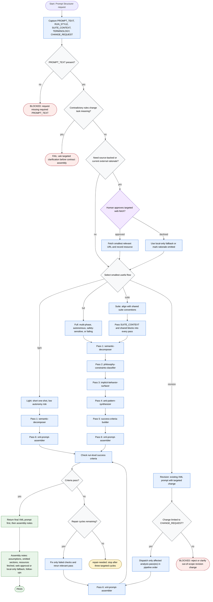

# Prompt Structurer Workflow

Prompt Structurer is a routing orchestrator: it captures `PROMPT_TEXT` and optional run context, chooses the smallest useful flow, dispatches bundled analysis passes in order, and returns the final XML prompt plus assembly notes. It trusts user-provided prompt text, terminology, suite context, and change requests as source of truth; subagent outputs are analysis artifacts. It may read local skill files and optional references as needed, but it must not invent scope, rename terminology without request, or mutate an existing structured prompt beyond the requested revision.

