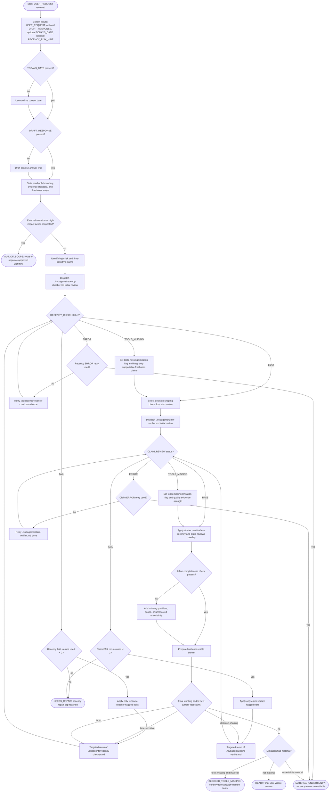

# Recency Guard

Recency Guard is a read-only response-validation orchestrator for answers that depend on current external facts. It prepares or inspects a draft response, identifies high-risk and time-sensitive claims, dispatches `./subagents/recency-checker.md` and `./subagents/claim-verifier.md` one at a time, applies only flagged repairs within bounded caps, and produces the final user-visible answer. Current external facts require evidence from official, canonical, or otherwise authoritative sources, guided by `./references/evidence-policy.md`, `./references/claim-extraction-playbook.md`, `./references/repair-and-integration.md`, `./references/output-templates.md`, and `./references/external-sources.md`. External mutations, posting, purchasing, deploying, policy changes, and irreversible actions are outside this flow and must be routed to a separate approved workflow.

Readiness rule: Produce the final user-visible answer, not a verification report, unless the user asks for verification details. Include date, freshness scope, evidence limits, unresolved material uncertainty, and conservative wording when evidence or tools are limited.

Deterministic repair rule: Each subagent receives one initial review. A `FAIL` permits at most 2 targeted reruns for that subagent after flagged edits. An `ERROR` permits one retry. Cap exits must resolve to `NEEDS_REPAIR`, `MATERIAL_UNCERTAINTY`, or `BLOCKED_TOOLS_MISSING`, not silent readiness.

New-claim rule: If final wording or completeness repair adds a new time-sensitive claim, rerun `./subagents/recency-checker.md`; if it adds a new decision-shaping claim, rerun `./subagents/claim-verifier.md`; if both, rerun the relevant checks one at a time before finalizing.

Mutation boundary: Any external mutation or high-impact action stays outside Recency Guard and must be routed to a separate approved workflow.
