# Refactoring Code

This workflow coordinates one behavior-preserving refactor for a required `TARGET_PATH`. The orchestrator keeps authority narrow: it maps current behavior, chooses the smallest useful strategy, edits only through the implementer after strategy approval, validates with the supplied or smallest safe command, reviews the diff, and stops for user approval whenever the work would change behavior, public APIs, tests, scope, state, external public web access, or file-size limits beyond the approved strategy.

```mermaid
flowchart TD
  START([Start: refactoring request]) --> INPUTS["Collect inputs: TARGET_PATH, USER_GOAL, TEST_COMMAND, SCOPE_LIMITS, MAX_LINES, REFERENCE_NEED"]
  INPUTS --> HAS_TARGET{TARGET_PATH provided?}
  HAS_TARGET -->|no| ASK_PATH["Ask one focused question for target path"]
  ASK_PATH --> NEEDS_CLARIFICATION([NEEDS_CLARIFICATION: target required])
  HAS_TARGET -->|yes| SET_BOUNDARY["Set behavior-preserving boundary and one-target cycle"]

  SET_BOUNDARY --> MAP["Dispatch behavior-mapper to inspect target, callers, dependencies, tests, behavior, risks, and file sizes"]
  MAP --> MAP_STATUS{BEHAVIOR_MAP status}
  MAP_STATUS -->|NEEDS_CLARIFICATION| MAP_QUESTION["Return mapper question and stop"]
  MAP_QUESTION --> NEEDS_CLARIFICATION
  MAP_STATUS -->|ERROR| ERROR_MAP([ERROR: behavior mapping failed])
  MAP_STATUS -->|PASS or NO_CHANGE_CANDIDATE| WEB_NEED{Optional public web sources needed?}

  WEB_NEED -->|yes| WEB_GATE["Request approval for public web fetching: sources, reason, risk, and bundled-only alternative"]
  WEB_GATE --> WEB_APPROVED{User approves?}
  WEB_APPROVED -->|approved| STRATEGY["Dispatch refactor-strategist with behavior map, scope, goal, MAX_LINES, reference paths, and approved web access"]
  WEB_APPROVED -->|declined| BUNDLED_ONLY["Use current code evidence and bundled references only"]
  BUNDLED_ONLY --> STRATEGY_LOCAL["Dispatch refactor-strategist without public web fetching"]
  WEB_NEED -->|no| STRATEGY_LOCAL

  STRATEGY --> STRATEGY_STATUS{STRATEGY status}
  STRATEGY_LOCAL --> STRATEGY_STATUS
  STRATEGY_STATUS -->|NO_CHANGE| NO_CHANGE([NO_CHANGE: report current behavior, diagnosis, and why no refactor is useful; include validation only if run])
  STRATEGY_STATUS -->|NEEDS_CLARIFICATION| STRATEGY_QUESTION["Return smallest required decision"]
  STRATEGY_QUESTION --> NEEDS_CLARIFICATION
  STRATEGY_STATUS -->|ERROR| ERROR_STRATEGY([ERROR: strategy failed])
  STRATEGY_STATUS -->|PASS| SENSITIVE_PLAN{Strategy requires explicit user approval?}

  SENSITIVE_PLAN -->|yes| PLAN_GATE["Request approval: action, target, reason, risk, reversibility, safer alternative, and audit note"]
  PLAN_GATE --> PLAN_APPROVED{User approves?}
  PLAN_APPROVED -->|declined| BLOCKED_DECLINED([BLOCKED: approval declined or missing])
  PLAN_APPROVED -->|approved| IMPLEMENT
  SENSITIVE_PLAN -->|no| IMPLEMENT["Dispatch refactor-implementer with behavior map, approved strategy, validation command, MAX_LINES, and reference index"]

  IMPLEMENT --> IMPLEMENT_STATUS{IMPLEMENTATION status}
  IMPLEMENT_STATUS -->|BLOCKED| BLOCKED_IMPLEMENT([BLOCKED: report reason, files touched, and recovery])
  IMPLEMENT_STATUS -->|ERROR| ERROR_IMPLEMENT([ERROR: implementation failed])
  IMPLEMENT_STATUS -->|PASS or PASS_WITH_WARNINGS| VALIDATION_GATE{Validation command mutates state or is destructive?}

  VALIDATION_GATE -->|yes| VALIDATION_APPROVAL["Request approval for command, target state, reason, risk, reversibility, and safer alternative"]
  VALIDATION_APPROVAL --> VALIDATION_APPROVED{User approves?}
  VALIDATION_APPROVED -->|declined| BLOCKED_VALIDATION([BLOCKED: validation approval declined or missing])
  VALIDATION_APPROVED -->|approved| RUN_VALIDATION
  VALIDATION_GATE -->|no| RUN_VALIDATION["Run supplied or smallest safe validation command"]

  RUN_VALIDATION --> VALIDATION_RESULT{Validation result}
  VALIDATION_RESULT -->|pass| REVIEW["Dispatch refactor-reviewer with behavior map, strategy, implementation report, validation output, MAX_LINES, and policy paths"]
  VALIDATION_RESULT -->|warning| VALIDATION_WARNING["Record missing validation, unavailable command, or pre-existing failure as residual risk"]
  VALIDATION_WARNING --> REVIEW
  VALIDATION_RESULT -->|fail| BLOCKED_VALIDATION_FAIL([BLOCKED: validation failed])
  VALIDATION_RESULT -->|error| ERROR_VALIDATION([ERROR: validation command failed unexpectedly])

  REVIEW --> REVIEW_STATUS{REFACTOR_REVIEW status}
  REVIEW_STATUS -->|ERROR| ERROR_REVIEW([ERROR: review failed])
  REVIEW_STATUS -->|PASS| HANDOFF["Build final handoff: behavior summary, design diagnosis, code changes, validation note, review outcome, file-size compliance, and improvement summary"]
  HANDOFF --> DONE([PASS: final user handoff])

  REVIEW_STATUS -->|FAIL| FIX_COUNT{Fewer than two targeted fix cycles used?}
  FIX_COUNT -->|yes| FIX_SCOPE["Re-dispatch implementer with only reviewer-required fixes"]
  FIX_SCOPE --> FIX_SENSITIVE{Fix requires new approval?}
  FIX_SENSITIVE -->|yes| FIX_GATE["Request approval for behavior/API/test/scope/state/size-waiver change"]
  FIX_GATE --> FIX_APPROVED{User approves?}
  FIX_APPROVED -->|declined| BLOCKED_FIX([BLOCKED: required fix approval declined or missing])
  FIX_APPROVED -->|approved| IMPLEMENT
  FIX_SENSITIVE -->|no| IMPLEMENT
  FIX_COUNT -->|no| UNRESOLVED([BLOCKED: unresolved review findings after two fix cycles])

  class HAS_TARGET,MAP_STATUS,WEB_NEED,WEB_APPROVED,STRATEGY_STATUS,SENSITIVE_PLAN,PLAN_APPROVED,IMPLEMENT_STATUS,VALIDATION_GATE,VALIDATION_APPROVED,VALIDATION_RESULT,REVIEW_STATUS,FIX_COUNT,FIX_SENSITIVE,FIX_APPROVED decision;
  class MAP,STRATEGY,STRATEGY_LOCAL,IMPLEMENT,RUN_VALIDATION,REVIEW,FIX_SCOPE check;
  class WEB_GATE,PLAN_GATE,VALIDATION_APPROVAL,FIX_GATE human;
  class BUNDLED_ONLY,VALIDATION_WARNING guard;
  class HANDOFF output;
  class DONE success;
  class ASK_PATH,MAP_QUESTION,STRATEGY_QUESTION refine;
  class NEEDS_CLARIFICATION,NO_CHANGE,BLOCKED_DECLINED,BLOCKED_IMPLEMENT,BLOCKED_VALIDATION,BLOCKED_VALIDATION_FAIL,BLOCKED_FIX,UNRESOLVED,ERROR_MAP,ERROR_STRATEGY,ERROR_IMPLEMENT,ERROR_VALIDATION,ERROR_REVIEW stop;

  classDef guard fill:#fff3cd,stroke:#856404,color:#000;
  classDef check fill:#e7f1ff,stroke:#0b5ed7,color:#000;
  classDef decision fill:#f8f9fa,stroke:#495057,color:#000;
  classDef human fill:#f3e8ff,stroke:#6f42c1,color:#000;
  classDef output fill:#e8f5e9,stroke:#2e7d32,color:#000;
  classDef success fill:#e8f5e9,stroke:#2e7d32,color:#000;
  classDef refine fill:#fff3cd,stroke:#856404,color:#000;
  classDef stop fill:#fdecea,stroke:#b02a37,color:#000;

```

