# refine-task reviewer-only refinement flow

This workflow keeps the coordinator thin and evidence-focused. It normalizes a Jira ticket, Jira epic, GitHub issue, or GitHub epic-style parent issue request; writes the review intent; collects compact evidence pointers; dispatches `refinement-reviewer`; and returns or posts exactly one refinement comment. Tracker items are evidence to review, not state to mutate. The coordinator may post one new comment only when posting is explicitly requested, tooling is available, and `POST_ALLOWED=yes`.

```mermaid
flowchart TD
  START(["Start: refine-task refinement request"]) --> INTAKE["Normalize inputs: ITEM_URL preferred, ITEM_CONTEXT optional, WRITE_MODE, HUMAN_APPROVALS, bundled reference paths"]
  INTAKE --> ROLE_BOUNDARY["Set reviewer-only authority: normalize context, collect compact pointers, dispatch reviewer, return or post one refinement comment"]
  ROLE_BOUNDARY --> SOURCE_AVAILABLE{"Source item or usable context available?"}

  SOURCE_AVAILABLE -->|no| ASK_SOURCE["Ask one concise question for ITEM_URL or usable ITEM_CONTEXT"]
  ASK_SOURCE --> BLOCKED_SOURCE(["Blocked: no source item or usable context"])
  SOURCE_AVAILABLE -->|yes| WRITE_INTENT["Detect write intent: draft, post-comment, or unknown"]

  WRITE_INTENT --> MUTATION_ONLY{"Request asks for tracker mutation beyond one new comment?"}
  MUTATION_ONLY -->|yes| DEFER_MUTATION(["Deferred: route metadata edits, body edits, lifecycle changes, child creation, links, splits, and other mutations to a separate approved workflow"])
  MUTATION_ONLY -->|no| POST_INTENT{"Posting requested?"}

  POST_INTENT -->|no| SNAPSHOT["Build compact source snapshot: body, comments, subtasks, linked items, docs, code references, and source timestamps when available"]
  POST_INTENT -->|yes| POST_PRECHECK{"Posting authorization and tooling clear?"}
  POST_PRECHECK -->|no| ASK_POSTING["Ask one concise question about posting authorization or tooling"]
  ASK_POSTING --> BLOCKED_POSTING(["Blocked: posting authorization or access unclear"])
  POST_PRECHECK -->|yes| SNAPSHOT

  SNAPSHOT --> CLASSIFY_EVIDENCE["Classify missing evidence: non-blocking gaps, unsupported technical claims, contradictions, or missing access/source context"]
  CLASSIFY_EVIDENCE --> ACCESS_GATE{"Missing access or source context blocks review?"}
  ACCESS_GATE -->|yes| BLOCKED_ACCESS(["Blocked: missing access or source context prevents review"])
  ACCESS_GATE -->|no| DISPATCH["Dispatch refinement-reviewer with compact pointers, write intent, approvals, mutation limits, and bundled reference paths"]

  DISPATCH --> REVIEW_POLICY["Reviewer loads policy references progressively and confirms boundaries, gates, phase order, and evidence standard"]
  REVIEW_POLICY --> READINESS_CHECKS["Run readiness checks: objective, scope, acceptance criteria, dependencies, risks, delivery shape, evidence gaps"]
  READINESS_CHECKS --> TECH_CLAIMS{"Technical claims present?"}
  TECH_CLAIMS -->|yes| VERIFY_CLAIMS["Verify claims against trusted official docs or codebase evidence"]
  TECH_CLAIMS -->|no| STATUS_CLASSIFY
  VERIFY_CLAIMS --> CLAIMS_SUPPORTED{"Required claim evidence found?"}
  CLAIMS_SUPPORTED -->|no| MARK_GAP["Mark as evidence gap, neutral question, spike need, or blocker based on impact"]
  CLAIMS_SUPPORTED -->|yes| STATUS_CLASSIFY
  MARK_GAP --> STATUS_CLASSIFY["Classify REVIEW_STATUS: Ready, Needs refinement, Needs split, Needs spike, Blocked, or Not actionable"]

  STATUS_CLASSIFY --> SENSITIVE_REC{"Sensitive lifecycle, split, spike, security, data, permissions, migration, customer-impact, or operational recommendation would be stated?"}
  SENSITIVE_REC -->|yes| APPROVAL_AVAILABLE{"Human approval available?"}
  APPROVAL_AVAILABLE -->|approved| INCLUDE_REC["Include approved recommendation with rationale, target, risk, reversibility, and safer alternative"]
  APPROVAL_AVAILABLE -->|declined| NEUTRALIZE_REC["Convert to neutral question or defer recommendation"]
  APPROVAL_AVAILABLE -->|missing| ASK_OR_DEFER["Ask one concise approval question or avoid the gated recommendation"]
  ASK_OR_DEFER --> NEUTRALIZE_REC
  SENSITIVE_REC -->|no| ASSEMBLE_COMMENT
  INCLUDE_REC --> ASSEMBLE_COMMENT
  NEUTRALIZE_REC --> ASSEMBLE_COMMENT["Assemble exactly one refinement comment using evidence-backed findings, actionable gaps, questions, and validation summary"]

  ASSEMBLE_COMMENT --> QUALITY_CHECK["Run quality checklist: evidence support, actionable gaps, boundary compliance, no unsupported claims, single-comment output"]
  QUALITY_CHECK --> QUALITY_PASS{"Quality checklist passes?"}
  QUALITY_PASS -->|yes| REVIEW_RETURN["Reviewer returns REVIEW, REVIEW_STATUS, POST_ALLOWED, Comment mode, final comment, and validation summary"]
  QUALITY_PASS -->|no| FIX_COUNT{"Fewer than 3 targeted fix cycles used?"}
  FIX_COUNT -->|yes| FIX_CYCLE["Fix only failed checks without expanding scope"]
  FIX_CYCLE --> QUALITY_CHECK
  FIX_COUNT -->|no| REVIEW_FAIL["Return REVIEW=FAIL with failed checks, final safe comment or reason unavailable, and validation summary"]
  REVIEW_FAIL --> REVIEW_RETURN

  REVIEW_RETURN --> REVIEW_ROUTER{"REVIEW value?"}
  REVIEW_ROUTER -->|ERROR| ERROR_OUT(["Blocked: reviewer error, return reason and no tracker mutation"])
  REVIEW_ROUTER -->|FAIL| FAIL_OUT(["Blocked: quality failures remain after bounded fix loop"])
  REVIEW_ROUTER -->|BLOCKED| BLOCKED_OUT(["Blocked: return reviewer status, reason, and comment if available"])
  REVIEW_ROUTER -->|PASS| FIELD_ROUTER["Route by REVIEW_STATUS, Comment mode, and POST_ALLOWED before output"]

  FIELD_ROUTER --> COORDINATOR_KEEP["Coordinator retains only verdict fields and final comment; raw payloads and long analysis stay out of coordinator context"]
  COORDINATOR_KEEP --> MODE_DECISION{"WRITE_MODE?"}

  MODE_DECISION -->|draft or unknown| DRAFT_MODE{"Comment mode?"}
  DRAFT_MODE -->|Draft| DRAFT_OUT(["Draft: return Mode, REVIEW_STATUS, final comment, and validation summary"])
  DRAFT_MODE -->|Ready to post| READY_TO_POST_OUT(["Ready to post: return Mode, REVIEW_STATUS, final comment, and validation summary"])
  DRAFT_MODE -->|Blocked| BLOCKED_OUT
  DRAFT_MODE -->|Deferred| DEFERRED_OUT(["Deferred: return reason, status, final comment if available, and no tracker mutation"])

  MODE_DECISION -->|post-comment| POST_ALLOWED_GATE{"POST_ALLOWED=yes?"}
  POST_ALLOWED_GATE -->|no| RETURN_REVIEWER_MODE["Do not post; return reviewer Comment mode, REVIEW_STATUS, final comment, and reason"]
  RETURN_REVIEWER_MODE --> DRAFT_MODE
  POST_ALLOWED_GATE -->|yes| POST_AVAILABLE{"Posting tooling available?"}
  POST_AVAILABLE -->|no| READY_TO_POST_OUT
  POST_AVAILABLE -->|yes| POST_COMMENT["Post exactly the returned final comment once; do not edit, expand, retry into duplicates, or mutate other tracker fields"]
  POST_COMMENT --> POST_SUCCESS{"Post succeeded?"}
  POST_SUCCESS -->|yes| POSTED_OUT(["Posted: return Mode=Posted, REVIEW_STATUS, posted comment, and validation summary"])
  POST_SUCCESS -->|no| POST_FAIL(["Blocked or Ready to post: return post failure reason, exact unposted comment, and no retry side effect"])

  class SOURCE_AVAILABLE,MUTATION_ONLY,POST_INTENT,POST_PRECHECK,ACCESS_GATE,TECH_CLAIMS,CLAIMS_SUPPORTED,SENSITIVE_REC,APPROVAL_AVAILABLE,QUALITY_PASS,FIX_COUNT,REVIEW_ROUTER,MODE_DECISION,DRAFT_MODE,POST_ALLOWED_GATE,POST_AVAILABLE,POST_SUCCESS decision;
  class ROLE_BOUNDARY,CLASSIFY_EVIDENCE,REVIEW_POLICY,READINESS_CHECKS,VERIFY_CLAIMS,QUALITY_CHECK,FIELD_ROUTER,COORDINATOR_KEEP check;
  class ASK_SOURCE,ASK_POSTING,ASK_OR_DEFER human;
  class SNAPSHOT,DISPATCH,ASSEMBLE_COMMENT,REVIEW_RETURN,RETURN_REVIEWER_MODE,POST_COMMENT output;
  class DRAFT_OUT,READY_TO_POST_OUT,POSTED_OUT success;
  class DEFER_MUTATION,DEFERRED_OUT refine;
  class BLOCKED_SOURCE,BLOCKED_POSTING,BLOCKED_ACCESS,ERROR_OUT,FAIL_OUT,BLOCKED_OUT,POST_FAIL stop;

  classDef guard fill:#fff3cd,stroke:#856404,color:#000;
  classDef check fill:#e7f1ff,stroke:#0b5ed7,color:#000;
  classDef decision fill:#f8f9fa,stroke:#495057,color:#000;
  classDef human fill:#f3e8ff,stroke:#6f42c1,color:#000;
  classDef output fill:#e8f5e9,stroke:#2e7d32,color:#000;
  classDef success fill:#e8f5e9,stroke:#2e7d32,color:#000;
  classDef refine fill:#fff3cd,stroke:#856404,color:#000;
  classDef stop fill:#fdecea,stroke:#b02a37,color:#000;
```

Readiness rule: the workflow completes only as `Draft`, `Ready to post`, `Posted`, `Blocked`, or `Deferred`. Completion requires a compact reviewer verdict, explicit routing by `REVIEW`, `REVIEW_STATUS`, `Comment mode`, and `POST_ALLOWED`, and either a passing quality checklist or safe terminal handling for `FAIL`, `ERROR`, blocked access, or posting failure. Posting may happen only once, only for the exact reviewer-returned final comment, and only when `WRITE_MODE=post-comment`, posting tooling is available, and `POST_ALLOWED=yes`.
