# refine-task reviewer-only refinement flow

This workflow keeps the coordinator thin and evidence-focused: it normalizes a Jira ticket, Jira epic, GitHub issue, or GitHub parent issue request; dispatches `refinement-reviewer` with compact source pointers; and returns or posts exactly one refinement comment only when posting is explicitly authorized and available. Tracker items are treated as evidence to review, not state to mutate; all edits, lifecycle changes, child creation, link changes, splitting actions, and other mutations are deferred to separate approved workflows.

```mermaid
flowchart TD
  START(["Start: refine-task refinement request"]) --> INTAKE["Normalize inputs: ITEM_URL preferred, ITEM_CONTEXT optional, WRITE_MODE, HUMAN_APPROVALS, reference paths"]
  INTAKE --> SOURCE_AVAILABLE{"Source item available?"}
  SOURCE_AVAILABLE -->|no| ASK_SOURCE["Ask one concise question for source item or usable context"]
  ASK_SOURCE --> BLOCKED_SOURCE(["Blocked: no source item or context"])
  SOURCE_AVAILABLE -->|yes| WRITE_INTENT["Detect write intent: draft, post-comment, or unknown"]

  WRITE_INTENT --> MUTATION_ONLY{"Request is mutation-only or outside comment review?"}
  MUTATION_ONLY -->|yes| DEFER_MUTATION(["Deferred: route tracker mutations to separate approved workflow"])
  MUTATION_ONLY -->|no| POSTING_CLARITY{"Posting intent and tooling clear if posting requested?"}
  POSTING_CLARITY -->|not posting requested| COLLECT_POINTERS["Collect compact evidence pointers: item body, comments, subtasks, linked items, docs, code references"]
  POSTING_CLARITY -->|yes| COLLECT_POINTERS
  POSTING_CLARITY -->|no| ASK_POSTING["Ask one concise question about posting authorization or tooling"]
  ASK_POSTING --> BLOCKED_POSTING(["Blocked: posting authorization or access unclear"])

  COLLECT_POINTERS --> ACCESS_OK{"Required evidence accessible?"}
  ACCESS_OK -->|no| BLOCKED_ACCESS(["Blocked: missing access prevents review"])
  ACCESS_OK -->|yes| DISPATCH["Dispatch refinement-reviewer with compact source pointers, user intent, and bundled reference paths"]

  DISPATCH --> REVIEWER_POLICY["Reviewer loads policy references progressively and confirms boundaries, gates, and phase order"]
  REVIEWER_POLICY --> READINESS_CHECKS["Run readiness checks: objective, scope, acceptance criteria, dependencies, risks, delivery shape, evidence gaps"]
  READINESS_CHECKS --> TECH_CLAIMS{"Technical claims need verification?"}
  TECH_CLAIMS -->|yes| VERIFY_CLAIMS["Verify against trusted official docs or codebase evidence"]
  TECH_CLAIMS -->|no| CLASSIFY
  VERIFY_CLAIMS --> CLASSIFY["Classify REVIEW_STATUS: Ready, Needs refinement, Needs split, Needs spike, Blocked, or Not actionable"]

  CLASSIFY --> SENSITIVE_REC{"Sensitive recommendation would materially change comment?"}
  SENSITIVE_REC -->|yes| APPROVAL_AVAILABLE{"Human approval available?"}
  APPROVAL_AVAILABLE -->|approved| INCLUDE_REC["Include approved recommendation with rationale and safer path"]
  APPROVAL_AVAILABLE -->|declined| NEUTRALIZE_REC["Convert recommendation to neutral question or defer it"]
  APPROVAL_AVAILABLE -->|missing| ASK_APPROVAL["Ask one concise question or avoid the gated recommendation"]
  ASK_APPROVAL --> NEUTRALIZE_REC
  SENSITIVE_REC -->|no| ASSEMBLE_COMMENT
  INCLUDE_REC --> ASSEMBLE_COMMENT
  NEUTRALIZE_REC --> ASSEMBLE_COMMENT["Assemble exactly one refinement comment or draft using the comment template"]

  ASSEMBLE_COMMENT --> QUALITY_CHECK["Run review quality checklist: evidence support, actionable gaps, boundary compliance, no unsupported claims"]
  QUALITY_CHECK --> QUALITY_PASS{"Quality checklist passes?"}
  QUALITY_PASS -->|no| FIX_CYCLE["Run targeted fix cycle without expanding scope"]
  FIX_CYCLE --> QUALITY_CHECK
  QUALITY_PASS -->|yes| REVIEW_RETURN["Reviewer returns compact REVIEW, REVIEW_STATUS, POST_ALLOWED, Comment mode, final comment, and validation"]

  REVIEW_RETURN --> COORDINATOR_KEEP["Coordinator retains only verdict fields and final comment; keeps raw payloads and long analysis out of top-level context"]
  COORDINATOR_KEEP --> MODE_DECISION{"Output mode?"}

  MODE_DECISION -->|draft or unknown| DRAFT_READY_MODE{"Comment mode=Ready to post?"}
  DRAFT_READY_MODE -->|yes| READY_TO_POST_OUT(["Ready to post: return Refinement review complete with Mode, Status, and Comment"])
  DRAFT_READY_MODE -->|no| DRAFT_OUT(["Draft: return Refinement review complete with Mode, Status, and Comment"])
  MODE_DECISION -->|post-comment requested| POST_ALLOWED_GATE{"POST_ALLOWED=yes?"}
  POST_ALLOWED_GATE -->|yes| POST_AVAILABLE{"Posting available?"}
  POST_ALLOWED_GATE -->|no| BLOCKED_POST(["Blocked: do not post; return reason plus final comment draft"])
  POST_AVAILABLE -->|yes| POST_COMMENT["Post only the returned refinement comment"]
  POST_AVAILABLE -->|no| READY_TO_POST_OUT
  POST_COMMENT --> POSTED_OUT(["Posted: return Refinement review complete with Mode, Status, and Comment"])

  classDef guard fill:#fff3cd,stroke:#856404,color:#000;
  classDef check fill:#e7f1ff,stroke:#0b5ed7,color:#000;
  classDef decision fill:#f8f9fa,stroke:#495057,color:#000;
  classDef human fill:#f3e8ff,stroke:#6f42c1,color:#000;
  classDef output fill:#e8f5e9,stroke:#2e7d32,color:#000;
  classDef refine fill:#fff3cd,stroke:#856404,color:#000;
  classDef stop fill:#fdecea,stroke:#b02a37,color:#000;

  class SOURCE_AVAILABLE,MUTATION_ONLY,POSTING_CLARITY,ACCESS_OK,TECH_CLAIMS,SENSITIVE_REC,APPROVAL_AVAILABLE,QUALITY_PASS,MODE_DECISION,DRAFT_READY_MODE,POST_ALLOWED_GATE,POST_AVAILABLE decision;
  class REVIEWER_POLICY,READINESS_CHECKS,VERIFY_CLAIMS,QUALITY_CHECK,FIX_CYCLE check;
  class ASK_SOURCE,ASK_POSTING,ASK_APPROVAL human;
  class INTAKE,WRITE_INTENT,COLLECT_POINTERS,DISPATCH,CLASSIFY,ASSEMBLE_COMMENT,REVIEW_RETURN,COORDINATOR_KEEP,INCLUDE_REC,NEUTRALIZE_REC,POST_COMMENT guard;
  class DRAFT_OUT,READY_TO_POST_OUT,POSTED_OUT output;
  class DEFER_MUTATION refine;
  class BLOCKED_SOURCE,BLOCKED_POSTING,BLOCKED_ACCESS,BLOCKED_POST stop;
```

Readiness rule: the workflow completes only as `Draft`, `Ready to post`, `Posted`, `Blocked`, or `Deferred` after the reviewer returns a compact verdict and final comment, quality validation passes or safe failure handling is reported, and the coordinator returns only retained verdict fields plus the final comment. Posting requires explicit posting intent, available tooling, and `POST_ALLOWED=yes`; otherwise the coordinator must not mutate the tracker.
