# refine-task reviewer-only refinement flow

This workflow keeps the coordinator reviewer-only and evidence-focused. It
normalizes Jira or GitHub item input, detects write intent, gathers compact
evidence pointers, dispatches exactly one `refinement-reviewer` subagent for
detailed readiness review, retains only the compact verdict and final comment,
and posts only that returned comment when explicit posting intent, permission,
tooling, and reviewer approval all pass. Tracker item content is evidence to
review, not state to fix; lifecycle changes, edits, splitting, child creation,
labels, links, and other mutations are deferred to separate approved workflows.

```mermaid
flowchart TD
  START(["Start: refine-task refinement request"]) --> INTAKE["Normalize ITEM_URL, ITEM_CONTEXT, WRITE_MODE, HUMAN_APPROVALS, and references"]
  INTAKE --> SOURCE_AVAILABLE{"Source item or usable context exists?"}
  SOURCE_AVAILABLE -->|no| ASK_SOURCE["Ask one concise question for source item or usable context"]
  ASK_SOURCE --> BLOCKED_SOURCE(["Mode=Blocked; Status=Blocked: no source item or context"])
  SOURCE_AVAILABLE -->|yes| WRITE_INTENT["Detect write intent: draft, post-comment, or unknown"]

  WRITE_INTENT --> MUTATION_ONLY{"Request is mutation-only or outside comment review?"}
  MUTATION_ONLY -->|yes| DEFER_MUTATION(["Mode=Deferred; Status=Not actionable: route tracker mutation to separate approved workflow"])
  MUTATION_ONLY -->|no| POSTING_INTENT{"Write intent and posting prerequisites clear?"}
  POSTING_INTENT -->|"draft or unknown"| COLLECT_CORE["Collect compact evidence pointers from source item or provided context"]
  POSTING_INTENT -->|"post-comment authorized and tooling known"| COLLECT_CORE
  POSTING_INTENT -->|"post-comment unclear"| ASK_POSTING["Ask one concise question about posting authorization or tooling"]
  ASK_POSTING --> BLOCKED_POSTING(["Mode=Blocked; Status=Blocked: posting authorization or access unclear"])

  COLLECT_CORE --> MEANINGFUL_REVIEW{"Enough accessible evidence for meaningful review?"}
  MEANINGFUL_REVIEW -->|no| BLOCKED_ACCESS(["Mode=Blocked; Status=Blocked: access prevents meaningful review"])
  MEANINGFUL_REVIEW -->|yes| OPTIONAL_EVIDENCE{"Optional linked evidence accessible?"}
  OPTIONAL_EVIDENCE -->|yes| ADD_AVAILABLE_POINTERS["Pass available comments, child items, links, docs, and code pointers"]
  OPTIONAL_EVIDENCE -->|no| RECORD_MISSING_EVIDENCE["Record missing optional evidence as reviewer readiness gaps, not coordinator blockers"]
  ADD_AVAILABLE_POINTERS --> DISPATCH["Dispatch exactly one refinement-reviewer with compact source pointers, intent, approvals, and references"]
  RECORD_MISSING_EVIDENCE --> DISPATCH

  subgraph REVIEWER_SUB["Single detailed subagent: refinement-reviewer"]
    direction TD
    RV_POLICY["Load policy references progressively and confirm boundaries, gates, and phase order"] --> RV_READINESS["Run readiness checks: objective, scope, acceptance criteria, dependencies, risks, delivery shape, and evidence gaps"]
    RV_READINESS --> RV_CAN_CONTINUE{"Reviewer can continue?"}
    RV_CAN_CONTINUE -->|blocked| RV_BLOCKED["Return REVIEW=BLOCKED with reason and recovery action"]
    RV_CAN_CONTINUE -->|error| RV_ERROR["Return REVIEW=ERROR with no-post recovery action"]
    RV_CAN_CONTINUE -->|yes| RV_TECH_CLAIMS{"Technical claims need verification?"}
    RV_TECH_CLAIMS -->|yes| RV_VERIFY["Verify against trusted docs or codebase evidence"]
    RV_TECH_CLAIMS -->|no| RV_CLASSIFY["Classify REVIEW_STATUS: Ready, Needs refinement, Needs split, Needs spike, Blocked, or Not actionable"]
    RV_VERIFY --> RV_CLASSIFY
    RV_CLASSIFY --> RV_SENSITIVE{"Sensitive recommendation would materially change comment?"}
    RV_SENSITIVE -->|yes| RV_APPROVAL{"Explicit human approval available?"}
    RV_APPROVAL -->|approved| RV_INCLUDE["Include approved recommendation with rationale and safer path"]
    RV_APPROVAL -->|declined| RV_NEUTRALIZE["Convert recommendation to neutral question or defer it"]
    RV_APPROVAL -->|missing| RV_ASK_APPROVAL["Ask one concise question or avoid the gated recommendation"]
    RV_ASK_APPROVAL --> RV_NEUTRALIZE
    RV_SENSITIVE -->|no| RV_ASSEMBLE["Assemble exactly one refinement comment or draft"]
    RV_INCLUDE --> RV_ASSEMBLE
    RV_NEUTRALIZE --> RV_ASSEMBLE
    RV_ASSEMBLE --> RV_QUALITY["Run quality checklist: evidence support, actionable gaps, boundary compliance, and no unsupported claims"]
    RV_QUALITY --> RV_QUALITY_PASS{"Quality checklist passes?"}
    RV_QUALITY_PASS -->|yes| RV_PASS["Return REVIEW=PASS with REVIEW_STATUS, POST_ALLOWED, Comment mode, compact summary, final comment, and validation"]
    RV_QUALITY_PASS -->|no| RV_FIX_LIMIT{"Targeted fix cycles used < 3?"}
    RV_FIX_LIMIT -->|yes| RV_FIX["Run one targeted fix cycle without expanding scope"]
    RV_FIX --> RV_QUALITY
    RV_FIX_LIMIT -->|no| RV_FAIL["Return REVIEW=FAIL with failed criteria and safest draft; POST_ALLOWED=no"]
  end

  DISPATCH --> RV_POLICY
  RV_PASS --> COORD_KEEP["Coordinator retains only reviewer return state, Mode, Status, POST_ALLOWED, Comment mode, and final Comment"]
  RV_BLOCKED --> COORD_KEEP
  RV_FAIL --> COORD_KEEP
  RV_ERROR --> COORD_KEEP

  COORD_KEEP --> REVIEW_STATE{"Reviewer return state?"}
  REVIEW_STATE -->|"REVIEW=PASS"| MODE_DECISION{"Output path requested?"}
  REVIEW_STATE -->|"REVIEW=BLOCKED"| BLOCKED_REVIEWER(["Mode=Blocked; Status=Blocked: return reviewer reason and recovery action"])
  REVIEW_STATE -->|"REVIEW=FAIL"| FAILED_REVIEW(["Mode=Draft; Status=Needs refinement: return failed criteria and safest draft; no posting"])
  REVIEW_STATE -->|"REVIEW=ERROR"| ERROR_RECOVERY(["Mode=Blocked; Status=Blocked: return no-post error recovery action"])

  MODE_DECISION -->|"draft or unknown"| COMMENT_READY{"Comment mode=Ready to post?"}
  COMMENT_READY -->|yes| READY_OUT(["Mode=Ready to post; return Status and final Comment"])
  COMMENT_READY -->|no| DRAFT_OUT(["Mode=Draft; return Status and final Comment"])
  MODE_DECISION -->|"post-comment"| POST_ATTEMPT_GATE{"May attempt post?"}
  POST_ATTEMPT_GATE -->|"POST_ALLOWED=yes and tooling authorized"| POST_COMMENT["Attempt one post: returned comment only; no extra mutation or retry outside this action"]
  POST_ATTEMPT_GATE -->|"posting unavailable"| READY_OUT
  POST_ATTEMPT_GATE -->|"not authorized or POST_ALLOWED=no"| RETURN_REVIEWER_MODE(["Return reviewer Mode, Status, and Comment without posting"])
  POST_COMMENT --> POST_RESULT{"Post execution result?"}
  POST_RESULT -->|success| POSTED_OUT(["Mode=Posted; return Status and final Comment"])
  POST_RESULT -->|"permission, API, or runtime failure"| POST_FAIL_KIND{"Failure blocks safe posting?"}
  POST_FAIL_KIND -->|yes| BLOCKED_POST_FAIL(["Mode=Blocked; Status=Blocked: return posting failure reason; no retry"])
  POST_FAIL_KIND -->|no| READY_POST_FAIL(["Mode=Ready to post; return failure reason and final Comment; no retry"])

  classDef guard fill:#fff3cd,stroke:#856404,color:#000;
  classDef check fill:#e7f1ff,stroke:#0b5ed7,color:#000;
  classDef decision fill:#f8f9fa,stroke:#495057,color:#000;
  classDef human fill:#f3e8ff,stroke:#6f42c1,color:#000;
  classDef output fill:#e8f5e9,stroke:#2e7d32,color:#000;
  classDef refine fill:#fff3cd,stroke:#856404,color:#000;
  classDef stop fill:#fdecea,stroke:#b02a37,color:#000;

  class SOURCE_AVAILABLE,MUTATION_ONLY,POSTING_INTENT,MEANINGFUL_REVIEW,OPTIONAL_EVIDENCE,RV_CAN_CONTINUE,RV_TECH_CLAIMS,RV_SENSITIVE,RV_APPROVAL,RV_QUALITY_PASS,RV_FIX_LIMIT,REVIEW_STATE,MODE_DECISION,COMMENT_READY,POST_ATTEMPT_GATE,POST_RESULT,POST_FAIL_KIND decision;
  class RV_POLICY,RV_READINESS,RV_VERIFY,RV_QUALITY,RV_FIX check;
  class ASK_SOURCE,ASK_POSTING,RV_ASK_APPROVAL human;
  class INTAKE,WRITE_INTENT,COLLECT_CORE,ADD_AVAILABLE_POINTERS,RECORD_MISSING_EVIDENCE,DISPATCH,RV_CLASSIFY,RV_INCLUDE,RV_NEUTRALIZE,RV_ASSEMBLE,COORD_KEEP,POST_COMMENT guard;
  class DRAFT_OUT,READY_OUT,POSTED_OUT,RETURN_REVIEWER_MODE,FAILED_REVIEW,READY_POST_FAIL output;
  class DEFER_MUTATION refine;
  class BLOCKED_SOURCE,BLOCKED_POSTING,BLOCKED_ACCESS,RV_BLOCKED,RV_ERROR,BLOCKED_REVIEWER,ERROR_RECOVERY,BLOCKED_POST_FAIL stop;
```

Readiness rule: the workflow completes only as `Draft`, `Ready to post`,
`Posted`, `Blocked`, or `Deferred`. The coordinator must not assume a reviewer
return is passable: only `REVIEW=PASS` can enter the output or posting path.
`REVIEW=BLOCKED`, `REVIEW=FAIL`, and `REVIEW=ERROR` all return safe no-post
outcomes with the reviewer's compact reason or recovery action.

Posting rule: posting requires `WRITE_MODE=post-comment`, explicit
authorization, available tooling, `POST_ALLOWED=yes`, and a successful post
execution result. If posting is unavailable or a permission, API, or runtime
failure occurs, the coordinator returns `Ready to post` or `Blocked` with the
reason and never retries or mutates anything beyond the single returned
refinement comment.

Final response fields: `Mode`, `Status`, and `Comment`.
