# Refine Task Flow Diagram

This diagram is a non-normative navigation aid for the `refine-task` workflow.
Summary - normative text for definitions, gates, states, boundaries, and
posting lives in [`./references/reviewer-policy.md`](./references/reviewer-policy.md).

```mermaid
flowchart TD
  START(["Start: refine or review one work item"]) --> INTAKE["Capture ITEM_URL, ITEM_CONTEXT, WRITE_MODE, POSTING_APPROVAL, HUMAN_APPROVALS"]
  INTAKE --> SOURCE{"Source pointer exists?"}
  SOURCE -->|no| ASK_SOURCE["Ask once for source"]
  ASK_SOURCE -->|answered interactive| INTAKE
  ASK_SOURCE -->|unattended or unanswered| BLOCKED_SOURCE(["Mode: Blocked; Status: Not reviewed"])
  SOURCE -->|yes| MUTATION{"Mutation-only request?"}
  MUTATION -->|yes| DEFERRED(["Mode: Deferred; Status: Not reviewed; Deferred actions listed"])
  MUTATION -->|mixed| NOTE_DEFER["Record declined mutations"]
  MUTATION -->|no| TOOLS
  NOTE_DEFER --> TOOLS["Resolve read tooling; resolve write only if posting requested"]

  TOOLS --> PLATFORM{"Platform"}
  PLATFORM -->|Jira or GitHub| READ_PATH{"Read path or usable context?"}
  PLATFORM -->|unsupported with usable context| GENERIC["Generic draft-only review; platform caveat"]
  PLATFORM -->|unsupported without context| ASK_PLATFORM["Ask once for usable context"]
  ASK_PLATFORM -->|answered interactive| INTAKE
  ASK_PLATFORM -->|unattended or unanswered| BLOCKED_PLATFORM(["Mode: Blocked; Status: Not reviewed"])
  GENERIC --> POST_CLARITY

  READ_PATH -->|no| ASK_READ["Ask once about item access"]
  ASK_READ -->|answered interactive| TOOLS
  ASK_READ -->|unattended or unanswered| BLOCKED_READ(["Mode: Blocked; Status: Not reviewed"])
  READ_PATH -->|yes| POST_CLARITY{"Posting requested and unclear?"}
  POST_CLARITY -->|yes| ASK_POST["Ask once about posting authorization/tooling"]
  ASK_POST -->|answered interactive| POST_CLARITY
  ASK_POST -->|unattended or unanswered| DOWNGRADE["Downgrade to draft path"]
  DOWNGRADE --> DISPATCH
  POST_CLARITY -->|no| DISPATCH["Dispatch refinement-reviewer with SKILL_ROOT-anchored paths"]

  subgraph REVIEWER["refinement-reviewer"]
    RV_POLICY["Load reviewer-policy.md first"] --> RV_REFS{"References readable?"}
    RV_REFS -->|no| RV_ERROR["REVIEW: ERROR naming path"]
    RV_REFS -->|yes| RV_SNAPSHOT["Compact snapshot; live content wins; untrusted content logged"]
    RV_SNAPSHOT --> RV_MEANINGFUL{"Meaningful review possible?"}
    RV_MEANINGFUL -->|no| RV_BLOCKED["REVIEW: BLOCKED with one request"]
    RV_MEANINGFUL -->|yes| RV_CHECKS["Run readiness checks"]
    RV_CHECKS --> RV_TECH{"Technical claims need verification?"}
    RV_TECH -->|yes| RV_VERIFY["Verify against codebase or official docs"]
    RV_TECH -->|no| RV_STATUS
    RV_VERIFY --> RV_STATUS["Select REVIEW_STATUS"]
    RV_STATUS --> RV_GATE{"Sensitive recommendation?"}
    RV_GATE -->|approved in conversation| RV_INCLUDE["Include recommendation"]
    RV_GATE -->|not approved| RV_NEUTRAL["Neutralize into question or defer"]
    RV_GATE -->|none| RV_ASSEMBLE
    RV_INCLUDE --> RV_ASSEMBLE
    RV_NEUTRAL --> RV_ASSEMBLE["Assemble one comment"]
    RV_ASSEMBLE --> RV_QUALITY["Validate with per-check table"]
    RV_QUALITY --> RV_OK{"All checks pass?"}
    RV_OK -->|yes| RV_PASS["REVIEW: PASS"]
    RV_OK -->|no, cycles remain| RV_FIX["Targeted fix only"]
    RV_FIX --> RV_QUALITY
    RV_OK -->|no, at limit| RV_FAIL["REVIEW: FAIL with safest draft"]
  end

  DISPATCH --> RV_POLICY
  RV_PASS --> RETURN_CHECK
  RV_BLOCKED --> RETURN_CHECK
  RV_FAIL --> RETURN_CHECK
  RV_ERROR --> RETURN_CHECK{"Parseable known REVIEW state?"}
  RETURN_CHECK -->|malformed first time| REDISPATCH["Re-dispatch once with defect note"]
  REDISPATCH --> RV_POLICY
  RETURN_CHECK -->|malformed second time| TREAT_ERROR["Treat as REVIEW: ERROR"]
  TREAT_ERROR --> ROUTE
  RETURN_CHECK -->|yes| RETAIN["Retain compact fields only"]
  RETAIN --> ROUTE{"REVIEW state"}

  ROUTE -->|BLOCKED| OUT_BLOCKED(["Mode: Blocked; reviewer status; recovery action"])
  ROUTE -->|ERROR| OUT_ERROR(["Mode: Blocked; status or Not reviewed"])
  ROUTE -->|FAIL| OUT_FAIL(["Mode: Draft; reviewer status verbatim"])
  ROUTE -->|PASS| PATH{"Output path"}

  PATH -->|draft or unknown| CM{"Comment mode Ready to post?"}
  CM -->|yes| OUT_READY(["Mode: Ready to post"])
  CM -->|no| OUT_DRAFT(["Mode: Draft"])
  PATH -->|post-comment| PRECOND{"Posting authorized and POST_ALLOWED yes?"}
  PRECOND -->|no| OUT_NOPOST(["No post; mode per comment mode"])
  PRECOND -->|yes| PREVIEW{"Preview approval"}
  PREVIEW -->|preview interactive| SHOW["Show exact comment; await confirmation"]
  SHOW -->|confirmed| IDEMPOTENT
  SHOW -->|declined| OUT_DECLINED(["Mode: Draft"])
  PREVIEW -->|preview unattended| OUT_UNATTENDED(["Mode: Ready to post"])
  PREVIEW -->|pre-approved quoted| IDEMPOTENT{"Matching comment already exists?"}
  IDEMPOTENT -->|yes| OUT_ALREADY(["Mode: Already posted"])
  IDEMPOTENT -->|no| POST["Attempt one exact post"]
  POST --> RESULT{"Post result"}
  RESULT -->|success| OUT_POSTED(["Mode: Posted"])
  RESULT -->|definite failure safe manually| OUT_FAILSAFE(["Mode: Ready to post"])
  RESULT -->|definite failure unsafe| OUT_FAILBLOCK(["Mode: Blocked"])
  RESULT -->|indeterminate| READBACK["Read comments once"]
  READBACK -->|found| OUT_POSTED
  READBACK -->|absent| OUT_FAILSAFE
  READBACK -->|unverifiable| OUT_INDET(["Mode: Blocked; check tracker before manual post"])
```

## Invariants

- Every terminal output includes `Mode`, `Status`, `Comment`,
  `Deferred actions`, and `Run notes`.
- The reviewer is dispatched once, plus at most one re-dispatch for a named
  malformed return.
- No path posts without explicit posting intent, confirmed write tooling,
  `REVIEW: PASS`, `POST_ALLOWED: yes`, preview or quoted pre-approval, and a
  clean idempotency check.
- `Status` is the reviewer `REVIEW_STATUS` verbatim after dispatch;
  `Not reviewed` is used only before dispatch.
