# Responding to PR Review Comments

This workflow covers a PR review-response orchestrator that treats review
comments as proposals to evaluate, not instructions to accept by default. The
agent may collect GitHub and repository evidence, dispatch focused subagents,
classify comments, draft replies, verify claims and tone, write a local Markdown
report, and only post exact approved replies to supported GitHub review-comment
threads. Mutations stay bounded: draft-only is the default, unsupported targets
require user choice, and posting requires explicit approval of the final preview.

```mermaid
flowchart TD
  START([Start: PR review-response run]) --> INTAKE[Normalize PR_URL, OUTPUT_FILE, POSTING_MODE, LANGUAGE_STYLE, COMMENT_SCOPE, and RESPONDER_LOGIN]
  INTAKE --> PRURL{PR_URL present and unambiguous?}
  PRURL -->|no| ASK_PR[Ask user for PR_URL]
  ASK_PR --> PRURL
  PRURL -->|yes| FETCH[Collect GitHub review comments, summaries, PR comments, reply metadata, and PR diff]
  FETCH --> DATA_OK{GitHub data available?}
  DATA_OK -->|auth, not found, or runtime error| FAIL_DATA([PR_COMMENT_RESPONSE AUTH, NOT_FOUND, or RESPONSE_ERROR])
  DATA_OK -->|yes| COMMENTS{In-scope comments found?}
  COMMENTS -->|no| FAIL_NONE([PR_COMMENT_RESPONSE NO_COMMENTS])
  COMMENTS -->|yes| DISPATCH[Dispatch focused subagents; keep raw payloads, diffs, long docs, and command output outside compact orchestrator state]
  DISPATCH --> CONTEXT[Inspect relevant code, PR context, existing replies, and status contracts]
  CONTEXT --> EXT_NEEDED{Need current external source for a source-backed claim?}
  EXT_NEEDED -->|yes| EXT_SOURCE[Fetch only needed source; record claim, source, and reason]
  EXT_NEEDED -->|no| CLASSIFY
  EXT_SOURCE --> CLASSIFY[Classify each comment with evidence, risk, action intent, support level, and draft response path]
  CLASSIFY --> USER_DECISION{Product intent or team preference decides the answer?}
  USER_DECISION -->|yes| ASK_DECISION[Ask one focused user question; record decision as evidence]
  ASK_DECISION --> REASSESS[Reassess only affected items with the user decision]
  REASSESS --> DECISION_RESOLVED{Decision resolved within allowed reassessment attempts?}
  DECISION_RESOLVED -->|no| FAIL_VERIFY([PR_COMMENT_RESPONSE NEEDS_USER_DECISION])
  DECISION_RESOLVED -->|yes| USER_DECISION
  USER_DECISION -->|no| DRAFT[Draft natural replies, per-comment action intents, and phase status blocks]
  DRAFT --> VERIFY[Verify evidence, tone, action intent, scope, unsupported targets, and posting safety]
  VERIFY --> VERIFY_OK{Verification passes?}
  VERIFY_OK -->|no, with fix target| VERIFY_REPAIR{Fewer than two targeted verification fix cycles used?}
  VERIFY_REPAIR -->|yes| REPAIR[Repair only the named collector, assessor, or drafter target]
  REPAIR --> VERIFY
  VERIFY_REPAIR -->|no| FAIL_VERIFY([PR_COMMENT_RESPONSE VERIFY_FAIL])
  VERIFY_OK -->|yes| REPORT_PATH{OUTPUT_FILE known and safe to write?}
  REPORT_PATH -->|no| ASK_OUTPUT[Ask for safe OUTPUT_FILE or confirm default report path]
  ASK_OUTPUT --> REPORT_PATH
  REPORT_PATH -->|yes| WRITE_REPORT[Write verified Markdown report to OUTPUT_FILE with drafts, evidence, risks, blockers, and action intents]
  WRITE_REPORT --> WRITE_OK{Report write succeeded?}
  WRITE_OK -->|no| FAIL_WRITE([PR_COMMENT_RESPONSE WRITE_ERROR])
  WRITE_OK -->|yes| POST_MODE{POSTING_MODE value?}
  POST_MODE -->|draft-only| NOT_POSTED([PR_COMMENT_RESPONSE PASS, posting not-posted])
  POST_MODE -->|post-after-confirmation| PREVIEW[Show exact final posting preview: target thread, reply text, reason, risk, reversibility, and safer draft-only alternative]
  PREVIEW --> APPROVAL{User explicitly approves exact preview?}
  APPROVAL -->|declined| CANCELLED([PR_COMMENT_RESPONSE CANCELLED, report remains local])
  APPROVAL -->|approved| POST[Post exact approved replies to supported review-comment threads; record skipped unsupported targets]
  POST --> POST_OK{Posting succeeded?}
  POST_OK -->|yes| POSTED([PR_COMMENT_RESPONSE PASS, posting posted])
  POST_OK -->|no| FAIL_POST([PR_COMMENT_RESPONSE POST_ERROR])

  classDef guard fill:#fff3cd,stroke:#856404,color:#000;
  classDef check fill:#e7f1ff,stroke:#0b5ed7,color:#000;
  classDef decision fill:#f8f9fa,stroke:#495057,color:#000;
  classDef human fill:#f3e8ff,stroke:#6f42c1,color:#000;
  classDef output fill:#e8f5e9,stroke:#2e7d32,color:#000;
  classDef success fill:#e8f5e9,stroke:#2e7d32,color:#000;
  classDef cancelled fill:#fff3cd,stroke:#856404,color:#000;
  classDef stop fill:#fdecea,stroke:#b02a37,color:#000;

  class PRURL,DATA_OK,COMMENTS,EXT_NEEDED,USER_DECISION,DECISION_RESOLVED,VERIFY_OK,VERIFY_REPAIR,REPORT_PATH,WRITE_OK,POST_MODE,APPROVAL,POST_OK decision;
  class INTAKE,FETCH,DISPATCH,CONTEXT,CLASSIFY,REASSESS,DRAFT,VERIFY,REPAIR check;
  class EXT_SOURCE guard;
  class ASK_PR,ASK_DECISION,ASK_OUTPUT,PREVIEW human;
  class WRITE_REPORT,POST output;
  class NOT_POSTED,POSTED success;
  class CANCELLED cancelled;
  class FAIL_DATA,FAIL_NONE,FAIL_VERIFY,FAIL_WRITE,FAIL_POST stop;
```

Report shape: the written report follows
[`references/report-template.md`](./references/report-template.md). Status
blocks and terminal response envelopes follow
[`references/status-contracts.md`](./references/status-contracts.md).

Readiness rule: the run is complete when it can emit `PR_COMMENT_RESPONSE:
PASS` with a verified report path and posting status, or when it emits one of
the documented failure envelope codes with the reason and next action. Posting
is allowed only after the user approves the exact final preview.
