# Responding to PR Review Comments

This workflow covers a PR review-response orchestrator that treats PR review
comments as proposals to evaluate, not instructions to accept by default. The
agent may normalize inputs, collect GitHub and repository evidence, dispatch
focused subagents, classify comments, draft replies, verify evidence and tone,
write a local Markdown report, and optionally post exact user-approved replies
to supported GitHub review-comment threads. Evidence comes from GitHub API or
CLI data, repository files, PR diff, CI/tests, linked issues, user decisions,
and current official external documentation. Raw payloads, long diffs, long
docs, and command output stay out of compact orchestrator state. Mutations are
bounded: draft-only is the default, only the verified local report path may be
written before posting, and posting requires explicit approval of the final
preview.

```mermaid
flowchart TD
  START([Start: PR comment-response run]) --> INTAKE[Normalize PR_URL, OUTPUT_FILE, POSTING_MODE, LANGUAGE_STYLE, COMMENT_SCOPE, and RESPONDER_LOGIN]

  INTAKE --> PRURL{PR_URL present and unambiguous?}
  PRURL -->|no| PRURL_LIMIT{PR_URL question cycles fewer than 3?}
  PRURL_LIMIT -->|yes| ASK_PR[Ask one focused question for PR_URL]
  ASK_PR --> INTAKE
  PRURL_LIMIT -->|no| NEEDS_DECISION(["PR_COMMENT_RESPONSE: NEEDS_USER_DECISION"])

  PRURL -->|yes| COLLECT[Dispatch review-comment-collector: fetch PR metadata, review comments, review summaries, issue comments, existing replies, PR diff, CI, and linked context]
  COLLECT --> COLLECT_STATUS{COLLECT status?}
  COLLECT_STATUS -->|AUTH| AUTH(["PR_COMMENT_RESPONSE: AUTH"])
  COLLECT_STATUS -->|NOT_FOUND| NOT_FOUND(["PR_COMMENT_RESPONSE: NOT_FOUND"])
  COLLECT_STATUS -->|ERROR| RESPONSE_ERROR(["PR_COMMENT_RESPONSE: RESPONSE_ERROR"])
  COLLECT_STATUS -->|NO_COMMENTS| NO_COMMENTS(["PR_COMMENT_RESPONSE: NO_COMMENTS"])
  COLLECT_STATUS -->|PASS| TAXONOMY[Normalize deterministic target taxonomy]

  TAXONOMY --> TARGET_TYPE{Comment or target type?}
  TARGET_TYPE -->|pull request review comment| REVIEW_COMMENT[Mark supported target as review-comment-reply:root-id when root top-level review-comment ID exists]
  TARGET_TYPE -->|reply to review comment| REVIEW_REPLY[Map to root top-level review-comment ID, or mark requires-user-choice:unsupported-review-reply]
  TARGET_TYPE -->|review summary| REVIEW_SUMMARY[Mark unsupported target as requires-user-choice:review-summary]
  TARGET_TYPE -->|issue or top-level PR comment| ISSUE_COMMENT[Mark unsupported target as requires-user-choice:issue-comment]
  TARGET_TYPE -->|unresolved metadata unavailable| UNRESOLVED_UNKNOWN[Mark unsupported target as requires-user-choice:unresolved-metadata; do not infer thread resolution]
  REVIEW_COMMENT --> ASSESS
  REVIEW_REPLY --> ASSESS
  REVIEW_SUMMARY --> ASSESS
  ISSUE_COMMENT --> ASSESS
  UNRESOLVED_UNKNOWN --> ASSESS

  ASSESS[Dispatch review-comment-assessor: evaluate evidence, risk, action intent, support level, target support, and reply path] --> ASSESS_STATUS{ASSESS status?}
  ASSESS_STATUS -->|NEEDS_CONTEXT| ASSESS_CONTEXT{Narrow context redispatch already used for this item?}
  ASSESS_CONTEXT -->|no| NARROW_LOOKUP[Run one focused repository, GitHub, CI, issue, or diff lookup; keep compact evidence only]
  NARROW_LOOKUP --> ASSESS
  ASSESS_CONTEXT -->|yes| RESPONSE_ERROR
  ASSESS_STATUS -->|NEEDS_USER_DECISION| DECISION_KIND{Decision type?}
  ASSESS_STATUS -->|ERROR| RESPONSE_ERROR
  ASSESS_STATUS -->|PASS| SOURCE_NEEDED{Recency-sensitive source-backed claim needed?}

  DECISION_KIND -->|product or team preference| PRODUCT_LIMIT{Product or team-preference cycles fewer than 3?}
  PRODUCT_LIMIT -->|yes| ASK_PRODUCT[Ask one focused product or team-preference question; record answer as evidence]
  ASK_PRODUCT --> ASSESS
  PRODUCT_LIMIT -->|no| NEEDS_DECISION
  DECISION_KIND -->|unsupported target choice| TARGET_LIMIT{Target-choice cycles fewer than 3?}
  TARGET_LIMIT -->|yes| ASK_TARGET[Ask whether to keep draft-only, convert to report-only note, or provide manual posting guidance]
  ASK_TARGET --> ASSESS
  TARGET_LIMIT -->|no| NEEDS_DECISION

  SOURCE_NEEDED -->|yes| FETCH_SOURCE[Fetch the smallest current official source needed for the claim]
  SOURCE_NEEDED -->|no| DRAFT
  FETCH_SOURCE --> SOURCE_STATUS{Source status?}
  SOURCE_STATUS -->|available| SOURCE_RECORD[Record claim, source, date, and reason]
  SOURCE_RECORD --> DRAFT
  SOURCE_STATUS -->|fetch failure| SOURCE_FAILURE[Remove or qualify the source-backed claim, or ask for user-provided source when needed]
  SOURCE_FAILURE --> SOURCE_RECOVERED{Claim still usable?}
  SOURCE_RECOVERED -->|yes| DRAFT
  SOURCE_RECOVERED -->|no| NEEDS_DECISION
  SOURCE_STATUS -->|source conflict| SOURCE_CONFLICT[Record conflict, prefer official current source, and ask user when policy or product intent decides]
  SOURCE_CONFLICT --> CONFLICT_DECISION{Conflict requires user decision?}
  CONFLICT_DECISION -->|yes| NEEDS_DECISION
  CONFLICT_DECISION -->|no| DRAFT

  DRAFT[Dispatch reply-drafter: draft natural replies, action intents, unsupported-target handling, and required phase status blocks] --> DRAFT_STATUS{DRAFT status?}
  DRAFT_STATUS -->|NEEDS_USER_DECISION| WORDING_LIMIT{Wording-choice cycles fewer than 3?}
  WORDING_LIMIT -->|yes| ASK_WORDING[Ask one focused wording or response-choice question]
  ASK_WORDING --> DRAFT
  WORDING_LIMIT -->|no| NEEDS_DECISION
  DRAFT_STATUS -->|ERROR| RESPONSE_ERROR
  DRAFT_STATUS -->|PASS| VERIFY

  VERIFY[Dispatch response-verifier: verify evidence, tone, action intent, scope, target support, status blocks, report readiness, and posting safety] --> VERIFY_STATUS{VERIFY status?}
  VERIFY_STATUS -->|NEEDS_CONTEXT| VERIFY_CONTEXT{Targeted verification context cycle fewer than 2?}
  VERIFY_CONTEXT -->|yes| VERIFY_LOOKUP[Repair only named collector, assessor, or drafter context gap]
  VERIFY_LOOKUP --> VERIFY
  VERIFY_CONTEXT -->|no| VERIFY_FAIL(["PR_COMMENT_RESPONSE: VERIFY_FAIL"])
  VERIFY_STATUS -->|FAIL with fix target| VERIFY_REPAIR{Targeted verification fix cycles fewer than 2?}
  VERIFY_REPAIR -->|yes| REPAIR[Repair only the named collector, assessor, or drafter target]
  REPAIR --> VERIFY
  VERIFY_REPAIR -->|no| VERIFY_FAIL
  VERIFY_STATUS -->|ERROR| VERIFY_FAIL
  VERIFY_STATUS -->|PASS| OUTPUT_PATH{OUTPUT_FILE known and safe to write?}

  OUTPUT_PATH -->|no| OUTPUT_LIMIT{OUTPUT_FILE question cycles fewer than 3?}
  OUTPUT_LIMIT -->|yes| ASK_OUTPUT[Ask for safe OUTPUT_FILE or approval of default local report path]
  ASK_OUTPUT --> OUTPUT_PATH
  OUTPUT_LIMIT -->|no| NEEDS_DECISION
  OUTPUT_PATH -->|yes| WRITE_REPORT[Dispatch response-report-writer: write verified Markdown report following references/report-template.md]

  WRITE_REPORT --> WRITE_STATUS{WRITE status?}
  WRITE_STATUS -->|ERROR| WRITE_ERROR(["PR_COMMENT_RESPONSE: WRITE_ERROR"])
  WRITE_STATUS -->|PASS| READ_BACK[Read back report and verify path, status blocks, drafts, evidence, residual risks, blocking user-decision items, and action intents]
  READ_BACK --> READBACK_OK{Read-back verification passes?}
  READBACK_OK -->|no| WRITE_ERROR
  READBACK_OK -->|yes| POST_MODE{POSTING_MODE value?}

  POST_MODE -->|draft-only| NOT_POSTED(["PR_COMMENT_RESPONSE: PASS<br/>Posting: not-posted"])
  POST_MODE -->|post-after-confirmation| BUILD_PREVIEW[Build exact final posting preview for each supported review-comment-reply:root-id target]
  POST_MODE -->|unsupported or ambiguous| NEEDS_DECISION

  BUILD_PREVIEW --> PREVIEW_READY{Preview can be built?}
  PREVIEW_READY -->|yes| PREVIEW[Show exact reply text, target thread, root ID, reason, risk, reversibility, skipped unsupported targets, and safer draft-only alternative]
  PREVIEW_READY -->|unsupported target choice needed| NEEDS_DECISION
  PREVIEW_READY -->|GitHub auth unavailable| AUTH
  PREVIEW_READY -->|error| POST_ERROR(["PR_COMMENT_RESPONSE: POST_ERROR"])

  PREVIEW --> APPROVAL{User explicitly approves exact final preview?}
  APPROVAL -->|declined| CANCELLED(["PR_COMMENT_RESPONSE: CANCELLED<br/>Posting: cancelled"])
  APPROVAL -->|needs wording change| APPROVAL_LIMIT{Posting-preview decision cycles fewer than 3?}
  APPROVAL_LIMIT -->|yes| ASK_PREVIEW[Ask one focused preview-change question, then redraft affected replies]
  ASK_PREVIEW --> DRAFT
  APPROVAL_LIMIT -->|no| NEEDS_DECISION
  APPROVAL -->|approved| POST[Dispatch thread-reply-poster: post exact approved replies only to supported review-comment-reply:root-id targets]

  POST --> POST_STATUS{POST status?}
  POST_STATUS -->|PASS| POSTED(["PR_COMMENT_RESPONSE: PASS<br/>Posting: posted"])
  POST_STATUS -->|AUTH| AUTH
  POST_STATUS -->|TARGET_UNSUPPORTED| NEEDS_DECISION
  POST_STATUS -->|PREVIEW_REQUIRED| PREVIEW
  POST_STATUS -->|ERROR| POST_ERROR

  classDef check fill:#e7f1ff,stroke:#0b5ed7,color:#000;
  classDef decision fill:#f8f9fa,stroke:#495057,color:#000;
  classDef human fill:#f3e8ff,stroke:#6f42c1,color:#000;
  classDef success fill:#e8f5e9,stroke:#2e7d32,color:#000;
  classDef stop fill:#fdecea,stroke:#b02a37,color:#000;

  class PRURL,COLLECT_STATUS,TARGET_TYPE,ASSESS_STATUS,ASSESS_CONTEXT,DECISION_KIND,PRODUCT_LIMIT,TARGET_LIMIT,SOURCE_NEEDED,SOURCE_STATUS,SOURCE_RECOVERED,CONFLICT_DECISION,DRAFT_STATUS,WORDING_LIMIT,VERIFY_STATUS,VERIFY_CONTEXT,VERIFY_REPAIR,OUTPUT_PATH,OUTPUT_LIMIT,WRITE_STATUS,READBACK_OK,POST_MODE,PREVIEW_READY,APPROVAL,APPROVAL_LIMIT,POST_STATUS,PRURL_LIMIT decision;
  class COLLECT,TAXONOMY,REVIEW_COMMENT,REVIEW_REPLY,REVIEW_SUMMARY,ISSUE_COMMENT,UNRESOLVED_UNKNOWN,ASSESS,NARROW_LOOKUP,FETCH_SOURCE,SOURCE_RECORD,SOURCE_FAILURE,SOURCE_CONFLICT,DRAFT,VERIFY,VERIFY_LOOKUP,REPAIR,WRITE_REPORT,READ_BACK,BUILD_PREVIEW,POST check;
  class ASK_PR,ASK_PRODUCT,ASK_TARGET,ASK_WORDING,ASK_OUTPUT,PREVIEW,ASK_PREVIEW human;
  class NOT_POSTED,POSTED success;
  class AUTH,NOT_FOUND,NO_COMMENTS,NEEDS_DECISION,RESPONSE_ERROR,VERIFY_FAIL,WRITE_ERROR,POST_ERROR,CANCELLED stop;
```

Report shape: the written report follows
[`references/report-template.md`](./references/report-template.md). Status
blocks and terminal response envelopes follow
[`references/status-contracts.md`](./references/status-contracts.md).

Readiness rule: the run is complete only when it emits `PR_COMMENT_RESPONSE: PASS`
with a verified report path and `Posting: not-posted` or `Posting: posted`, or
when it emits one documented terminal envelope with the reason and next action.
Posting is allowed only after the user approves the exact final preview;
declined posting is terminal as `PR_COMMENT_RESPONSE: CANCELLED` with
`Posting: cancelled`.
