# Responding to PR Review Comments

This workflow covers a PR review-response orchestrator that treats review
comments as proposals to evaluate, not instructions to accept by default. The
agent may collect GitHub and repository evidence, dispatch focused subagents,
classify comments, draft replies, verify claims and tone, write a local Markdown
report, and only post exact approved replies to supported GitHub review-comment
threads. Mutations stay bounded: draft-only is the default, unsupported targets
require user choice, and posting requires explicit approval of the final preview.

```mermaid
flowchart TD
  START([Start: PR review-response run]) --> INTAKE[Normalize PR_URL, OUTPUT_FILE, POSTING_MODE, LANGUAGE_STYLE, COMMENT_SCOPE, and RESPONDER_LOGIN]
  INTAKE --> PRURL{PR_URL present and unambiguous?}
  PRURL -->|no| ASK_PR[Ask user for PR_URL]
  ASK_PR --> PRURL
  PRURL -->|yes| FETCH[Collect GitHub review comments, summaries, PR comments, reply metadata, and PR diff]
  FETCH --> DATA_OK{GitHub data available?}
  DATA_OK -->|auth or not found| FAIL_DATA([Blocked failure: auth, not-found, or runtime error])
  DATA_OK -->|yes| COMMENTS{In-scope comments found?}
  COMMENTS -->|no| FAIL_NONE([Blocked failure: no-comments])
  COMMENTS -->|yes| DISPATCH[Dispatch focused subagents; keep raw payloads, diffs, long docs, and command output outside compact orchestrator state]
  DISPATCH --> CONTEXT[Inspect relevant code, PR context, existing replies, and status contracts]
  CONTEXT --> EXT_NEEDED{Need current external source for a source-backed claim?}
  EXT_NEEDED -->|yes| EXT_SOURCE[Fetch only needed source; record claim, source, and reason]
  EXT_NEEDED -->|no| CLASSIFY
  EXT_SOURCE --> CLASSIFY[Classify each comment with evidence, risk, action intent, support level, and draft response path]
  CLASSIFY --> USER_DECISION{Product intent or team preference decides the answer?}
  USER_DECISION -->|yes| ASK_DECISION[Ask one focused user question; record decision as evidence]
  ASK_DECISION --> DRAFT
  USER_DECISION -->|no| DRAFT[Draft natural replies, per-comment action intents, and phase status blocks]
  DRAFT --> VERIFY[Verify evidence, tone, action intent, scope, unsupported targets, and posting safety]
  VERIFY --> VERIFY_OK{Verification passes?}
  VERIFY_OK -->|no| FAIL_VERIFY([Blocked failure: unrecoverable verification or needs-user-decision])
  VERIFY_OK -->|yes| REPORT_PATH{OUTPUT_FILE known and safe to write?}
  REPORT_PATH -->|no| ASK_OUTPUT[Ask for safe OUTPUT_FILE or confirm default report path]
  ASK_OUTPUT --> REPORT_PATH
  REPORT_PATH -->|yes| WRITE_REPORT[Write verified Markdown report to OUTPUT_FILE with drafts, evidence, risks, blockers, and action intents]
  WRITE_REPORT --> POST_MODE{POSTING_MODE requests posting?}
  POST_MODE -->|no or draft-only| NOT_POSTED([Complete: not-posted with verified report path])
  POST_MODE -->|yes| PREVIEW[Show exact final posting preview: target thread, reply text, reason, risk, reversibility, and safer draft-only alternative]
  PREVIEW --> APPROVAL{User explicitly approves exact preview?}
  APPROVAL -->|declined| CANCELLED([Complete: cancelled; report remains local])
  APPROVAL -->|approved| TARGETS{All targets are supported review-comment threads?}
  TARGETS -->|no| NEEDS_CHOICE([Blocked: requires-user-choice for unsupported posting targets])
  TARGETS -->|yes| POST[Post exact approved replies; record GitHub result metadata]
  POST --> POST_OK{Posting succeeded?}
  POST_OK -->|yes| POSTED([Complete: posted with posting result])
  POST_OK -->|no| FAIL_POST([Failed: posting error with report and failure envelope])

  classDef guard fill:#fff3cd,stroke:#856404,color:#000;
  classDef check fill:#e7f1ff,stroke:#0b5ed7,color:#000;
  classDef decision fill:#f8f9fa,stroke:#495057,color:#000;
  classDef human fill:#f3e8ff,stroke:#6f42c1,color:#000;
  classDef output fill:#e8f5e9,stroke:#2e7d32,color:#000;
  classDef success fill:#e8f5e9,stroke:#2e7d32,color:#000;
  classDef stop fill:#fdecea,stroke:#b02a37,color:#000;

  class PRURL,DATA_OK,COMMENTS,EXT_NEEDED,USER_DECISION,VERIFY_OK,REPORT_PATH,POST_MODE,APPROVAL,TARGETS,POST_OK decision;
  class INTAKE,FETCH,DISPATCH,CONTEXT,CLASSIFY,DRAFT,VERIFY check;
  class EXT_SOURCE guard;
  class ASK_PR,ASK_DECISION,ASK_OUTPUT,PREVIEW human;
  class WRITE_REPORT,POST output;
  class NOT_POSTED,CANCELLED,POSTED success;
  class FAIL_DATA,FAIL_NONE,FAIL_VERIFY,NEEDS_CHOICE,FAIL_POST stop;
```



Report contract:

```text
Status: not-posted | posted | cancelled | failed | blocked
PR: <PR_URL>
Output file: <OUTPUT_FILE>
Scope and posting mode:
Evidence checked:
Per-comment assessment:
Action intents:
Draft replies:
Unsupported targets:
Risks and blockers:
User decisions:
Posting preview:
Posting results:
Failure envelope:
```

Readiness rule: the run is complete only when the report is verified and
written, or when a blocked, cancelled, failed, or posted terminal state records
the reason, evidence, and safe next action. Posting is allowed only after the
user approves the exact final preview.
