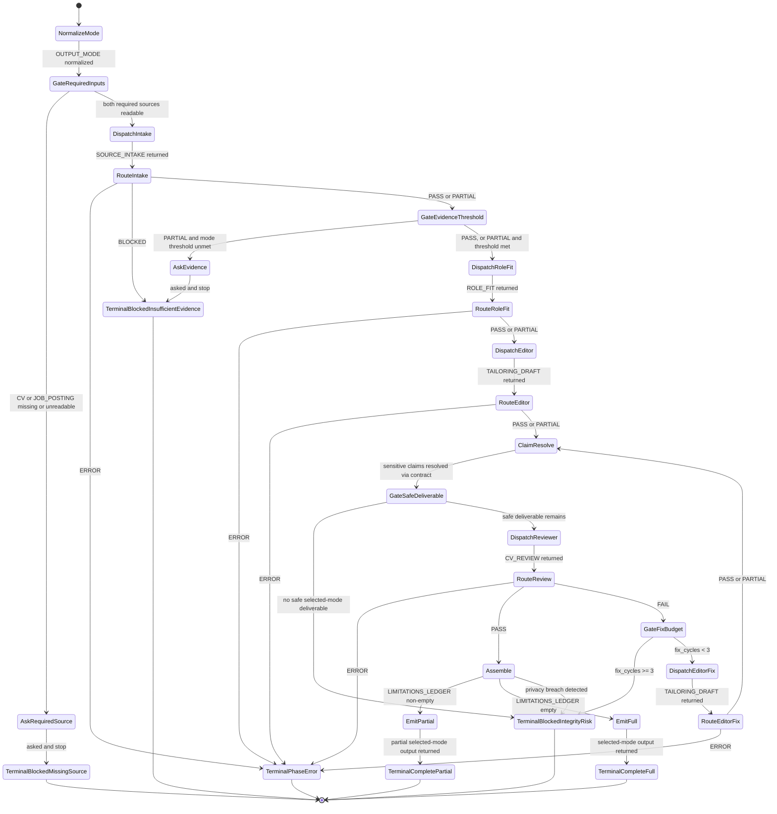

# Review Software Engineer CV — Flow

Finite-state control flow for this skill. Companion transition table:
[`state-machine.md`](./state-machine.md). Load both at run start with
`SKILL.md`.

Privacy is a **continuous invariant**: never submit CV text, applicant context,
contact details, private job text, or drafts to external scanners, forms, or
analysis tools. A detected breach transitions to `TerminalBlockedIntegrityRisk`
from any state that performed external I/O.

## Canonical rules

- Status vocabularies are **phase-asymmetric** by design; see `state-machine.md`
  and `references/cv-review-contract.md`. Do not invent missing statuses.
- Review `FAIL` redispatches **only** `cv-tailoring-editor`, then re-enters
  `ClaimResolve` before `DispatchReviewer`. Cap: three fix cycles.
- `ClaimResolve` requires `references/cv-review-contract.md` loaded.
- Completion: full output, partial output with labeled limitations, or an
  explicit blocked/error terminal — never a silent incomplete review.
