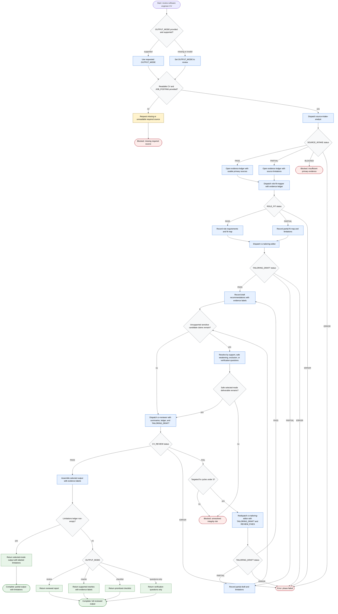

# Review Software Engineer CV

This workflow coordinates a read-only CV review for software engineer applications. The agent may normalize inputs, route work to intake, role-fit, tailoring, and review subagents, and produce evidence-labeled recommendations. Candidate facts may come only from the `CV` and `APPLICANT_CONTEXT`; job requirements come from `JOB_POSTING`; public resume or ATS guidance is background only and never candidate evidence.

Completion rule: finish with a full selected-mode output, a partial selected-mode output with propagated limitations, a blocked missing-source status, a blocked insufficient-evidence status, a blocked unresolved-integrity status after three targeted fix cycles or unsafe claim resolution, or a phase error.

Sensitive-action rule: publishable candidate claims, metrics, seniority signals, domain depth claims, and technology/tool claims must be directly supported by `CV` or `APPLICANT_CONTEXT`, safely weakened, excluded, or carried as verification questions. They must not be asserted from background guidance.
